--- 
title: Reactive outputs
lesson: 7
layout: tutorial
categories: tutorial
---
Observers aren't the only type of reactive object you can create with Shiny. You can use Shiny to create three types of reactive output: 

1. Observers
2. Reactive Expressions (e.g. Observables)
3. Isolating Expressions

Each does something different. Observers create the reactive graphs, tables, and text that make your Shiny apps so attractive. Reactive expressions and isolating expressions create links between reactive values and observers. You can use reactive expressions to create faster apps that require less calulation, and you can use isolating expressions to delay reactions in your app. 

This lesson will explain Reactive Expressions and Isolating Expressions at a conceptual level. [Lesson 8](../lesson8/) will provide a hands on demonstration with a new app.

## The chain of reactivity

In the R language, most functions take values as input and return values as output. As a result, you can arrange R functions into a chain of commands, where the output of one function provides the input for the next function. 

    vec <- c(1:100)
    xbar <- mean(vec)
    diffs <-  '-'(vec, xbar)  # same as vec - xbar
    squares <- '^'(diffs, 2) # same as diffs ^ 2
    var <- mean(squares)

However, a handful of functions, such as `print` and `plot` do not return any output. Instead these functions create a side effect. `print` causes a line of text to appear in the R console, and `plot` causes a graph to appear in R's graphics device. If you were to use one of these functions, it would end the chain of commands, because neither function provides a value for future functions to use. 

Observers use reactive values, but do not return a value of their own. Instead, an observer creates a side effect, which is then included in your web app. 

What would happen if an observer returned a value of its own? For example, if the observer is the expression `a + 1` where `a` is a reactive value. When `a` changes, the value of the observer will change. If you think about it, the value of the observer would itself be a reactive value. It could change at any moment without warning, which wouldn't be safe for normal R expressions. You'd have to use some type of reactive observer to handle the value of the first observer, just as if it were a reactive value. If this second observer also returned a value, you'd need a third observer to handle its output. Where would the chain of observers and outputs end?

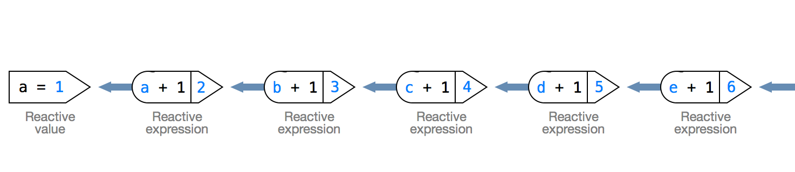

As in [Lesson 6](../Lesson-6/), the direction of the arrows here shows which objects look up which. 

Compare this to an observer that only generates a side effect (such as a plot or a print statement). You don't have to worry about the side effect passing on anything reactive; it doesn't pass on anything at all. In fact, observer an observer that generates a side effect creates a convenient way to end the chain of reactivity. Once a print statement prints, or a plot is plotted, R can rest until the observer is called again. 

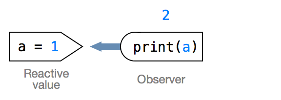

The distinction between reactive output that calls side effects and reactive output that passes on values is subtle, but important. In fact, it is so important that Shiny uses two different classes to describe the output. Output that calls a side effect is known as an `observer`. Output that passes on a value is known as an `observable` (but you'll hear me and probably everyone else refer to it as a _reactive expression_).

## Observers

Observers are the most common output to pair with reactive values. You'll use them in your apps, even after you learn to use reactive expressions and isolated values. Why is this? Both reactivity and Shiny are built around observers. The `output` object you use to communicate between `server.R` and `ui.R` is a list of observer objects. Shiny turns each of the expressions that you save to `output` into an observer. You don't have to worry about doing this transformation, the `render` functions from [Lesson 4](../Lesson-4/) take care of it in conjunction with Shiny's server side processing. Do these observers pass on values? Nope. Just side effects. In this case, the side effect generates part of your app's web page. (Note: The expression you put inside of a `render` function may pass on a value, but the render function itself will pass on a side effect (that involves the value).)

You can also create observer objects manually with `observe`, as you learned in [Lesson 6](../Lesson-6/).

The reactivity scheme we outlined in [Lesson 6](../Lesson-6/) makes observers behave in particular way: observers are executed with _eager evaluation_. Whenever an observer becomes outdated, a series of events occurs that causes the server to re-evaluate the observer within a few microseconds. It's as if the observer just can't wait to be re-evaluated. This is different than every other expression in R. Other R expressions are evaluated with _lazy evaluation_, which means they are not evaluated until another expression calls upon them (or until you yourself command R to run them at the command line).

Why does R rely on lazy evaluation? Because it saves time and memory. In most R programs, expressions return values that are then passed to higher level expressions and so on. In this paradigm, it makes sense to not generate a value until something -- perhaps another expression, perhaps you -- asks for it. By running an out of date observer, the Shiny server sets off a cascade of _lazy evaluation_ that will update every expression that the observer depends on.

## Reactive Expressions (observables)

Reactive expressions are just observers that pass on a new reactive value. You can create a reactive expression with `reactive`. It works in a similar way to `observe`, but you need to use function syntax to retrieve the value of your reactive expression. This makes some sense if you think of your reactive expression as an expression that must be run to calculate its current value.

    val <- reactiveValues(a = 1)
    exp <- reactive({ val$a + 1 })
    observe({ print(exp()) })
    shiny:::flushReact()
    ## 2

Because a reactive expression returns a reactive value, its output can only be used by an observer, another reactive expression, or an isolated value (still to come).

### Reactive expressions and memory

Shiny can make some assumptions about how reactive expressions will be used because reactive expressions pass on a value. Shiny uses these assumptions to optimize the performance of apps that use reactive expressions.

First, Shiny assumes that reactive expressions will always be called by another expression. Hence they can be evaluated with lazy evaluation, like everythign else in R, instead of eager evaluation, like an observer.

What does this mean for you? The reactive expressions in your app won't be evaluated unless an observer calls upon them. If no observer calls upon the expression, it may not be evaluated at all! (In this case, you should probably ask yourself why you are including the reactive expression to begin with.)

Because they are lazily evaluated, reactive expressions work a bit differently than observers in the reactive framework. Like observers, a reactive expression will register a context that has a callback with each reactive value it uses. In [Lesson 6](../Lesson-6/), we used a homing pigeon as a metaphor for this context. 

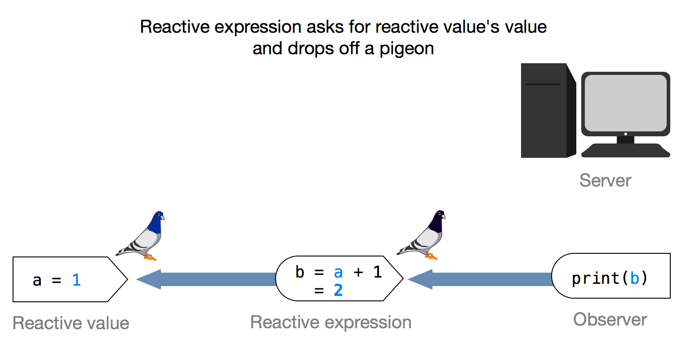

When the reactive value changes, it invalidates the context, but instead of sending the callback to the server, the reactive values object sends the callback to the reactive expression. 

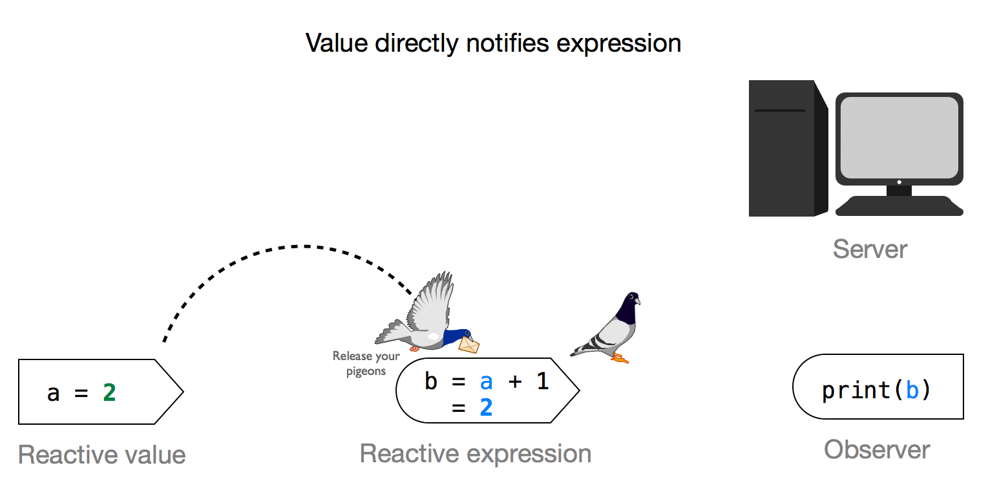

When the reactive expression gets the callback, it doesn't re-evaluate itself or do anything to update, but it does do two things. First, it invalidates any contexts that it has received from observers or other reactive expressions. Second, it flags itself as invalid.

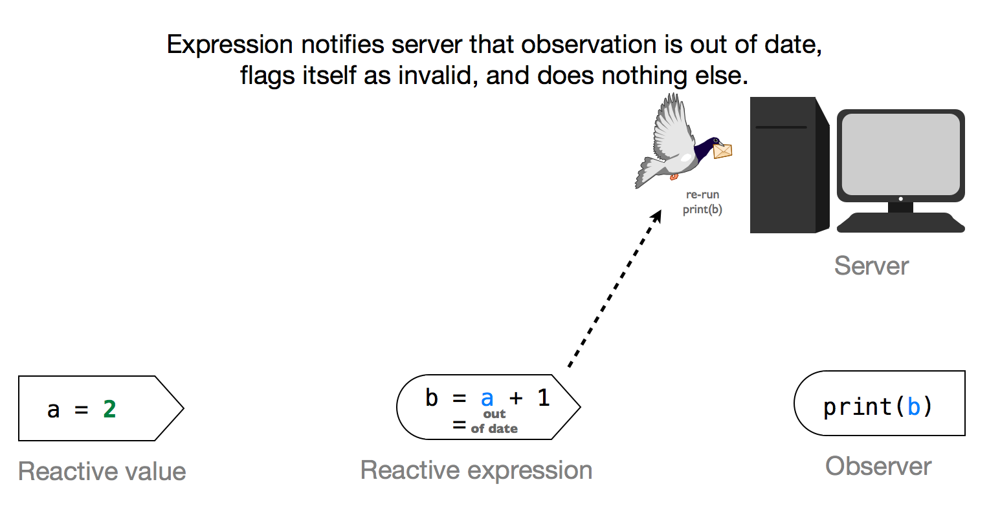

The next time an observer or reactive expression asks for the reactive expression's value, the expression checks its invalidation flag. If it is invalid, it re-runs itself, fetches the current values of each reactive value object it uses and in the process registers new contexts to start the cycle over again.

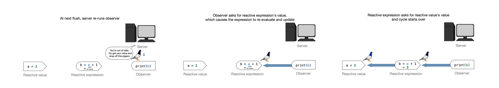

What if the reactive expression sees that it is still valid? Shiny has thought two steps ahead here. Since reactive expressions pass on a reactive value, Shiny can assume that other expressions will frequently ping the reactive expression for its value. It would be a waste of RAM to re-evaluate the reactive value for each of these pings. As an alternative, Shiny has reactive values cache their values. If an observer or expression asks for a reactive expression's reactive value _while it is still valid_, the reactive expression will just return its cached value and no computation occurs.

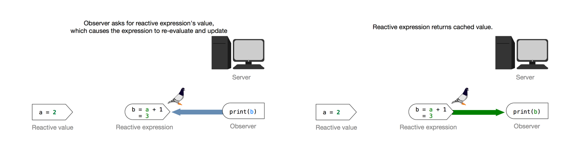

You can use this behaviour to make your Shiny apps computationally efficient (that means faster and better able to handle multiple users). Whenever two observers repeat the same code, put the common code into a reactive expression. On each flush, the first observer will cause the code to re-evaluate and update itself. The second observer will then just use the cached value (whereas before it would re-run the code on its own).

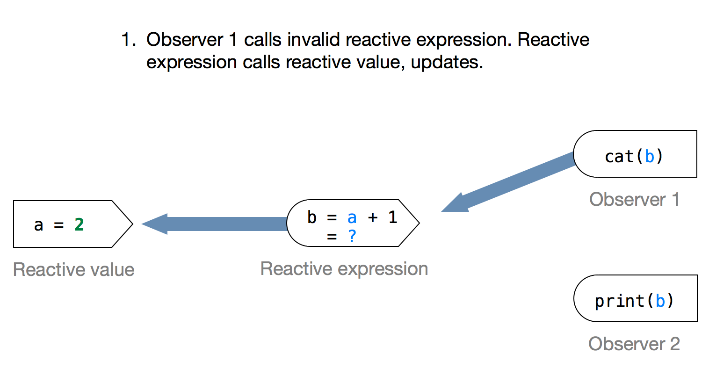
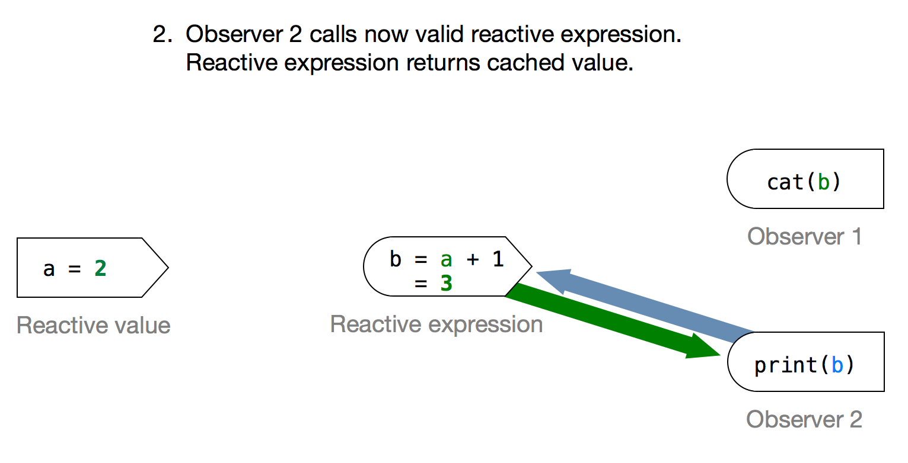

## Isolating expressions

What if you want to create a reactive expression that returns a regular, non-reactive value? In Shiny parlance, these expressions are called Isolating Expressions, you can make them with the `isolate` function. 

    isolate(val$a + 1)

When an isolating expression is run, it will look up the current values of any reactive values it relies upon, but it will not react when those values change. You can safely pass the output of an isolating function to any R function without worrying that it will cause problems. The output will be inert and will behave just like any other R value. This makes `isolate` a useful way to send reactive values to `print` without getting an error message. For example, the code below will invoke the console's hidden `print` call without any errors.

    isolate(val$a)

How do isolating expresssions work in the reactive framework? When an isolating function uses a reactive value, it registers a context without a callback. When the context is invalidated, nothing happens. The pigeon just flies away. As a result the output of the isolating function will not react to changes in the reactive values.

Of course, if you call the isolating function again, it will update its output just like any R function would. In other words, it will look up the current values of each of its reactive values and return a new, updated output value. However, this value will always be a regular R object and will never react to changes in the reactive values. 

Since isolating functions opt out of the reactive alert system, they do not know whether they are valid or invalid. Hence they cannot save RAM by caching their values like reactive expressions do.

You can use isolating expressions to control when and how your app updates. For example, you can postpone reactions until the user enters multiple inputs and then asks for the update to occur -- perhaps with a submit button. The questions in the quiz will step you through an example of this. [Lesson 8](../Lesson-8/) will help you implement it in a real shiny app.

## Quiz

Let's set up another reactive system to test your understanding. Just like in [Lesson 6](../Lesson-6/), you'll play the part of the server with `shiny:::flushReact`. 

First, you'll need a set of reactive values

    values <- reactiveValues(p = 1, q = 1)

Next, you'll need a reactive expression. Although reactive expressions should return a value, you can certainly insert a print statement into them. This statement will print to the console each time the expression is run, which can help you debug. We will use it to tell whether or not the reactive expressions has been run.

    reactExp <- reactive({ 
      print("running reactExp")
      values$p + 1
    })

Now we have our first reactive system, and its time for question 1.

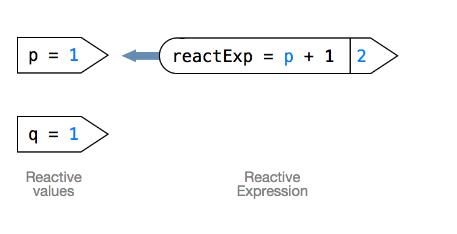

### 1. What will happen if you change values$p and then flush the system above?

    values$p <- 2
    shiny:::flushReact()

Nothing. Do you know why not? Our system only contains a reactive expression, which is lazily evaluated. R will not evaluate `reactExp` until you directly call it or until an observer calls it (or calls something that eventually calls it). Give it a try. Directly call `reactExp()`. 

    reactExp()
    ## Error in .getReactiveEnvironment()$currentContext() : 
    ##   Operation not allowed without an active reactive context. 
    ## (You tried to do something that can only be done from 
    ## inside a reactive function.)

Oho! Trick question strikes again! You cannot directly call reactive expressions in the console because they return a reactive value. To examine `reactExp()` in the console, surround it with `isolate` (and great work if you thought to do that on your own). `isolate` will create an isolating expression that uses `reactExp()` as input, but returns a non-reactive value. This is the correct way to display the current value of reactive values and reactive expressions in the console. Try it out. (No tricks this time, I promise).

    isolate(reactExp())
    [1] "running reactExp"
    [1] 3

Okay, let's add an observer to our system for question 2. Notice that this is another way to display the value of `reactExp()`, but it is not as straightforward as `isolate`.

    observe({
      print(reactExp())
      print(values$p)
    })

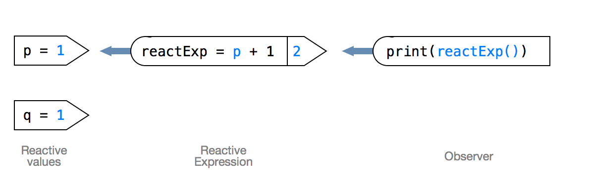

### 2. What will happen if you change values$p back to 1 and then flush the system above? Specifically, will reactExp be evaluated?

    values$p <- 1
    shiny:::flushReact()
    ## "running reactExp"
    ## 2
    ## 1

`reactExp()` gets evaluated. You can tell because the console prints "running reactExp". The change invalidated `reactExp`, which caused `reactExp` to invalidate the context the observer had registered with `reactExp`. This added the observer to the next flush and when the observer was re-run, it called on `reactExp`. Since `reactExp` was flagged as invalid, it re-ran itself. As you can see, Shiny takes care of many details behind the scenes, but now you know how to follow along.

### 3. What will happen if you change values$q to 2 and then flush the system? Specifically, will reactExp be evaluated?

    values$q <- 2
    shiny:::flushReact()
    ## 2
    ## 2

`reactExp` is _not_ re-evaluated. How can this be? `reactExp` only depends on `values$p`. Since `values$p` hasn't changed, `reactExp` is not flagged as invalid. `values$q` has changed, which triggered shiny to run the observer on the next flush. The observer uses `reactExp`, but since `reactExp` was still valid, it just gave the observer its cached value and didn't re-run itself.

Imagine the more complicated reactive systems below. You don't have to make them, but think about them for Question 4.

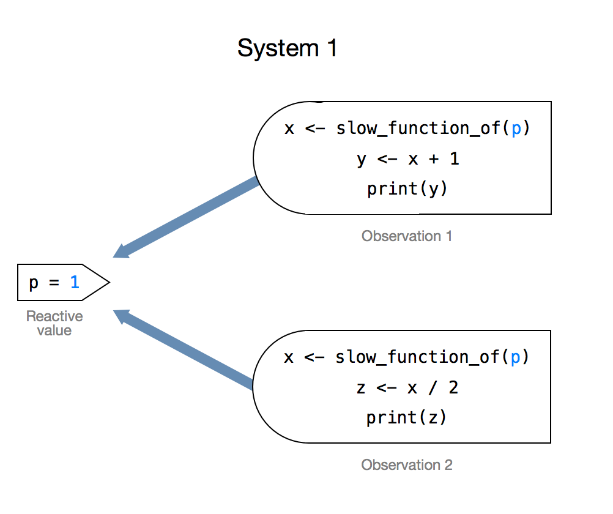
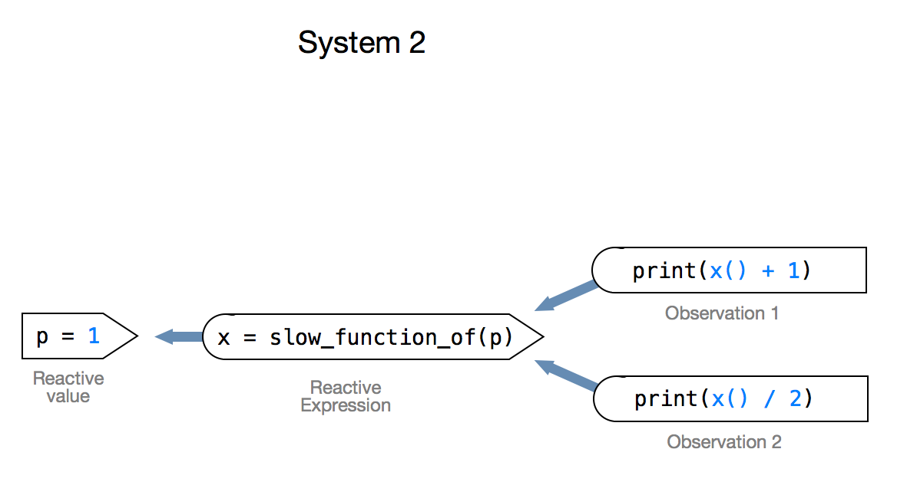

### 4. Which system above will run faster and consume less RAM?

System 2. In each app, both observations depend on the same chunk of code

    slow_function_of(values$p)

In System 1, this code gets run twice each time the app updates. It is run once to update Observation 1 and once to update Observation 2. In System 2, this code is only run once each time the app updates. `slow_function_of(values$p)` is run once to update Observation 1. The reactive expression will cache this result and supply it without re-running itself when Observation 2 is updated.

In general, you can make your apps more efficient by migrating common code in the observers to a single reactive expression.

Let's create a new reactive system, this time we'll use an isolating expression.

    inputs <- reactiveValues(a = 100, b = 200)
    output <- isolate(inputs$a + inputs$b)

### 5. Will you get an error message if you try to look at the value of `output` in the console?

    output
    ## 300

No. `isolate` severs the chain of reactivity. The output of an isolating expression is a normal R value, which you can definitely display in the console.

### 6. What will `output` equal if you change `input$a` to 500?

    inputs$a <- 500
    output
    ## 300

`output` doesn't change. Why? Because the output of isolating functions is not reactive.

### 7. What will `output` equal if you rerun `output <- isolate(inputs$a + inputs$b)`?

    output <- isolate(inputs$a + inputs$b)
    output
    ## 700

`output` updates when you re-run `output <- isolate(inputs$a + inputs$b)`. Any expression would update if you re-run it. R doesn't stores previous values, so it must use current values when it re-runs an expression.

Now, let's make things weird. You can make an observer that observes an isolating expression. Let's call this one, Observer I, and let's immediately flush the system so we can see its value.

    # Observer I
    observe({
      print(isolate(inputs$a))
    })
    shiny:::flushReact()
    ## 500

### 8. Will Observer I update if you change `inputs$a` to 99 and flush the system?

    inputs$a <- 99
    shiny:::flushReact()

Nope. Nothing happened. Even though Observer I can react to reactive values, it is observing a non-reactive value (e.g. the output of `isolate(inputs$a)`. The isolate statement has severed the chain of reactivity. Can this be useful? You bet. Let's make a plan. 

### 9. How could you write an observer that displays the value of `inputs$a` but only updates when you change the value of `inputs$b`?

Think about it.

Think about it.

Got it? How about this?

    # Observer II
    observe({
      inputs$b
      print(isolate(inputs$a))
    })

Observer II will display the value of `inputs$a` because it is in the `print` statement, but not the value of `inputs$b` because it is not in the print statement. However, it will update whenever `inputs$b` changes, but not when `inputs$a` changes because it is inside an `isolate` statement. It doesn't matter that Observer II doesn't ultimately do anything with `inputs$b`. It calls `inputs$b`, which is all that is necessary to leave a context with `inputs$b`. The context will callback Observer II when `inputs$b` changes.

Want to see how it works? First let's flush the system to display the initial value of Observer II.

    shiny:::flushReact()
    ## 99

Great, 99 is the current value of `inputs$a`. What if you change it (and then flush the system)? 

    inputs$a <- 100
    shiny:::flushReact()

Nothing happened! Now let's change `inputs$b` (and flush the system).

    inputs$b <- 5555555
    shiny:::flushReact()
    ## 100

The observer updated, but it doesn't display the current value of `inputs$b`; it displays the current value of `inputs$a`. How did this happen? Changing `inputs$b` caused Observer II to re-run, which caused `isolate(inputs$a)` to re-run, which fetched the current value of `inputs$a`. Observer II only prints the value of `isolate(inputs$a)` because that's how we wrote the print statement.

This is your first example of creating delayed reaction. Shiny supplies a widget that is specially designed to help you create delayed reaction in your apps. It's called `actionButton`. When you use it in conjunction with isolate, you can give your users a submit button that controls when the reactions occur. [Lesson 8](../Lesson-8/) will help you build an app that uses one of these.

## Recap

You now know the three types of reactive output implemented by Shiny, as well as what they are useful for. These are

Output              | Can be used by                           | Caches value? | Updates when
------------------- | ---------------------------------------- | ------------- | ------------
Observer            | Nothing                                  | No            | First flush after a change
Reactive Expression | Observers and other reactive expressions | Yes           | Called by another expression (only when out of date)
Isolated value      | Anything                                 | No            | Called by another expression (each time)

Think you got it? Click through to [Lesson-8](../Lesson-8/) to see how to use this system to create an efficiently run app.

See you in [Lesson 8](../Lesson-8/)!

_Thank you for reading this lesson. It's a work in progress, and I'd love your feedback. If anything is not clear, or if you can suggest an improvement, please leave me a comment below._
