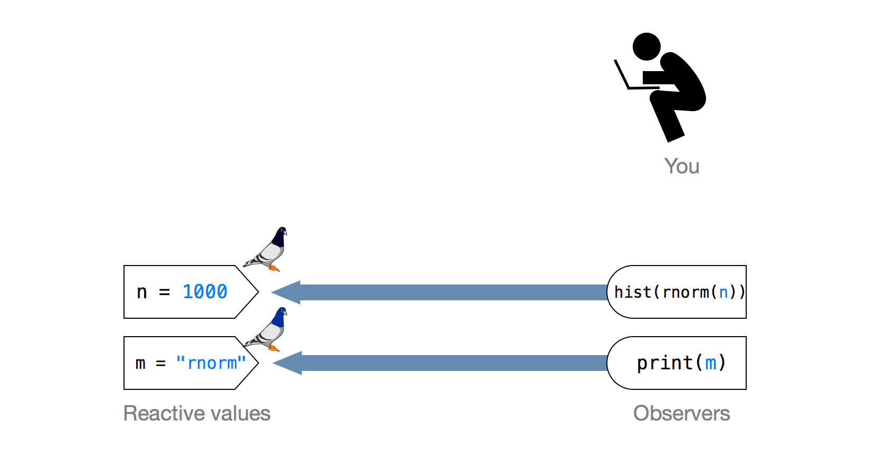
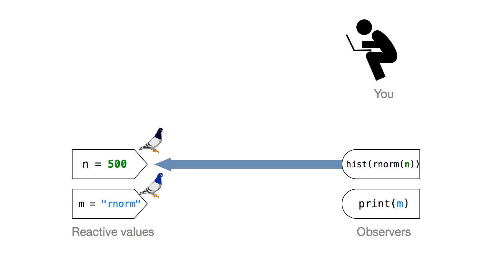

--- 
title: How reactivity works
lesson: 6
layout: tutorial
categories: tutorial
---
Reactivity is what makes your Shiny apps responsive. It let's the app instantly update itself whenever the user makes a change. You don't need to know how reactivity occurs to use it (just follow the steps laid out in [Lesson 4](../lesson4/)), but understanding reactivity will make you a better Shiny programmer. You'll be able to

1. create more efficient and sophisticated Shiny apps, and
2. avoid the errors that come from misusing reactive values in R (which is easy to do!).

Let's take a look at reactivity by building a very simple Shiny app. You can use the `ui.R` and `server.R` files below to make this app. 

    # ui.R
    
    shinyUI(pageWithSidebar(
      headerPanel("basic app"),
      
      sidebarPanel(
        
        sliderInput("a", 
          label = "Select an input to display",
          min = 0, max = 100, value = 50)
      ),
      
      mainPanel(h1(textOutput("text")))
    ))

and

    # server.R
    
    shinyServer(
      function(input, output) {
        output$text <- renderText({
          print(input$a)
        })
      }
    )

The app sets up a very basic reactive system: it has a single input value that can change (`input$a`); it has a single output value that can respond (`print(input$a)`); and it has a server that can oversee the process. Every Shiny app will have these same components, although most apps will have multiple input values and multiple output expressions.

When you move the slider, you can see reactivity in action: the number to the left of the slider automatically updates to show the current slider value. This may seem simple, but it is very special. Let's look at why.

## Reactivity is unexpected

Reactivity creates the illusion that changes in input values automatically flow to the plots, text, and tables that use the input -- and cause them to update. You can think of this flow as a current of electricity, or a stream of water that _pushes_ information from input to output. You saw this illusion in action when you moved the slider bar. Changes in the slider bar seemed to automatically propagate to the number beside the bar.

This illusion is amazing, because information in R only travels through _pull_ mechanisms, not _push_ mechanisms. In other words, if you have a simple R expression like `{a + 1}`, R will retrieve information from `a` to evaluate the expression, but R won't modify the result of `{a + 1}` if you later change the value of `a`. 

    a <- 1
    a + 1
    ## 2
    
    a <- 2
    ## (nothing happens)

Pictorially, the system looks like this. Notice that the arrow in the diagram goes from right to left. This is to imply that the expression on the right is doing the work. It is telling R to look up the value of `a`. `a` is just sitting passively in memory.

For our app, this suggests that R should look up the value of `input$a` once, print the value, and then not notice when `input$a` changes.

Incredibly, this isn't what happens, as you saw above. Reactivity appears to reverse the flow of information in R. How does it do that? 

## What is reactivity?

Think of reactivity as a magic trick: reactivity creates the illusion that one thing is happening, when in fact something else is going on. The illusion is that information is being pushed from inputs to outputs (or at least that inputs and outputs are linked in an inseperable way). The reality is that Shiny is re-running your R expressions in a carefully scheduled way.

I've prepared four maxims to help you understand this process. We'll look at each of them (and the process itself), with a simple thought experiment: how could we recreate our basic app without breaking the rules of R?

Here are our maxims

1. _R expressions update themselves, if you ask_
2. _Nothing needs to happen instantly_
3. _The app must do as little as possible_
4. _Think carrier pigeons, not electricity_

### 1. R expressions update themselves, _if you ask_

Reactivity ensures that the output of `print(input$a)` is always up to date, but what does it mean for output to be _out of date_? Let's consider output -- and the expression that made it -- to be out of date if one of the objects in the expression has been given a new value since the expression was called. For example, at the end of this code, the expression `print(a)` is out of date. The last time `print(a)` ran, `a` was 1.

    a <- 1
    print(a)
    ## 1
    
    a <- 2

Updating an out of date expression is not hard: you just need to re-run the expression. Everything in R updates itself each time it is run. This isn't reactivity; it's just standard R behavior.

    a <- 1
    print(a)
    ## 1
    
    a <- 2
    print(a)
    ## 2

Think of it like this: every time you run an expression, the expression updates itself. It looks up the current value of each object that it uses and computes new ouput. However, you must tell R to run the expresssion for this to happen because R uses a style of execution known as _lazy evaluation_. In other words, R will not execute an expression until you force it to.

You could use this behavior -- and nothing else -- to create a reactive web app. All you need to do is manually re-run the expressions in the app whenever the user makes a change. 

### 2. Nothing needs to happen instantly

How quickly do you need to re-run an expression after a user makes a change? If the update appears instantaneous, the user will feel like they caused it. In other words, the update will create the illusion of reactivity. However, humans aren't very good at noticing small windows of time. You could actually let a few microseconds pass between change and update and your user wouldn't notice. This suggests a new feature for our plan.

Instead of watching the user (which would require logistics we haven't thought through), you could just have your server re-run each expression in the app every few microseconds. That way whenever the user makes a change, an update will follow within a few microseconds. If you re-run _every_ expression in the app, you don't even need to worry about which part of the app the user is changing.

What if the user doesn't make a change? Then the expressions will re-compute their previous results and the app will appear to be in the same state it was before. 

This plan creates the illusion of reactivity without violating the rules of R. Information still travels from input to output in a pull fashion. For example, `print(input$a)` only learns the new value of `input$a` because the server re-executes `print(input$a)`. Since `print(input$a)` is re-executed so often, it seems to learn of the change very fast, as if it were connected to `input$a` or as if `input$a` pushed its new value to `print(input$a)`.

Shiny uses this approach to create reactivity. That is why your R session becomes busy when you launch a Shiny app. Your server is using it to monitor the app and re-run expressions. However, Shiny takes this approach one step further. It creates an alert system that let's Shiny know exactly which expressions need to be re-run.

### 3. The app must do as little as possible

It takes a very powerful computer to re-run every expression in an app every few microseconds without bogging down. If you used our approach in reality, your app would quickly become slow and unresponsive, which would destroy the illusion of reactivity.

If you want your updates to run so fast that they appear instantaneous, you'll need to save your computer power for just the expressions that are out of date. However, your app may use hundreds of expressions. How will you know which ones are out of date? 

Shiny solves this problem by creating a system of alerts that lets the server know when an expression becomes out of date. The server still checks in on your app every few microseconds, but instead of re-running each expression each time, it only runs the expressions that the alert system has flagged as out of date. If no alerts have appeared, the server doesn't have to run anything at all. It can rest until the next check. If alerts have appeared, the server runs all of the expressions that are out of date at that moment, an event known as a _flush_.

This alert system is the key to reactivity. It allows your server to update your app as fast as possible, so fast that changes seem to travel instantly from inputs to outputs. Let's not try to brainstorm our own alert system. Instead let's examine the system that Shiny uses.

### 4. Think carrier pigeons, not electricity

The details of the alert system are fairly complicated. If they sound confusing in this next paragraph, don't worry. We're going to break them down step by step with an analogy that will make them more transparent.

Shiny implements reactivity with two special object classes, `reactivevalues` and `observers`. In our example `input$a` is a reactive values object and `print(input$a)` is an observer. These two classes behave like regular R values and R expressions with a few exceptions. Whenever an observer uses a reactive value, it registers a _reactive context_ with the value. This context contains an expression to be run if the value ever changes. The expression is called a _callback_ and it is always a command to re-run the observer. A single reactive value can hold many contexts if multiple observers use that value.

The set method of reactive values objects includes instructions to send any callbacks the reactive value has received to the server. If the reactive values object is set to a new value, it executes these instructions and the server receives the callbacks. 

The server saves the callbacks in a queue which acts as a list of observers that have become out of date. On the next flush, the server runs each callback in the queue which re-runs each out of date observer, which restarts the cycle.

 

If this seems complicated, think of reactivity as a carrier pigeon system between three objects. If you don't know what carrier pigeons are, check out this [link](http://en.wikipedia.org/wiki/Pigeon_post) -- it's pretty fascinating. Basically, you can take a carrier pigeon anywhere and when you release it, it will always fly back to the same location. Soldiers on the move used carrier pigeons to deliver messages to their headquarters. We're going to use them to deliver messages to the server.

A context is like a virtual carrier pigeon that an observer leaves with a reactive value. The context contains a message (its callback) that it will deliver to the server when released. The observer writes this message for the context, and it is a simple instruction to re-run the observer. An observer leaves behind a context each time it looks up a reactive values object. In fact, a reactive values object will return an error if an expression tries to access its value without leaving behind a context.

When a reactive values object receives a context, it simply holds onto it. It will collect multiple contexts if other observers look up the object as well. If the reactive value object ever changes, it will release all of the contexts it has collected (a process known as _invalidating the contexts_). This behavior is like releasing carrier pigeons, the pigeons are free to fly back to the server and deliver the callbacks that they have been holding onto. When a context is invalidated, it places its callback in the server's queue to be run on the next flush. Then the context ceases to be relevant, just like a pigeon that has delivered its message.

The callback of a context is an R command that when run, will re-execute the observer that created the context. This will cause the observer to update itself with the new value of the reactive values object. When the server checks in on the app, all it needs to do is run any callbacks that have arrived. This will automatically update the app.

Running the callbacks also sets up a new reactive cycle. When an observer is re-run, it looks up the reactive value objects that it uses, which causes it to register new contexts with each value. In short, the observer leaves a new homing pigeon behind and the cycle is ready to repeat itself. 

This system enables reactivity because it lets your server work fast enough to create the illusion of instant responses. Instead of re-running every expression in your app every few seconds, the server only needs to check its queue for new callbacks. The result is the quick, responsive updates you see in your Shiny app.

Now you know how reactivity works in Shiny. Notice that this system doesn't ask R to behave in a new way. Your observers are still looking up information from the reactive values. The values are not being pushed to the observer like a flow of electricity, or a stream. The key to this system is speed. Shiny enacts the pull mechanisms of R so fast that they look like push mechanisms.

How well do you understand reactivity? In the next section, we'll hone your understanding with a few short quizzes.

## Your turn!

Let's test your understanding by creating a reactive system that we can monitor closely. We'll build this system outside of a Shiny app so we can control it through the console. Normally, I wouldn't recommend doing this. There's not much point in using reactivity with R's limited display devices (that's why Shiny uses web pages). However, this exercise can be useful for educational purposes. We'll use it to test your understanding of reactivity. Let's start by creating the three essential features of a reactive system: a reactive values object, an observer object and a server.

### Reactive values

You can make a list of reactive values with the function `reactiveValues`, like so. here we are creating a list called `values` that has the elements `m` and `n`.

    library(shiny)
    values <- reactiveValues(m = "rnorm", n = 1000)
    class(values)
    ## "reactivevalues"

The `input` object in your Shiny app is a list of reactive values. Technically, the whole list is a `reactivevalues` object. Reactive values only come as lists of values. 

You can use list notation to extract the actual values from your object. However, reactive values expect to be called from within a reactive function, like the functions that create an observer. If you try to examine the elements of `values` outside of a reactive function you'll get an error message. 

    values$n
    ## Error in .getReactiveEnvironment()$currentContext() : 
    ##  Operation not allowed without an active reactive context. 
    ## (You tried to do something that can only be done from 
    ## inside a reactive function.)

Now let's create an observer that can work with these values.

### Observe

You can turn an R expression, like `print`, into an `observer` object with `observe`. Notice the braces. `observe` expects them, and you can use them to pass multiple expressions as a single observer. You don't need to assign an observer to a variable. Shiny records observers in a special environment, which tracks them for you. Let's create two observrs, one for each reactive value.

    observe({
      print(values$m)
    })
    
    observe({ 
      hist(rnorm(values$n)) 
    })

When these observers update, they'll re-run the expressions inside `observe`. Since we're working outside of a Shiny app, this effect will appear somewhat humble. Whenever the first observer updates, it will print the new value of `values$m` in the console. Whenever the second observer updates, it will draw a new histogram in the graphics pane.

Did you notice that the observer calls didn't create any R output when you first defined them? They're waiting for a server to tell them to run. We're not going to launch a Shiny server, so you'll have to stand in for one. This means that you'll need to do some of the things that a server can do.

### Callback Queue

First, I'd like you to be able to see the callbacks that have arrived in the queue and are waiting to be run. these callbacks will be a list of all of the observers that are out of date. There's no easy way to view this list, so please just copy and paste in this function I wrote for you. I wouldn't recommend using it anywhere but here.

    roost <- function() {
      cue <- shiny:::.reactiveEnvironment$.pendingFlush$.itemsByPriority$values()
      if (!length(cue)) return("everything is up to date")
      lapply(cue[[1]], function(object) object$.label)
    }

### Flush

Next, I'd like you to be able to flush the system, which will update every observer in the callback queue. You can flush the reactive system with 

    shiny:::flushReact()

Notice that `flushReact` is a non-exported function from the Shiny package, which means you have to access it with the prefix `shiny:::` (It also means that you shoudn't use `shiny:::flushReact` in daily practice. It might change in future versions of Shiny, or even disappear altogether).

Run `shiny:::flushReact()` now. `"rnorm"` should print in your console window and a histogram should appear in your graphics window. Now we have a complete reactive system to play with. Let's use it to test your understanding of reactivity.

## Quiz

### 1. What happens if you run the code below?

Notice that one of your observers uses `value$n` to make a histogram. If you change `values$n`, will R re-plot the histogram? Try it and see.

    values$n <- 500

**Answer**: The plot does not update. Why? The plot didn't update because the server hasn't asked it to yet. Remember, reactivity isn't a magic flow where changes in your values are pushed to your output. The changes just notify the server that the expression is out of date. Your expression won't update until you ask it to by running a new flush.

### 2. What callbacks have arrived so far?

You can look at your system's callback queue with the `roost` function that you defined earlier. If you look at your server's callback queue now, what should we see? Make a prediction and then look at the queue by running `roost`.

    roost()
    ## [[1]]
    ## [1] "observe({\n    hist(rnorm(values$n))\n})"

**Answer**: You see all of the observers that are now out of date. This is how your server knows which expressions to run on the next flush - each time a context is invalidated, it adds its observer to the list. `observe({ hist(rnorm(values$n)) })` is in the queue because `values$n` has changed and the observer is now out of date. Notice that `observe({ print(values$m) })` isn't in the queue. This observer isn't out of date because `values$m` hasn't changed.

### 3. How can you update your observers?

**Answer**: If you said "re-run them," good job! If you said `shiny:::flushReact()`, great job! 

`shiny:::flushReact()` will re-run all of the callbacks that are currently in the server's queue. 

Consider one more question before you try it; will the `print(values$m)` statement also be re-run? Run `shiny:::flushReact()` and see.

    shiny:::flushReact()
    ## (graph updates)

No, `print(values$m)` didn't get re-run. You can tell because "rnorm" wasn't re-printed to your console. This is how Shiny creates efficiency.

### 4. Now what's in your callback queue?

What should be in you queue now that you've flushed everything? Make a prediction and then check with `roost()`.

    roost()
    ## "everything is up to date"

**Answer**: Nothing is in the queue because all of your expressions are up to date. If you ran a flush right now, R wouldn't have to do any real work. It'd just check the queue and then stop there. This is another way Shiny builds efficiency.

### 5. What is the value of values$n?

Has anything changed while you weren't looking? Check the value of `values$n` to be sure. What do you think the value will be?

    values$n
    ## Error in .getReactiveEnvironment()$currentContext() : 
    ##  Operation not allowed without an active reactive context. 
    ## (You tried to do something that can only be done from 
    ## inside a reactive function.)

**Answer**: That was a trick question! Did you fall for it? Reactive values must be called from inside certain types of functions. In [Lesson 7](../lesson7/) I'll show you how to easily peek at reactive values with `isolate`. Until then, we'll only be able to see them if they appear in the output of an observer.

### 6. What will immediately react if you change both values$n and values$m? Make a prediction and then try it.

    values$n <- 10
    values$m <- "bazinga!"

**Answer**: Nothing happens. Updates won't occur until the next flush (remember the server flushes multiple times a second; we're a little slower.) Also remember, reactive expressions do not immediately update to changes. The server just runs flushes so often that the updates seem immediate. That's the magic trick!

### 7. What will change on the next flush? How do you know?

**Answer**: You can find out what observers will be run by checking the callback queue. At the moment, both observers are scheduled to be run on the next flush. On the flush, the server runs what's in its queue (and nothing else).

    roost()
    ## [[1]]
    ## [1] "observe({\n    hist(rnorm(values$n))\n})"
    
    ## [[2]]
    ## [1] "observe({\n    print(values$m)\n})"

### 8. What will happen on the next flush?

What will happen when you run `shiny:::flushReact()`? Make a prediction and then see.

    shiny:::flushReact()
    ## (graph updates)
    ## "bazinga!"

**Answer**: Everything will update. R will draw a new histogram and print `"bazinga"` to the console.

### 9. How's that going to look to your viewers? 

**Answer**: Like magic.

## Recap

this was a difficult lesson that covered some dense material. You may want to re-read it once or twice until you feel that you understand how reactivity works under the hood. When you do, you'll know that

* Reactivity is an administration system for scheduling fast, targeted updates of out of date expressions.
* Reactivity uses R's natural behavior: expressions update themselves when re-run.
* Your Shiny server checks for changes many times a second and updates observers when it finds changes.
* Reactivity relies on an alert system and uses contexts, callbacks, and flushes.
* You can only access reactive values from inside a reactive function like `observe`.

How should you use this knowledge? For now, just file it as useful information. It's much easier to do magic when you know how the trick works. In [Lesson 7](../lesson7/) I'll extend these ideas in a way you can immediately use. You'll learn how to create different types of "observers" to control exactly how your app reacts to input.

See you [Lesson 7](../lesson7/)!

_Thank you for reading this lesson. It's a work in progress, and I'd love your feedback. If anything is not clear, or if you can suggest an improvement, please leave me a comment below._
