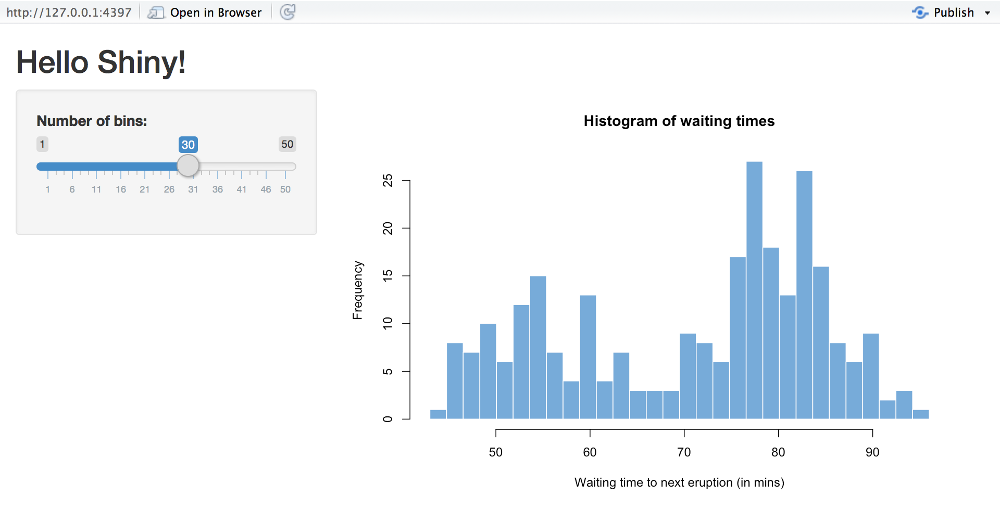

The Shiny package comes with eleven built-in examples that demonstrate how Shiny works. This article reviews the first three examples, which demonstrate the basic structure of a Shiny app.

## Example 1: Hello Shiny

{: .example-screenshot}

The Hello Shiny example is a simple application that plots R's built-in `faithful` dataset with a configurable number of bins. To run the example, type:


library(shiny)
runExample("01_hello")


Shiny applications have two components, a user interface object and a server function, that are passed as arguments to the `shinyApp` function that creates a Shiny app object from this UI/server pair. The source code for both of these components is listed below.

In subsequent sections of the article we'll break down Shiny code in detail and explain the use of "reactive" expressions for generating output. For now, though, just try playing with the sample application and reviewing the source code to get an initial feel for things. Be sure to read the comments carefully.

The user interface is defined as follows:

#### ui


# Define UI for app that draws a histogram ----
ui <- fluidPage(

  # App title ----
  titlePanel("Hello Shiny!"),

  # Sidebar layout with input and output definitions ----
  sidebarLayout(

    # Sidebar panel for inputs ----
    sidebarPanel(

      # Input: Slider for the number of bins ----
      sliderInput(inputId = "bins",
                  label = "Number of bins:",
                  min = 1,
                  max = 50,
                  value = 30)

    ),

    # Main panel for displaying outputs ----
    mainPanel(

      # Output: Histogram ----
      plotOutput(outputId = "distPlot")

    )
  )
)


The server-side of the application is shown below. At one level, it's very simple -- a random distribution is plotted as a histogram with the requested number of bins. However, you'll also notice that the code that generates the plot is wrapped in a call to `renderPlot`. The comment above the function explains a bit about this, but if you find it confusing, don't worry, we'll cover this concept in much more detail soon.

#### server


# Define server logic required to draw a histogram ----
server <- function(input, output) {

  # Histogram of the Old Faithful Geyser Data ----
  # with requested number of bins
  # This expression that generates a histogram is wrapped in a call
  # to renderPlot to indicate that:
  #
  # 1. It is "reactive" and therefore should be automatically
  #    re-executed when inputs (input$bins) change
  # 2. Its output type is a plot
  output$distPlot <- renderPlot({

    x    <- faithful$waiting
    bins <- seq(min(x), max(x), length.out = input$bins + 1)

    hist(x, breaks = bins, col = "#007bc2", border = "white",
         xlab = "Waiting time to next eruption (in mins)",
         main = "Histogram of waiting times")

    })

}


#### shinyApp

Finally, we use the `shinyApp` function to create a Shiny app object from the UI/server pair that we defined above.


shinyApp(ui, server)


We save all of this code, the `ui` object, the `server` function, and the call to the `shinyApp` function, in an R script called `app.R`. This is the same basic structure for all Shiny applications.

The next example will show the use of more input controls, as well as the use of reactive functions to generate textual output.

## Example 2: Shiny Text

{: .example-screenshot}

The Shiny Text application demonstrates printing R objects directly, as well as displaying data frames using HTML tables. To run the example, type:


library(shiny)
runExample("02_text")


The first example had a single numeric input specified using a slider and a single plot output. This example has a bit more going on: two inputs and two types of textual output.

If you try changing the number of observations to another value, you'll see a demonstration of one of the most important attributes of Shiny applications: inputs and outputs are connected together "live" and changes are propagated immediately (like a spreadsheet). In this case, rather than the entire page being reloaded, just the table view is updated when the number of observations change.

Here is the user interface object for the application. Notice in particular that the `sidebarPanel` and `mainPanel` functions are now called with two arguments (corresponding to the two inputs and two outputs displayed):

#### ui


# Define UI for dataset viewer app ----
ui <- fluidPage(

  # App title ----
  titlePanel("Shiny Text"),

  # Sidebar layout with a input and output definitions ----
  sidebarLayout(

    # Sidebar panel for inputs ----
    sidebarPanel(

      # Input: Selector for choosing dataset ----
      selectInput(inputId = "dataset",
                  label = "Choose a dataset:",
                  choices = c("rock", "pressure", "cars")),

      # Input: Numeric entry for number of obs to view ----
      numericInput(inputId = "obs",
                   label = "Number of observations to view:",
                   value = 10)
    ),

    # Main panel for displaying outputs ----
    mainPanel(

      # Output: Verbatim text for data summary ----
      verbatimTextOutput("summary"),

      # Output: HTML table with requested number of observations ----
      tableOutput("view")

    )
  )
)


The server side of the application has also gotten a bit more complicated. Now we create:

* A reactive expression to return the dataset corresponding to the user choice
* Two other rendering expressions (`renderPrint` and `renderTable`) that return the `output$summary` and `output$view` values

These expressions work similarly to the `renderPlot` expression used in the first example: by declaring a rendering expression you tell Shiny that it should only be executed when its dependencies change. In this case that's either one of the user input values (`input$dataset` or `input$obs`).

#### server


# Define server logic to summarize and view selected dataset ----
server <- function(input, output) {

  # Return the requested dataset ----
  datasetInput <- reactive({
    switch(input$dataset,
           "rock" = rock,
           "pressure" = pressure,
           "cars" = cars)
  })

  # Generate a summary of the dataset ----
  output$summary <- renderPrint({
    dataset <- datasetInput()
    summary(dataset)
  })

  # Show the first "n" observations ----
  output$view <- renderTable({
    head(datasetInput(), n = input$obs)
  })

}


We've demonstrated more use of reactive expressions but haven't really explained how they work yet. The next example will start with this one as a baseline and expand significantly on how reactive expressions work in Shiny.

## Example 3: Reactivity

{: .example-screenshot}

The Reactivity application is very similar to Hello Text, but goes into much more detail about reactive programming concepts. To run the example, type:


library(shiny)
runExample("03_reactivity")


The previous examples have given you a good idea of what the code for Shiny applications looks like. We've explained a bit about reactivity, but mostly glossed over the details. In this section, we'll explore these concepts more deeply. If you want to dive in and learn about the details, see the Understanding Reactivity section, starting with [Reactivity Overview](/articles/reactivity-overview.html).

### What is Reactivity?

The Shiny web framework is fundamentally about making it easy to wire up *input values* from a web page, making them easily available to you in R, and have the results of your R code be written as *output values* back out to the web page.

    input values => R code => output values

Since Shiny web apps are interactive, the input values can change at any time, and the output values need to be updated immediately to reflect those changes.

Shiny comes with a **reactive programming** library that you will use to structure your application logic. By using this library, changing input values will naturally cause the right parts of your R code to be reexecuted, which will in turn cause any changed outputs to be updated.

### Reactive Programming Basics

Reactive programming is a coding style that starts with **reactive values**--values that change in response to the user, or over time--and builds on top of them with **reactive expressions**--expressions that access reactive values and execute other reactive expressions.

What's interesting about reactive expressions is that whenever they execute, they automatically keep track of what reactive values they read and what reactive expressions they invoked. If those "dependencies" become out of date, then they know that their own return value has also become out of date. Because of this dependency tracking, changing a reactive value will automatically instruct all reactive expressions that directly or indirectly depend on that value to re-execute.

The most common way you'll encounter reactive values in Shiny is using the `input` object. The `input` object, which is passed to your `shinyServer` function, lets you access the web page's user input fields using a list-like syntax. Code-wise, it looks like you're grabbing a value from a list or data frame, but you're actually reading a reactive value. No need to write code to monitor when inputs change--just write reactive expression that read the inputs they need, and let Shiny take care of knowing when to call them.

It's simple to create reactive expression: just pass a normal expression into `reactive`. In this application, an example of that is the expression that returns an R data frame based on the selection the user made in the input form:


datasetInput <- reactive({
   switch(input$dataset,
          "rock" = rock,
          "pressure" = pressure,
          "cars" = cars)
})


To turn reactive values into outputs that can viewed on the web page, we assigned them to the `output` object (also passed to the `shinyServer` function). Here is an example of an assignment to an output that depends on both the `datasetInput` reactive expression we just defined, as well as `input$obs`:


output$view <- renderTable({
   head(datasetInput(), n = input$obs)
})


This expression will be re-executed (and its output re-rendered in the browser) whenever either the `datasetInput` or `input$obs` value changes.

### Back to the Code

Now that we've taken a deeper look at some of the core concepts, let's revisit the source code for the Reactivity example and try to understand what's going on in more depth. The user interface object has been updated to include a text-input field that defines a caption. Other than that it's very similar to the previous example:

#### ui


# Define UI for dataset viewer app ----
ui <- fluidPage(

  # App title ----
  titlePanel("Reactivity"),

  # Sidebar layout with input and output definitions ----
  sidebarLayout(

    # Sidebar panel for inputs ----
    sidebarPanel(

      # Input: Text for providing a caption ----
      # Note: Changes made to the caption in the textInput control
      # are updated in the output area immediately as you type
      textInput(inputId = "caption",
                label = "Caption:",
                value = "Data Summary"),

      # Input: Selector for choosing dataset ----
      selectInput(inputId = "dataset",
                  label = "Choose a dataset:",
                  choices = c("rock", "pressure", "cars")),

      # Input: Numeric entry for number of obs to view ----
      numericInput(inputId = "obs",
                   label = "Number of observations to view:",
                   value = 10)

    ),

    # Main panel for displaying outputs ----
    mainPanel(

      # Output: Formatted text for caption ----
      h3(textOutput("caption", container = span)),

      # Output: Verbatim text for data summary ----
      verbatimTextOutput("summary"),

      # Output: HTML table with requested number of observations ----
      tableOutput("view")

    )
  )
)


#### server

The server function declares the `datasetInput` reactive expression as well as three reactive output values. There are detailed comments for each definition that describe how it works within the reactive system:


# Define server logic to summarize and view selected dataset ----
server <- function(input, output) {

  # Return the requested dataset ----
  # By declaring datasetInput as a reactive expression we ensure
  # that:
  #
  # 1. It is only called when the inputs it depends on changes
  # 2. The computation and result are shared by all the callers,
  #    i.e. it only executes a single time
  datasetInput <- reactive({
    switch(input$dataset,
           "rock" = rock,
           "pressure" = pressure,
           "cars" = cars)
  })

  # Create caption ----
  # The output$caption is computed based on a reactive expression
  # that returns input$caption. When the user changes the
  # "caption" field:
  #
  # 1. This function is automatically called to recompute the output
  # 2. New caption is pushed back to the browser for re-display
  #
  # Note that because the data-oriented reactive expressions
  # below don't depend on input$caption, those expressions are
  # NOT called when input$caption changes
  output$caption <- renderText({
    input$caption
  })

  # Generate a summary of the dataset ----
  # The output$summary depends on the datasetInput reactive
  # expression, so will be re-executed whenever datasetInput is
  # invalidated, i.e. whenever the input$dataset changes
  output$summary <- renderPrint({
    dataset <- datasetInput()
    summary(dataset)
  })

  # Show the first "n" observations ----
  # The output$view depends on both the databaseInput reactive
  # expression and input$obs, so it will be re-executed whenever
  # input$dataset or input$obs is changed
  output$view <- renderTable({
    head(datasetInput(), n = input$obs)
  })

}


We've reviewed a lot code and covered a lot of conceptual ground in the first three examples. The [next article](/articles/build.html) focuses on the mechanics of building a Shiny application from the ground up.
