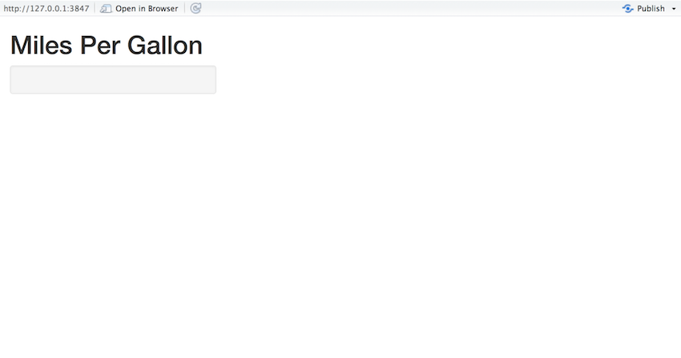
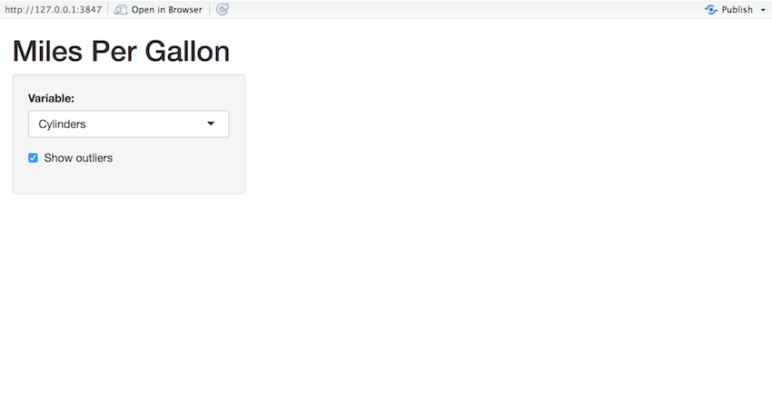
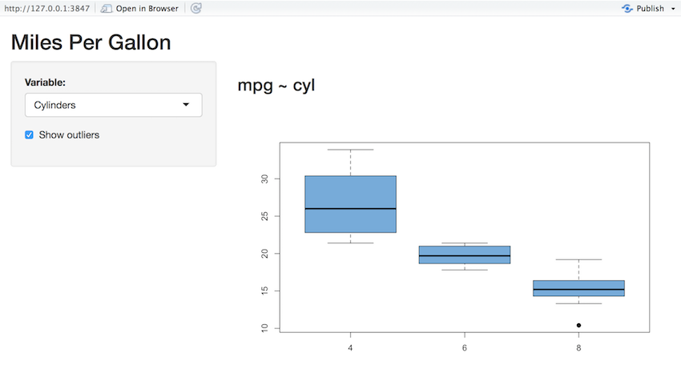

Let's walk through the steps of building a simple Shiny application. A Shiny application is simply a directory containing an R script called `app.R` which is made up of a user interface object and a server function. This folder can also contain any any additional data, scripts, or other resources required to support the application. 

## UI & Server

To get started building the application, create a new empty directory wherever you'd like, then create an empty `app.R` file within it. For purposes of illustration we'll assume you've chosen to create the application at ~/shinyapp:

<pre><code>~/shinyapp
|-- app.R
</code></pre>

Now we'll add the minimal code required in the source file called `app.R`.

First, we load the shiny package:


library(shiny)


#### ui

Then, we define the user interface by calling the function `pageWithSidebar`:


# Define UI for miles per gallon app ----
ui <- pageWithSidebar(

  # App title ----
  headerPanel("Miles Per Gallon"),

  # Sidebar panel for inputs ----
  sidebarPanel(),

  # Main panel for displaying outputs ----
  mainPanel()
)


The three functions `headerPanel`, `sidebarPanel`, and `mainPanel` define the various regions of the user-interface. The application will be called "Miles Per Gallon" so we specify that as the title when we create the header panel. The other panels are empty for now.

Now let's define a skeletal server implementation. To do this we call `shinyServer` and pass it a function that accepts two parameters, `input` and `output`:

#### server


# Define server logic to plot various variables against mpg ----
server <- function(input, output) {

}


Our server function is empty for now but later we'll use it to define the relationship between our inputs and outputs.

#### app.R

Finally, we need the `shinyApp` function that uses the `ui` object and the `server` function we defined to build a Shiny app object.

Putting it altogether, our `app.R` script looks like this:


library(shiny)

# Define UI for miles per gallon app ----
ui <- pageWithSidebar(
  
  # App title ----
  headerPanel("Miles Per Gallon"),
  
  # Sidebar panel for inputs ----
  sidebarPanel(),
  
  # Main panel for displaying outputs ----
  mainPanel()
)

# Define server logic to plot various variables against mpg ----
server <- function(input, output) {
  
}

shinyApp(ui, server)


We've now created the most minimal possible Shiny application. You can run the application by calling the `runApp` function as follows:


> library(shiny)
> runApp("~/shinyapp")


Alternatively, if you are working on you can click the Run App button on your RStudio Editor.

If everything is working correctly you'll see the application appear in your browser looking something like this: 

{: .example-screenshot}

We now have a running Shiny application however it doesn't do much yet. In the next section we'll complete the application by specifying the user interface object and implementing the server function

## Inputs & Outputs

### Adding Inputs to the Sidebar

The application we'll be building uses the mtcars data from the R datasets package, and allows users to see a box-plot that explores the relationship between miles-per-gallon (MPG) and three other variables (Cylinders, Transmission, and Gears). 

We want to provide a way to select which variable to plot MPG against as well as provide an option to include or exclude outliers from the plot. To do this we'll add two elements to the sidebar, a `selectInput` to specify the variable and a `checkboxInput` to control display of outliers. Our user-interface definition looks like this after adding these elements:

#### ui


# Define UI for miles per gallon app ----
ui <- pageWithSidebar(
  
  # App title ----
  headerPanel("Miles Per Gallon"),
  
  # Sidebar panel for inputs ----
  sidebarPanel(
  
        # Input: Selector for variable to plot against mpg ----
      selectInput("variable", "Variable:", 
                c("Cylinders" = "cyl",
                  "Transmission" = "am",
                  "Gears" = "gear")),

      # Input: Checkbox for whether outliers should be included ----
      checkboxInput("outliers", "Show outliers", TRUE)
  
  ),
  
  # Main panel for displaying outputs ----
  mainPanel()
)


If you run the application again after making these changes you'll see the two user-inputs we defined displayed within the sidebar:

{: .example-screenshot}

### Creating the server function

Next we need to define the server-side of the application which will accept inputs and compute outputs. Our `server` function is shown below, and illustrates some important concepts:

* Accessing input using slots on the `input` object and generating output by assigning to slots on the `output` object.
* Initializing data at startup that can be accessed throughout the lifetime of the application.
* Using a reactive expression to compute a value shared by more than one output.

The basic task of a Shiny server function is to define the relationship between inputs and outputs. Our function does this by accessing inputs to perform computations and by assigning reactive expressions to output slots. 

Here is the source code for the full server function (the inline comments explain the implementation technqiues in more detail):

#### server


# Data pre-processing ----
# Tweak the "am" variable to have nicer factor labels -- since this
# doesn't rely on any user inputs, we can do this once at startup
# and then use the value throughout the lifetime of the app
mpgData <- mtcars
mpgData$am <- factor(mpgData$am, labels = c("Automatic", "Manual"))

# Define server logic to plot various variables against mpg ----
server <- function(input, output) {

  # Compute the formula text ----
  # This is in a reactive expression since it is shared by the
  # output$caption and output$mpgPlot functions
  formulaText <- reactive({
    paste("mpg ~", input$variable)
  })

  # Return the formula text for printing as a caption ----
  output$caption <- renderText({
    formulaText()
  })

  # Generate a plot of the requested variable against mpg ----
  # and only exclude outliers if requested
  output$mpgPlot <- renderPlot({
    boxplot(as.formula(formulaText()),
            data = mpgData,
            outline = input$outliers,
            col = "#007bc2", pch = 19)
  })

}


The use of `renderText` and `renderPlot` to generate output (rather than just assigning values directly) is what makes the application reactive. These reactive wrappers return special expressions that are only re-executed when their dependencies change. This behavior is what enables Shiny to automatically update output whenever input changes.

### Displaying Outputs

The server function assigned two output values: `output$caption` and `output$mpgPlot`. To update our user interface to display the output we need to add some elements to the main UI panel. 

In the updated user-interface definition below you can see that we've added the caption as an h3 element and filled in its value using the `textOutput` function, and also rendered the plot by calling the `plotOutput` function:

#### ui


# Define UI for miles per gallon app ----
ui <- fluidPage(

  # App title ----
  titlePanel("Miles Per Gallon"),

  # Sidebar layout with input and output definitions ----
  sidebarLayout(

    # Sidebar panel for inputs ----
    sidebarPanel(

      # Input: Selector for variable to plot against mpg ----
      selectInput("variable", "Variable:",
                  c("Cylinders" = "cyl",
                    "Transmission" = "am",
                    "Gears" = "gear")),

      # Input: Checkbox for whether outliers should be included ----
      checkboxInput("outliers", "Show outliers", TRUE)

    ),

    # Main panel for displaying outputs ----
    mainPanel(

      # Output: Formatted text for caption ----
      h3(textOutput("caption")),

      # Output: Plot of the requested variable against mpg ----
      plotOutput("mpgPlot")

    )
  )
)


Running the application now shows it in its final form including inputs and dynamically updating outputs:

{: .example-screenshot}

## Details

The `shinyApp()` function returns an object of class `shiny.appobj`. When this is returned to the console, it is printed using the `print.shiny.appobj()` function, which launches a Shiny app from that object.

You can also use a similar technique to create and run files that aren't named `app.R` and don't reside in their own directory. If, for example, you create a file called `test.R` and have it call `shinyApp()` at the end, you could then run it from the console with:


print(source("test.R"))


When the file is sourced, it returns a `shiny.appobj`—but by default, the return value from `source()` isn't printed. Wrapping it in `print()` causes Shiny to launch it.

This method is handy for quick experiments, but it lacks some advantages that you get from having an `app.R` in its own directory. When you do `runApp("newdir")`, Shiny will monitor the file for changes and reload the app if you reload your browser, which is useful for development. This doesn't happen when you simply source the file. Also, Shiny Server and shinyapps.io expect an app to be in its own directory. So if you want to deploy your app, it should go in its own directory.

Now that we've got a simple application running we'll probably want to make some changes. The [next article](/articles/running.html) covers the basic cycle of editing, running, and debugging Shiny applications.
