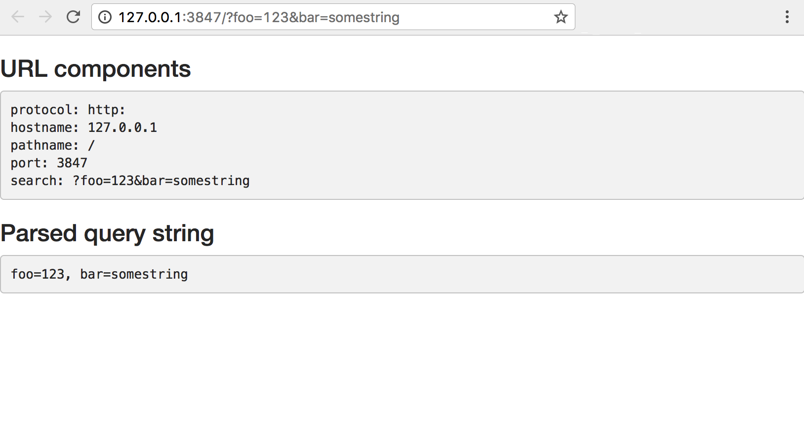

## Getting Non-Input Data From the Client

On the server side, Shiny applications use the `input` object to receive user input from the client web browser. The values in `input` are set by UI objects on the client web page. There are also non-input values (in the sense that the user doesn't enter these values through UI components) that are stored in an object called `session$clientData`. These values include the URL, the pixel ratio (for high-resolution "Retina" displays), the hidden state of output objects, and the height and width of plot outputs. You can see an example app which uses client data [here]({{ site.baseurl }}/gallery/client-data-and-query-string.html).

### Using session$clientData

To access `session$clientData` values, you need to add a `session` argument to your `server` function (`session` is a special object that is used for finer control over a user's app session). Once it's in there, you can access `session$clientData` just as you would `input`.

In the example below, the client browser will display out the components of the URL and also parse and print the query/search string (the part of the URL after a "`?`"):


ui <- bootstrapPage(
  h3("URL components"),
  verbatimTextOutput("urlText"),

  h3("Parsed query string"),
  verbatimTextOutput("queryText")
)

server <- function(input, output, session) {

  # Return the components of the URL in a string:
  output$urlText <- renderText({
    paste(sep = "",
      "protocol: ", session$clientData$url_protocol, "\n",
      "hostname: ", session$clientData$url_hostname, "\n",
      "pathname: ", session$clientData$url_pathname, "\n",
      "port: ",     session$clientData$url_port,     "\n",
      "search: ",   session$clientData$url_search,   "\n"
    )
  })

  # Parse the GET query string
  output$queryText <- renderText({
    query <- parseQueryString(session$clientData$url_search)

    # Return a string with key-value pairs
    paste(names(query), query, sep = "=", collapse=", ")
  })
}

shinyApp(ui, server)


This app will display the following (note that the query string, `?foo=123&bar=somestring` was added manually to the URL after lauching the app):

{: .example-screenshot}

### Viewing all available values in clientData

The values in `session$clientData` will depend to some extent on the outputs. For example, a plot output object will report its height, width, and hidden status. The app below has a plot output, and displays all the values in `session$clientData`:


ui <- pageWithSidebar(
  headerPanel("Shiny Client Data"),
  sidebarPanel(
    sliderInput("obs", "Number of observations:",
                min = 0, max = 1000, value = 500)
  ),
  mainPanel(
    h3("clientData values"),
    verbatimTextOutput("clientdataText"),
    plotOutput("myplot")
  )
)

server <- function(input, output, session) {
  # Store in a convenience variable
  cdata <- session$clientData

  # Values from cdata returned as text
  output$clientdataText <- renderText({
    cnames <- names(cdata)

    allvalues <- lapply(cnames, function(name) {
      paste(name, cdata[[name]], sep = " = ")
    })
    paste(allvalues, collapse = "\n")
  })

  # A histogram
  output$myplot <- renderPlot({
    hist(rnorm(input$obs), main = "Generated in renderPlot()")
  })
}

shinyApp(ui, server)


Notice that, just as with `input`, values in `session$clientData` can be accessed with `session$clientData$myvar` or `session$clientData[['myvar']]`. Or, equivalently, since we've saved it into a convenience variable `cdata`, we can use `cdata$myvar` or `cdata[['myvar']]`.

For the plot output `output$myplot`, there are at least three entries in `clientData`:

* `output_myplot_height`: The height of the plot on the web page, in pixels.
* `output_myplot_width`: The width of the plot on the web page, in pixels.
* `output_myplot_hidden`: If the object is hidden (not visible), this is `TRUE`. This is used because Shiny will by default suspend the output object when it is hidden. When suspended, the observer will not execute even when its inputs change.

Here is the view from the client, with all the `clientData` values:

{: .example-screenshot}

As of Shiny v1.5, this as well as other plot output information (e.g. CSS styles of the HTML container) is accessible via `getCurrentOutputInfo()`, which provides a more convenient way to access output-specific information since it:

* Returns a list of reactive expressions, allowing reactive expressions that depend on output information to depend on *particular* output information.
* Uses `htmltools::parseCssColors()` to return CSS color string(s) as R color string(s).

To learn more about `getCurrentOutputInfo()`, see the [reference page](https://shiny.rstudio.com/reference/shiny/latest/getCurrentOutputInfo.html).
