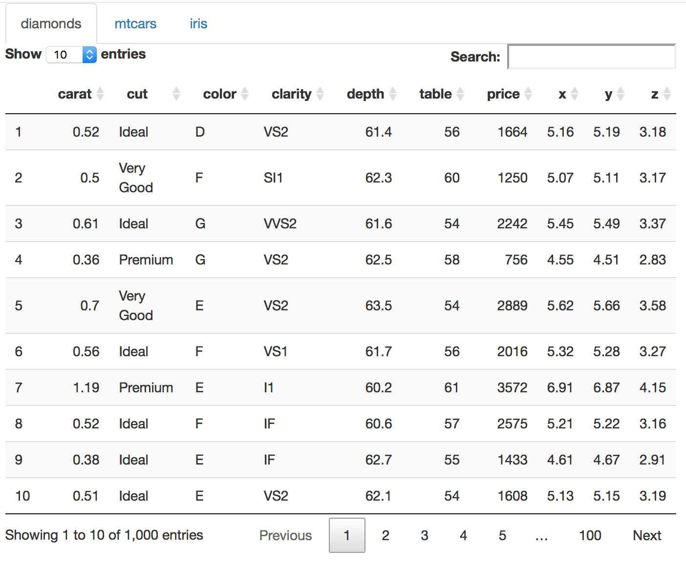

### Basic Usage

The [DataTables application](https://gallery.shinyapps.io/012-datatables/)
demonstrates HTML tables using the jQuery library
[DataTables](http://datatables.net).

{: .example-screenshot}

To build DataTables in R, we recommend using the `DT` package (http://rstudio.github.io/DT/):


library(DT)


The basic usage is to create an output element in the UI using
`DT::dataTableOutput(id = 'foo')`, and render a table on the server side using
`output$foo <- DT::renderDataTable({ data })`. Normally `renderDataTable()` 
takes an expression that returns a rectangular data object with column names, 
such as a data frame or a matrix. 

Note: Both `shiny` and `DT` packages have functions named `dataTableOutput` and 
`renderDataTable`. The `shiny::renderDataTable` function provides the server-side 
version of DataTables (using R to process the data object on the server side), while `DT::renderDataTable` allows you to create both server-side and client-side 
DataTables, and supports additional DataTables features. Hence we recommend using 
functions from the `DT` package when building DataTables in your Shiny app.

Below is a minimal example:


library(DT)

ui <- basicPage(
  h2("The mtcars data"),
  DT::dataTableOutput("mytable")
)

server <- function(input, output) {
  output$mytable = DT::renderDataTable({
    mtcars
  })
}
  
shinyApp(ui, server)


By default, the data is paginated, showing 10 rows per page. The number of
rows to display can be changed through the drop down menu in the top-left.
We can sort the columns by clicking on the column headers, and sort multiple
columns by holding the `Shift` key while clicking (the sorting direction
loops through `ascending`, `descending`, and `none` if we keep on clicking).
We can search globally in the table using the text input box in the
top-right, or search individual columns using the text boxes at the bottom.
Currently the searching terms are treated as regular expressions in R. Since
searching can be time-consuming in large datasets, there is a delay of 0.5
seconds (customizable) before searching is really processed; that means if
we type fast enough in the search box, searching may be processed only once
on the server side even if we have typed more than one character.

### Customizing DataTables

There are a large number of options in DataTables that are customizable (see its
website for details). In [this
example](https://gallery.shinyapps.io/012-datatables/), we show a few
possibilities. Here is the code for the entire app:


library(shiny)
library(ggplot2)  # for the diamonds dataset

ui <- fluidPage(
  title = "Examples of DataTables",
  sidebarLayout(
    sidebarPanel(
      conditionalPanel(
        'input.dataset === "diamonds"',
        checkboxGroupInput("show_vars", "Columns in diamonds to show:",
                           names(diamonds), selected = names(diamonds))
      ),
      conditionalPanel(
        'input.dataset === "mtcars"',
        helpText("Click the column header to sort a column.")
      ),
      conditionalPanel(
        'input.dataset === "iris"',
        helpText("Display 5 records by default.")
      )
    ),
    mainPanel(
      tabsetPanel(
        id = 'dataset',
        tabPanel("diamonds", DT::dataTableOutput("mytable1")),
        tabPanel("mtcars", DT::dataTableOutput("mytable2")),
        tabPanel("iris", DT::dataTableOutput("mytable3"))
      )
    )
  )
)

server <- function(input, output) {
  
  # choose columns to display
  diamonds2 = diamonds[sample(nrow(diamonds), 1000), ]
  output$mytable1 <- DT::renderDataTable({
    DT::datatable(diamonds2[, input$show_vars, drop = FALSE])
  })
  
  # sorted columns are colored now because CSS are attached to them
  output$mytable2 <- DT::renderDataTable({
    DT::datatable(mtcars, options = list(orderClasses = TRUE))
  })
  
  # customize the length drop-down menu; display 5 rows per page by default
  output$mytable3 <- DT::renderDataTable({
    DT::datatable(iris, options = list(lengthMenu = c(5, 30, 50), pageLength = 5))
  })
  
}

shinyApp(ui, server)


#### ui

First, we created the UI to display three datasets `diamonds`, 
`mtcars`, and `iris`, with each dataset in its own tab. We also 
added a checkbox group to select the columns to show in the
`diamonds` data.

#### server

The `options` argument in `renderDataTable()` can take a list (literally an
R list) of options, and pass them to DataTables when the table is
initialized. For example, for the `mtcars` data, we pass `orderClasses =
TRUE` to DataTables so that the sorted columns will have CSS classes
attached on them (this is disabled by default); in this example, we can see
the sorted columns are highlighted by darker colors. For the `iris` data, we
pass the options `lengthMenu` and `pageLength` to customize the drop
down menu, which has items `[10, 25, 50, 100]` by default; now the menu has
three items `[5, 30, 50]`, and `5` is selected as the default value.

For more DataTable options, please refer to its full reference on its website.

### Upgrading from DataTables v1.9 to v1.10

Shiny (>= v1.10.2) currently uses DataTables v1.10. If you have used DataTables
in Shiny before (specifically, before Shiny v0.10.2), you may need to change
some parameter names for your DataTables, because Shiny (<= v0.10.1) was using
DataTables v1.9, and DataTables v1.10 has changed the parameter names.

A guide for upgrading parameter names from DataTables 1.9 to 1.10 is here:
<https://datatables.net/upgrade/1.10-convert>. Shiny will try to automatically
correct some of the old parameter names, but this automatic correction certainly
will not work for all use cases, especially if you have deeply customized your
DataTables using complicated JavaScript options. You can see [this GIT
commit](https://github.com/rstudio/shiny-examples/commit/6f2a5618) for examples
of converting DataTables 1.9 names to 1.10 names.
