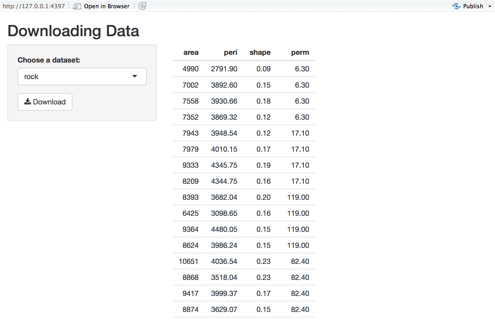

Shiny has the ability to offer file downloads that are created on the fly, which makes it easy to build data exporting features. 

{: .example-screenshot}

See [here]({{ site.baseurl }}/gallery/download-file.html) for an example app with file downloads.

To run the example below, type:


library(shiny)
runExample("10_download")


You define a download using the `downloadHandler` function on the server side, and either `downloadButton` or `downloadLink` in the UI:

#### ui


ui <- fluidPage(

  # App title ----
  titlePanel("Downloading Data"),

  # Sidebar layout with input and output definitions ----
  sidebarLayout(

    # Sidebar panel for inputs ----
    sidebarPanel(

      # Input: Choose dataset ----
      selectInput("dataset", "Choose a dataset:",
                  choices = c("rock", "pressure", "cars")),

      # Button
      downloadButton("downloadData", "Download")

    ),

    # Main panel for displaying outputs ----
    mainPanel(

      tableOutput("table")

    )

  )
)


#### server


server <- function(input, output) {

  # Reactive value for selected dataset ----
  datasetInput <- reactive({
    switch(input$dataset,
           "rock" = rock,
           "pressure" = pressure,
           "cars" = cars)
  })

  # Table of selected dataset ----
  output$table <- renderTable({
    datasetInput()
  })

  # Downloadable csv of selected dataset ----
  output$downloadData <- downloadHandler(
    filename = function() {
      paste(input$dataset, ".csv", sep = "")
    },
    content = function(file) {
      write.csv(datasetInput(), file, row.names = FALSE)
    }
  )

}


As you can see, `downloadHandler` takes a `filename` argument, which tells the web browser what filename to default to when saving. This argument can either be a simple string, or it can be a function that returns a string (as is the case here).

The `content` argument must be a function that takes a single argument, the file name of a non-existent temp file. The `content` function is responsible for writing the contents of the file download into that temp file.

Both the `filename` and `content` arguments can use reactive values and expressions (although in the case of `filename`, if you are using a reactive value, be sure your argument is an actual function; `filename = paste(input$dataset, ".csv", sep = "")` will not work the way you want it to, since it is evaluated only once, when the download handler is being defined).

Generally, those are the only two arguments you'll need. There is an optional `contentType` argument; if it is `NA` or `NULL`, Shiny will attempt to guess the appropriate value based on the filename. Provide your own content type string (e.g. `"text/plain"`) if you want to override this behavior.
