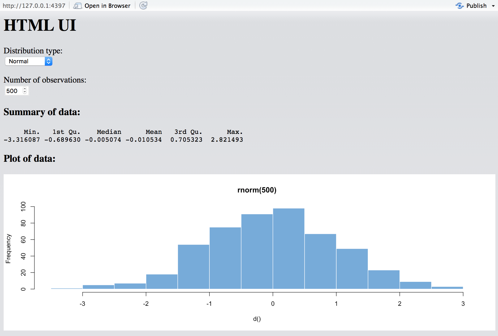

{: .example-screenshot}

The HTML UI application demonstrates defining a Shiny user interface using a standard HTML page rather than a UI object. To run the example type: 


library(shiny)
runExample("08_html")


### Defining an HTML UI

Many Shiny apps use a UI object file to build their user interfaces. While this is a fast and convenient way to build user interfaces, some applications will inevitably require more flexiblity. For this type of application, you can define your user interface directly in HTML. For such apps, the directory structure looks like this:

<pre><code>&lt;<em>application-dir</em>&gt;
|-- app.R
|-- www
    |-- index.html
</code></pre>

In this example we re-write the front-end of the [Tabsets application](/gallery/tabsets.html) (`runExample("06_tabsets")`) using HTML directly. Here is the source code for the new user interface definition:

#### www/index.html



<!DOCTYPE html>
<html>

<head>
  
  
  <link rel="stylesheet" type="text/css" href="shared/shiny.css"/>
</head>

<body>

  <h1>HTML UI</h1>

  

    <label>Distribution type:</label> 
    <select name="dist">
      <option value="norm">Normal</option>
      <option value="unif">Uniform</option>
      <option value="lnorm">Log-normal</option>
      <option value="exp">Exponential</option>
    </select>
  

  

    <label>Number of observations:</label> 
    <input type="number" name="n" value="500" min="1" max="1000" />

  

  <h3>Summary of data:</h3>
  <pre id="summary" class="shiny-text-output"></pre>

  <h3>Plot of data:</h3>
  

  <h3>Head of data:</h3>
  

</body>
</html>



There are few things to point out regarding how Shiny binds HTML elements back to inputs and outputs:

* HTML form elements (in this case a select list and a number input) are bound to input slots using their `name` attribute.
* Output is rendered into HTML elements based on matching their `id` attribute to an output slot and by specifying the requisite css class for the element (in this case either shiny-text-output, shiny-plot-output, or shiny-html-output).

With this technique you can create highly customized user interfaces using whatever HTML, CSS, and JavaScript you like.

### Server function

All of the changes from the original Tabsets application were to the user interface, the server script remains the same:


# Define server logic for random distribution app ----
server <- function(input, output) {

  # Reactive expression to generate the requested distribution ----
  # This is called whenever the inputs change. The output functions
  # defined below then use the value computed from this expression
  d <- reactive({
    dist <- switch(input$dist,
                   norm = rnorm,
                   unif = runif,
                   lnorm = rlnorm,
                   exp = rexp,
                   rnorm)

    dist(input$n)
  })

  # Generate a plot of the data ----
  # Also uses the inputs to build the plot label. Note that the
  # dependencies on the inputs and the data reactive expression are
  # both tracked, and all expressions are called in the sequence
  # implied by the dependency graph.
  output$plot <- renderPlot({
    dist <- input$dist
    n <- input$n

    hist(d(),
         main = paste("r", dist, "(", n, ")", sep = ""),
         col = "#007bc2", border = "white")
  })

  # Generate a summary of the data ----
  output$summary <- renderPrint({
    summary(d())
  })

  # Generate an HTML table view of the head of the data ----
  output$table <- renderTable({
    head(data.frame(x = d()))
  })

}


### Building the Shiny app object

We end the `app.R` file with a call to the `shinyApp` function to build the Shiny app object using the UI and server components we defined above.


shinyApp(ui = htmlTemplate("www/index.html"), server)


## Learn more

For more on this topic, see the following resources:

[<i class="fas fa-play-circle fa-lg" aria-hidden="true"></i> Shiny UI](https://resources.rstudio.com/shiny-developer-conference/shinydevcon-shinyui-garrettgrolemund-1080p)
