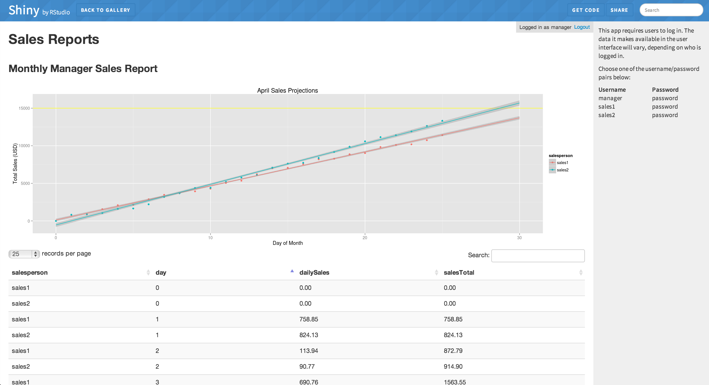

It is easy to create User Privileges in Shiny apps when you use [RStudio Connect](https://www.rstudio.com/products/connect/) or [Shiny Server Pro](http://www.rstudio.com/shiny/server/). Your app can recognize a user based on log-in information and deliver personalized content in response. You can use this feature to control who gets to see what content and when they see it.

## Personalized Data Access

The [Sales Report]({{ site.baseurl }}/gallery/personalized-ui.html) app demonstrates how you can use this feature to control data your app displays. You can view this app and its code in the [Shiny Gallery]({{ site.baseurl }}/gallery).

When a sales person logs into the Sales Report app, Shiny displays the data related only to that sales person.

{: .example-screenshot}

 

When a manager logs into the Sales Report app, Shiny displays the data for _every_ sales person. This information can help the manager compare performance.

{: .example-screenshot}

 

The Sales Report app creates this effect by creating personal output for each log-in. 

If you want to create a similar effect, begin in the `server.R` file. In that file, you can access your user's log-in information with `session$user` (the topic of the article called ["Learn about your user with session$clientData"]({{ site.baseurl }}/articles/client-data.html)).

First, if it's not there already, include `session` as the third argument of the `server` function. The Sales Report app does this in line 27 of its [`server.R`](https://gist.github.com/trestletech/9790025#file-server-r-L27) file. Including `session` will ensure that the code inside `server` has access to that variable at runtime.


server <- function(input, output, session) { 

}


Next, access and store your user's username with `session$user`. The Sales Report app does this in lines 32-34 of its `server.R` script.


  user <- reactive({
    session$user
  })


After you store usernames with `session$user`, you can use the user information with `switch`, `if`, and other conditional functions. These functions will build outputs tailored for the user. The Sales Report app does this by testing whether the user's log-in matches the names of known manager log-ins (here "manager"). The Sales Report app includes a helper function that runs this test.


  isManager <- reactive({
    if (user() == "manager"){
      return(TRUE)
    } else{
      return(FALSE)
    }
  })


It uses the results to determine the scope of the data set to display.


  # Based on the logged in user, pull out only the data this user 
  # should be able to see.
  myData <- reactive({
    if (isManager()){
      # If a manager, show everything.
      return(salesData)
    } else{
      # If a regular salesperson, only show their own sales.
      return(salesData[salesData$salesperson == user(),])
    }
  })


This approach is very versatile and provides a convenient way to control who has access to which data and which widgets in your Shiny apps.

The [Airline Delays]({{ site.baseurl }}/gallery/authentication-and-database.html) app pushes this method a step further. This app compares the user log-in to a table of known users. Then it uses `renderUI` to create a personalized user-interface for each user. See the article ["Build a dynamic UI that reacts to user input"]({{ site.baseurl }}/articles/dynamic-ui.html) for more tips on rendering a custom UI with `renderUI`.
