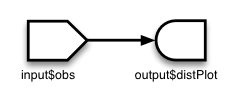
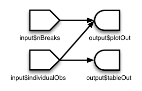
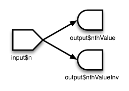

It's easy to build interactive applications with Shiny, but to get the most out of it, you'll need to understand the reactive programming model used by Shiny.

In Shiny, there are three kinds of objects in reactive programming: reactive sources, reactive conductors, and reactive endpoints, which are represented with these symbols:

### Reactive sources and endpoints

The simplest structure of a reactive program involves just a source and an endpoint:

In a Shiny application, the source typically is user input through a browser interface. For example, when the user selects an item, types input, or clicks on a button, these actions will set values that are reactive sources. A reactive endpoint is usually something that appears in the user's browser window, such as a plot or a table of values.

In a simple Shiny application, reactive sources are accessible through the `input` object, and reactive endpoints are accessible through the `output` object. (Actually, there are other possible kinds of sources and endpoints, which we'll talk about later, but for now we'll just talk about `input` and `output`.)

This simple structure, with one source and one endpoint, is used by the `01_hello` example. The `server` function code for that example looks something like this:


server <- function(input, output) {
  output$distPlot <- renderPlot({
    hist(rnorm(input$obs))
  })
}


You can see it in action at [https://gallery.shinyapps.io/01_hello/](https://gallery.shinyapps.io/01_hello/).

The `output$distPlot` object is a reactive endpoint, and it uses the reactive source `input$obs`. Whenever `input$obs` changes, `output$distPlot` is notified that it needs to re-execute. In traditional program with an interactive user interface, this might involve setting up event handlers and writing code to read values and transfer data. Shiny does all these things for you behind the scenes, so that you can simply write code that looks like regular R code.

A reactive source can be connected to multiple endpoints, and vice versa. Here is the `server` function of a slightly more complex Shiny application:


server <- function(input, output) {
  output$plotOut <- renderPlot({
    hist(faithful$eruptions, breaks = as.numeric(input$nBreaks))
    if (input$individualObs)
      rug(faithful$eruptions)
  })

  output$tableOut <- renderTable({
    if (input$individualObs)
      faithful
    else
      NULL
  })
}


In a Shiny application, there's no need to explictly describe each of these relationships and tell R what to do when each input component changes; Shiny automatically handles these details for you.

In an app with the structure above, whenever the value of the `input$nBreaks` changes, the expression that generates the plot will automatically re-execute. Whenever the value of the `input$individualObs` changes, the plot and table functions will automatically re-execute. (In a Shiny application, most endpoint functions have their results automatically wrapped up and sent to the web browser.)

### Reactive conductors

So far we've seen reactive sources and reactive endpoints, and most simple examples use just these two components, wiring up sources directly to endpoints. It's also possible to put reactive components in between the sources and endpoints. These components are called _reactive conductors_.

A conductor can both be a dependent and have dependents. In other words, it can be both a parent and child in a graph of the reactive structure. Sources can only be parents (they can have dependents), and endpoints can only be children (they can be dependents) in the reactive graph.

Reactive conductors can be useful for encapsulating slow or computationally expensive operations. For example, imagine that you have this application that takes a value `input$n` and prints the _n_th value in the Fibonacci sequence, as well as the inverse of _n_th value in the sequence plus one (note the code in these examples is condensed to illustrate reactive concepts, and doesn't necessarily represent coding best practices):


# Calculate nth number in Fibonacci sequence
fib <- function(n) ifelse(n<3, 1, fib(n-1)+fib(n-2))

server <- function(input, output) {
  output$nthValue    <- renderText({ fib(as.numeric(input$n)) })
  output$nthValueInv <- renderText({ 1 / fib(as.numeric(input$n)) })
}


The graph structure of this app is:

The `fib()` algorithm is very inefficient, so we don't want to run it more times than is absolutely necessary. But in this app, we're running it twice! On a reasonably fast modern machine, setting `input$n` to 30 takes about 15 seconds to calculate the answer, largely because `fib()` is run twice.

The amount of computation can be reduced by adding a reactive conductor in between the source and endpoints:


fib <- function(n) ifelse(n<3, 1, fib(n-1)+fib(n-2))

server <- function(input, output) {
  currentFib         <- reactive({ fib(as.numeric(input$n)) })

  output$nthValue    <- renderText({ currentFib() })
  output$nthValueInv <- renderText({ 1 / currentFib() })
}


Here is the new graph structure:

Keep in mind that if your application tries to access reactive values or expressions from outside a reactive context &mdash; that is, outside of a reactive expression or observer &mdash; then it will result in an error. You can think of there being a reactive "world" which can see and change the non-reactive world, but the non-reactive world can't do the same to the reactive world. Code like this will not work, because the call to `fib()` is not in the reactive world (it's not in a `reactive()` or `renderXX()` call) but it tries to access something that is, the reactive value `input$n`:


server <- function(input, output) {
  # Will give error
  currentFib      <- fib(as.numeric(input$n))
  output$nthValue <- renderText({ currentFib })
}


On the other hand, if `currentFib` is a function that accesses a reactive value, and that function is called within the reactive world, then it will work:


server <- function(input, output) {
  # OK, as long as this is called from the reactive world:
  currentFib <- function() {
    fib(as.numeric(input$n))
  }

  output$nthValue <- renderText({ currentFib() })
}


### Summary

In this section, we've learned about:

* **Reactive sources** can signal objects downstream that they need to re-execute.
* **Reactive conductors** are placed somewhere in between sources and endpoints on the reactive graph. They are typically used for encapsulating slow operations.
* **Reactive endpoints** can be told to re-execute by the reactive environment, and can request _upstream_ objects to execute.
* **Invalidation arrows** diagram the flow of invalidation events. It can also be said that the child node is a **dependent of** or **takes a dependency on** the parent node.

### Implementations of sources, conductors, and endpoints: values, expressions, and observers

We've discussed reactive sources, conductors, and endpoints. These are general terms for parts that play a particular role in a reactive program. Presently, Shiny has one class of objects that act as reactive sources, one class of objects that act as reactive conductors, and one class of objects that act as reactive endpoints, but in principle there could be other classes that implement these roles.

* **Reactive values** are an implementation of Reactive sources; that is, they are an implementation of that role. 
* **Reactive expressions** are an implementation of Reactive conductors. They can access reactive values or other reactive expressions, and they return a value. 
* **Observers** are an implementation of Reactive endpoints. They can access reactive sources and reactive expressions, and they don't return a value; they are used for their side effects.

All of the examples use these three implementations, as there are presently no other implementations of the source, conductor, and endpoint roles.

### Reactive values

Reactive values contain values (not surprisingly), which can be read by other reactive objects. The `input` object is a `ReactiveValues` object, which looks something like a list, and it contains many individual reactive values. The values in `input` are set by input from the web browser.

### Reactive expressions

We've seen reactive expressions in action, with the Fibonacci example above. They cache their return values, to make the app run more efficiently. Note that, abstractly speaking, _reactive conductors_ do not necessarily cache return values, but in this implementation, _reactive expressions_, they do.

A reactive expressions can be useful for caching the results of any procedure that happens in response to user input, including:

* accessing a database
* reading data from a file
* downloading data over the network
* performing an expensive computation

### Observers

Observers are similar to reactive expressions, but with a few important differences. Like reactive expressions, they can access reactive values and reactive expressions. However, they do not return any values, and therefore do not cache their return values. Instead of returning values, they have side effects -- typically, this involves sending data to the web browser.

The `output` object looks something like a list, and it can contain many individual observers.

If you look at the code for `renderText()` and friends, you'll see that they each return a function which returns a value. They're typically used like this:


output$number <- renderText({ as.numeric(input$n) + 1 })


This might lead you to think that the observers _do_ return values. However, this isn't the whole story. The function returned by `renderText()` is actually not an observer/endpoint. When it is assigned to `output$x`, the function returned by `renderText()` gets automatically wrapped into another function, which is an observer. The wrapper function is used because it needs to do special things to send the data to the browser.

### Differences between reactive expressions and observers

Reactive expressions and observers are similar in that they store expressions that can be executed, but they have some fundamental differences.

* Observers (and endpoints in general) respond to reactive _flush_ events, but reactive expressions (and conductors in general) do not. We'll learn more about flush events in the next section. If you want a reactive expression to execute, it must have an observer as a descendant on the reactive dependency graph.
* Reactive expressions return values, but observers don't. 
