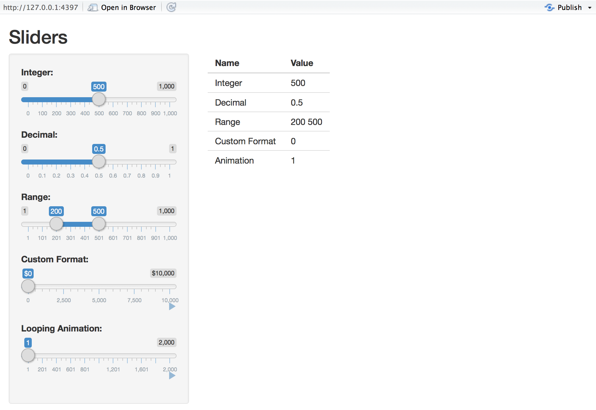

The [Sliders app](/gallery/sliders.html) demonstrates the many capabilities of slider controls, including the ability to run an animation sequence. 

{: .example-screenshot}

To run the example locally type: 


library(shiny)
runExample("05_sliders")


### Customizing Sliders

Shiny slider controls are extremely capable and customizable. Features supported include:

* The ability to input both single values and ranges
* Custom formats for value display (e.g for currency)
* The ability to animate the slider across a range of values

Slider controls are created by calling the `sliderInput` function. The UI demonstrates using sliders with a variety of options:

#### ui


# Define UI for slider demo app ----
ui <- fluidPage(

  # App title ----
  titlePanel("Sliders"),

  # Sidebar layout with input and output definitions ----
  sidebarLayout(

    # Sidebar to demonstrate various slider options ----
    sidebarPanel(

      # Input: Simple integer interval ----
      sliderInput("integer", "Integer:",
                  min = 0, max = 1000,
                  value = 500),

      # Input: Decimal interval with step value ----
      sliderInput("decimal", "Decimal:",
                  min = 0, max = 1,
                  value = 0.5, step = 0.1),

      # Input: Specification of range within an interval ----
      sliderInput("range", "Range:",
                  min = 1, max = 1000,
                  value = c(200,500)),

      # Input: Custom currency format for with basic animation ----
      sliderInput("format", "Custom Format:",
                  min = 0, max = 10000,
                  value = 0, step = 2500,
                  pre = "$", sep = ",",
                  animate = TRUE),

      # Input: Animation with custom interval (in ms) ----
      # to control speed, plus looping
      sliderInput("animation", "Looping Animation:",
                  min = 1, max = 2000,
                  value = 1, step = 10,
                  animate =
                    animationOptions(interval = 300, loop = TRUE))

    ),

    # Main panel for displaying outputs ----
    mainPanel(

      # Output: Table summarizing the values entered ----
      tableOutput("values")

    )
  )
)


### Server Script

The server side of the Slider application is very straightforward -- it creates a data frame containing all of the input values and then renders it as an HTML table:

#### server


# Define server logic for slider examples ----
server <- function(input, output) {

  # Reactive expression to create data frame of all input values ----
  sliderValues <- reactive({

    data.frame(
      Name = c("Integer",
               "Decimal",
               "Range",
               "Custom Format",
               "Animation"),
      Value = as.character(c(input$integer,
                             input$decimal,
                             paste(input$range, collapse = " "),
                             input$format,
                             input$animation)),
      stringsAsFactors = FALSE)

  })

  # Show the values in an HTML table ----
  output$values <- renderTable({
    sliderValues()
  })

}

