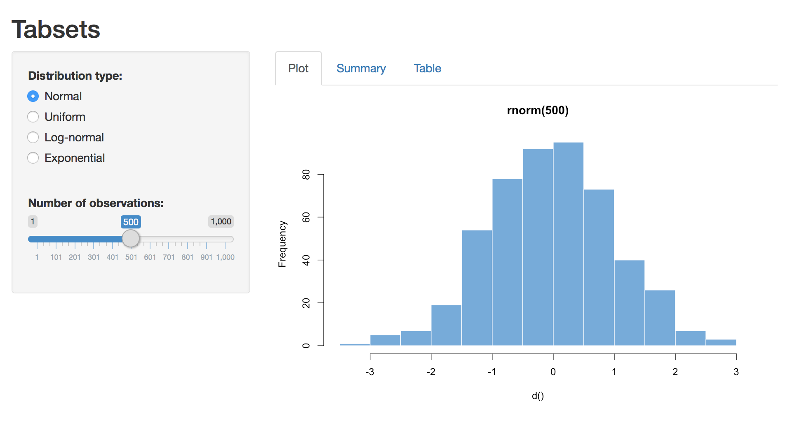

{: .example-screenshot}

The Tabsets application demonstrates using tabs to organize output. To run the example type: 


library(shiny)
runExample("06_tabsets")


### Tab Panels

Tabsets are created by calling the `tabsetPanel` function with a list of tabs created by the `tabPanel` function. Each tab panel is provided a list of output elements which are rendered vertically within the tab.

In this example we added a summary and table view of the data to the Hello Shiny app, each rendered on their own tab. Here is the source code for the UI object:


# Define UI for random distribution app ----
ui <- fluidPage(

  # App title ----
  titlePanel("Tabsets"),

  # Sidebar layout with input and output definitions ----
  sidebarLayout(

    # Sidebar panel for inputs ----
    sidebarPanel(

      # Input: Select the random distribution type ----
      radioButtons("dist", "Distribution type:",
                   c("Normal" = "norm",
                     "Uniform" = "unif",
                     "Log-normal" = "lnorm",
                     "Exponential" = "exp")),

      # br() element to introduce extra vertical spacing ----
      br(),

      # Input: Slider for the number of observations to generate ----
      sliderInput("n",
                  "Number of observations:",
                  value = 500,
                  min = 1,
                  max = 1000)

    ),

    # Main panel for displaying outputs ----
    mainPanel(

      # Output: Tabset w/ plot, summary, and table ----
      tabsetPanel(type = "tabs",
                  tabPanel("Plot", plotOutput("plot")),
                  tabPanel("Summary", verbatimTextOutput("summary")),
                  tabPanel("Table", tableOutput("table"))
      )

    )
  )
)


### Tabs and Reactive Data

Introducing tabs into our user interface underlines the importance of creating reactive expressions for shared data. In this example each tab provides its own view of the dataset. If the dataset is expensive to compute then our user interface might be quite slow to render. The `server` function below demonstrates how to calculate the data once in a reactive expression and have the result be shared by all of the output tabs:


# Define server logic for random distribution app ----
server <- function(input, output) {

  # Reactive expression to generate the requested distribution ----
  # This is called whenever the inputs change. The output functions
  # defined below then use the value computed from this expression
  d <- reactive({
    dist <- switch(input$dist,
                   norm = rnorm,
                   unif = runif,
                   lnorm = rlnorm,
                   exp = rexp,
                   rnorm)

    dist(input$n)
  })

  # Generate a plot of the data ----
  # Also uses the inputs to build the plot label. Note that the
  # dependencies on the inputs and the data reactive expression are
  # both tracked, and all expressions are called in the sequence
  # implied by the dependency graph.
  output$plot <- renderPlot({
    dist <- input$dist
    n <- input$n

    hist(d(),
         main = paste("r", dist, "(", n, ")", sep = ""),
         col = "#007bc2", border = "white")
  })

  # Generate a summary of the data ----
  output$summary <- renderPrint({
    summary(d())
  })

  # Generate an HTML table view of the data ----
  output$table <- renderTable({
    d()
  })

}

