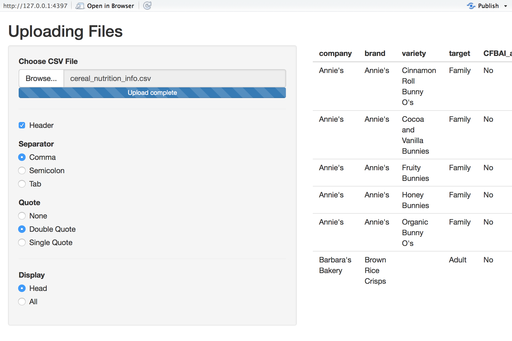

Sometimes you'll want users to be able to upload their own data to your application. Shiny makes it easy to offer your users file uploads straight from the browser, which you can then access from your server logic.

{: .example-screenshot}

**Important notes:**
* This feature does not work with Internet Explorer 9 and earlier (not even with Shiny Server).
* By default, Shiny limits file uploads to 5MB per file. You can modify this limit by using the `shiny.maxRequestSize` option. For example, adding `options(shiny.maxRequestSize = 30*1024^2)` to the top of `app.R` would increase the limit to 30MB.

To run this example, type:


> library(shiny)
> runExample("09_upload")


File upload controls are created by using the `fileInput` function in your UI. You access the uploaded data similarly to other types of input: by referring to <code>input$<i>inputId</i></code>. The `fileInput` function takes a `multiple` parameter that can be set to `TRUE` to allow the user to select multiple files, and an `accept` parameter can be used to give the user clues as to what kind of files the application expects.

#### app.R


library(shiny)

# Define UI for data upload app ----
ui <- fluidPage(

  # App title ----
  titlePanel("Uploading Files"),

  # Sidebar layout with input and output definitions ----
  sidebarLayout(

    # Sidebar panel for inputs ----
    sidebarPanel(

      # Input: Select a file ----
      fileInput("file1", "Choose CSV File",
                multiple = TRUE,
                accept = c("text/csv",
                         "text/comma-separated-values,text/plain",
                         ".csv")),

      # Horizontal line ----
      tags$hr(),

      # Input: Checkbox if file has header ----
      checkboxInput("header", "Header", TRUE),

      # Input: Select separator ----
      radioButtons("sep", "Separator",
                   choices = c(Comma = ",",
                               Semicolon = ";",
                               Tab = "\t"),
                   selected = ","),

      # Input: Select quotes ----
      radioButtons("quote", "Quote",
                   choices = c(None = "",
                               "Double Quote" = '"',
                               "Single Quote" = "'"),
                   selected = '"'),

      # Horizontal line ----
      tags$hr(),

      # Input: Select number of rows to display ----
      radioButtons("disp", "Display",
                   choices = c(Head = "head",
                               All = "all"),
                   selected = "head")

    ),

    # Main panel for displaying outputs ----
    mainPanel(

      # Output: Data file ----
      tableOutput("contents")

    )

  )
)

# Define server logic to read selected file ----
server <- function(input, output) {

  output$contents <- renderTable({

    # input$file1 will be NULL initially. After the user selects
    # and uploads a file, head of that data file by default,
    # or all rows if selected, will be shown.

    req(input$file1)

    df <- read.csv(input$file1$datapath,
             header = input$header,
             sep = input$sep,
             quote = input$quote)

    if(input$disp == "head") {
      return(head(df))
    }
    else {
      return(df)
    }

  })

}
# Run the app ----
shinyApp(ui, server)


This example receives a file and attempts to read it as comma-separated values using `read.csv`, then displays the results in a table. As the comment in the `server` function indicates, `inFile` is either `NULL` or a dataframe that contains one row per uploaded file. In this case, `fileInput` did not have the `multiple` parameter so we can assume there is only one row.

The file contents can be accessed by reading the file named by the `datapath` column. See the `?fileInput` help topic to learn more about the other columns that are available.
