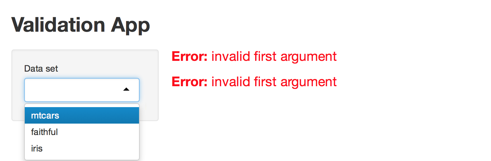
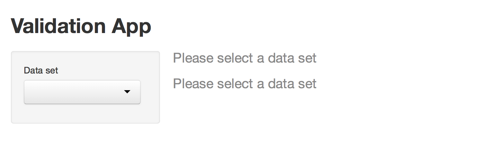
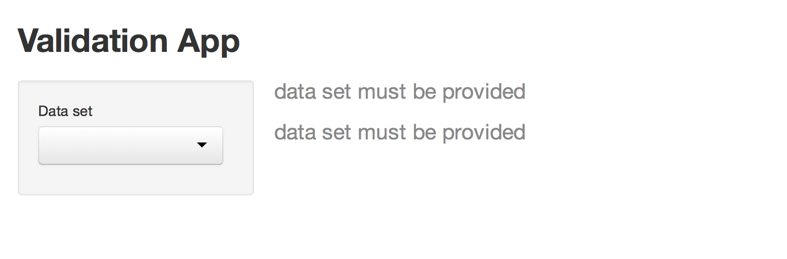
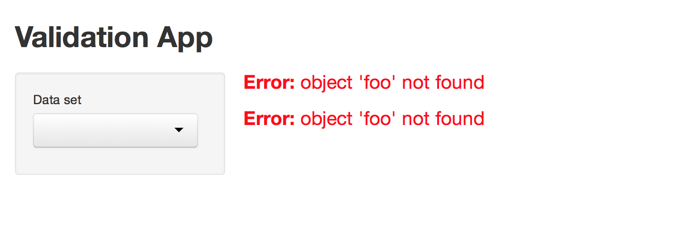
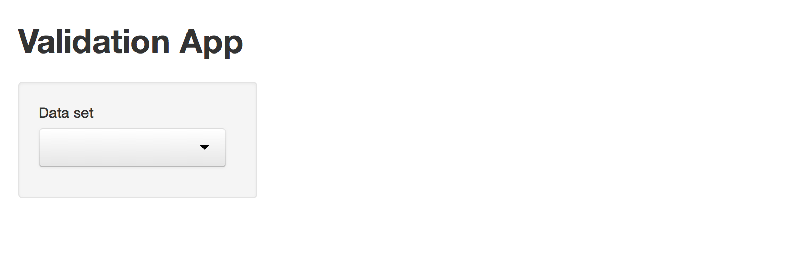
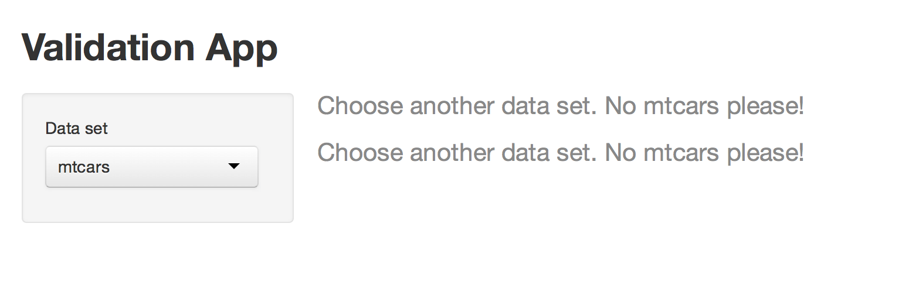
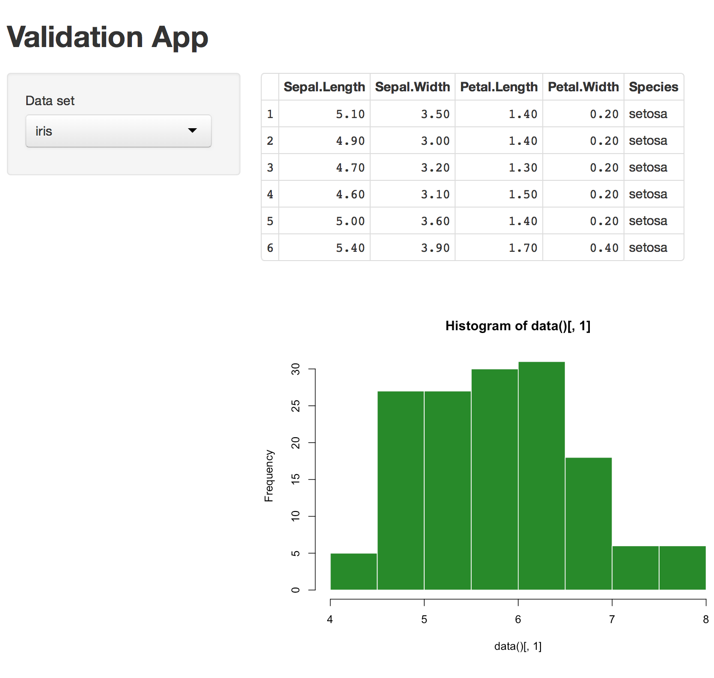
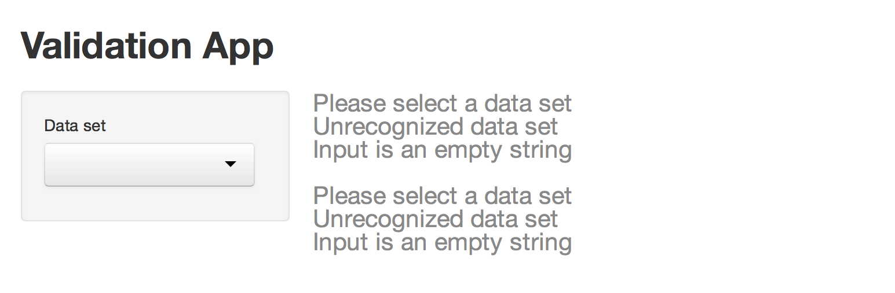
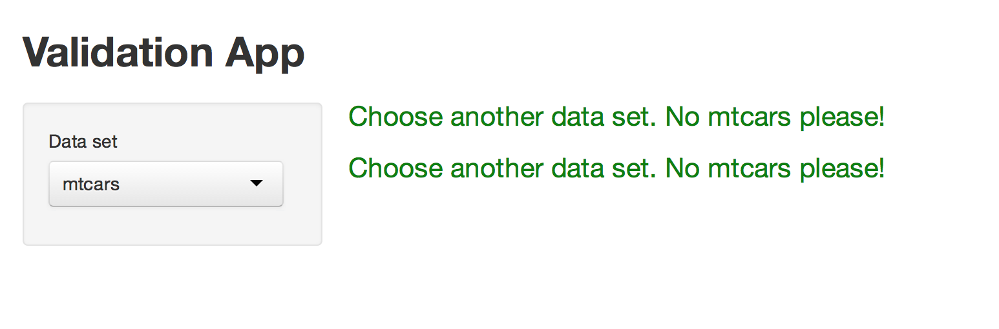

Have you ever seen a Shiny app go wrong? Shiny delivers a bold red error message to your user. This message is often unhelpful because it mentions things that _you_ may understand as a developer, but that your user may not.

This article will show you how to craft "validation errors," errors designed to lead your user through the UI of your Shiny app. Validation errors are user-friendly and, unlike the bold red error message, pleasing to the eye. Best of all, validation errors respond directly to your user's input.

We'll start by creating an app that quickly returns an error message. The `app.R` script below makes a simple app that displays a table and draws a plot. To make this app, copy these scripts into your [working directory](http://www.rstudio.com/ide/docs/using/workspaces) and run:

_Note: This file needs to be the only one named `app.R` in your working directory._


library(shiny)

ui <- fluidPage(

  titlePanel("Validation App"),

  sidebarLayout(
    sidebarPanel(
      selectInput("data", label = "Data set",
        choices = c("", "mtcars", "faithful", "iris"))
    ),

    # Show a plot of the generated distribution
    mainPanel(
      tableOutput("table"),
      plotOutput("plot")
    )
  )
)

server <- function(input, output) {

  data <- reactive({ get(input$data, 'package:datasets') })

  output$plot <- renderPlot({
    hist(data()[, 1], col = 'forestgreen', border = 'white')
  })

  output$table <- renderTable({
    head(data())
  })

}

shinyApp(ui, server)


When you first launch the app, it should look like this picture:

{: .example-screenshot}

The app displays a table and then draws a plot beneath it, but both the table and plot depend on the value of the select box. Until your user selects a data set, the app will display two red error messages.

Our goal is to replace these error messages. We want messages that:

* Help the user understand what went wrong
* Do not cause panic (i.e., are not bold red)

You can write these more helpful messages with Shiny's `validate` function.

## validate

`validate` tests a condition and returns a validation error if the test fails. Validation errors are designed to interact with the Shiny framework in a pleasing way. Shiny will:

* recognize a validation error
* display a validation error in a neutral grey color
* pass a validation error to any reactive expression or observer object that depends on it

`validate` takes one or more specially formatted arguments. You can provide these arguments `need`, a new function designed to work with `validate`. You can also provide these arguments with your own functions if you like.

### need

`need` provides a simple way to tell Shiny what to test and what to return if the test goes wrong. `need` uses two arguments

* An R expression that returns `TRUE` or `FALSE`.
* A character string. Shiny will display this string as a validation error message if the R expression returns `FALSE`. If the R expression returns `TRUE`, Shiny treats the validation test as if it passed and continues with the app.

Let's put these ideas all together.

You can create a complete validation test by calling `validate` and passing it the output of `need`:


validate(
  need(input$data != "", "Please select a data set")
)


The validation test above checks whether an object named `input$data` is an empty string. If the object is an empty string, the test returns the message: "Please select a data set."

To use this validation test in your app, place it at the start of any `reactive` or `render*` expression that calls `input$data`. In our app, our validation test appears in this `server` function after `reactive({`:


server <- function(input, output) {

  data <- reactive({
    validate(
      need(input$data != "", "Please select a data set")
    )
    get(input$data, 'package:datasets')
  })

  output$plot <- renderPlot({
    hist(data()[, 1], col = 'forestgreen', border = 'white')
  })

  output$table <- renderTable({
    head(data())
  })

}


Modify your script and relaunch the app. Now Shiny runs the validation test before it uses `input$data` and encounters an error, and the app does not show the bold red error message. Instead it displays your user-friendly validation error message.

{: .example-screenshot}

#### Best practices

Notice that neither `output$plot` nor `output$table` call the validation test. However, both the plot and table objects display the validation error message.

When these objects call `data()`, `data()` retrieves the value of the reactive expression `data`. In our example, the value of the reactive expression `data` is the validation error message because the validation test fails.

You can use this arrangement to write efficient apps: one that fail fast and in a useful manner. To do this:

1. Separate `input` objects that might cause trouble into their own reactive expressions.
2. Have each reactive expression run a validation test on the `input`.
3. Arrange for other objects to access the `input` by calling the reactive expression.

This arrangement will let you use one validation test per input to catch any errors generated by your apps UI.

#### Labels

You do not have to provide `need` with a full message to display. If you prefer, you can skip the message and pass `need` a `label` argument. If you do, `need` will construct a message by adding "must be provided" to the end of your label.

You can see this behavior in this app:

{: .example-screenshot}

It uses the following `server` function.


server <- function(input, output) {

  data <- reactive({
    validate(
      need(input$data != "", label = "data set")
    )
    get(input$data, 'package:datasets')
  })

  output$plot <- renderPlot({
    hist(data()[, 1], col = 'forestgreen', border = 'white')
  })

  output$table <- renderTable({
    head(data())
  })

}


#### Errors vs. Validation errors

Validation tests do not remove the possibility of other types of errors. Shiny will still display system error messages in the familiar bold red font (designed to catch the developer's eye) when they happen.

For example, Shiny will display a red error message if the R expression in `need` returns an error. In the code below, the `need` expression calls the object `foo`, but `foo` does not exist.


server <- function(input, output) {

  data <- reactive({
    validate(
      need(input$data != foo, "Please select a data set")
    )
    get(input$data, 'package:datasets')
  })

  output$plot <- renderPlot({
    hist(data()[, 1], col = 'forestgreen', border = 'white')
  })

  output$table <- renderTable({
    head(data())
  })

}


Since Shiny cannot find `foo`, it displays a system error message.

{: .example-screenshot}

You can prevent validation tests from generating system errors by wrapping the first argument of `need` in `try`:


    validate(
      need(try(input$data != foo), "Please select a data set")
    )


`try` returns a try error if `input$data != foo` fails. `need` treats try errors the same way it treats `FALSE`s. If the first argument of `need` returns a try error, `need` returns a validation error that displays its message.

Several other types of output also trigger `need` to return a validation error. You can write the first argument of `need` to return any output from the list below (if the validation fails). `need` returns a validation error for each of these outputs.

* `FALSE`
* `NULL`
* ""
* An empty atomic vector
* An atomic vector that contains only missing values
* A logical vector that contains all `FALSE` or missing values
* An object of class `try-error`
* A value that represents an unclicked actionButton

### Write your own tests

Shiny power users can write their own `need` functions. This can be useful if you test for the same conditions across many apps. You can use any function in place of `need` as long as your function returns one of three objects:

1. `NULL`
2. A character string
3. `FALSE`

`validate` will run the function and then proceed in one of three ways.

* If your function returns `NULL`, `validate` will consider the check to have passed, and proceed as normal.
* If your function returns a character string, `validate` will consider the check to have failed and will return the string as a validation error to be displayed.
* If your function returns`FALSE`, `validate` will fail silently. Shiny will not continue with the app (which would result in a red error message), but it will not display a grey validation error message either.

Here is an example of a `need` type function:


not_mtcars <- function(input) {
  if (input == "mtcars") {
     "Choose another data set. No mtcars please!"
  } else if (input == "") {
     FALSE
  } else {
    NULL
  }
}


Here is the function in use:


not_mtcars <- function(input) {
  if (input == "mtcars") {
     "Choose another data set. No mtcars please!"
  } else if (input == "") {
     FALSE
  } else {
    NULL
  }
}

server <- function(input, output) {

  data <- reactive({
    validate(
      not_mtcars(input$data)
    )
    get(input$data, 'package:datasets')
  })

  output$plot <- renderPlot({
    hist(data()[, 1], col = 'forestgreen', border = 'white')
  })

  output$table <- renderTable({
    head(data())
  })

}


When this app first launches, it looks like this app:

{: .example-screenshot}

When you select `mtcars` in the select box, the app looks like this:

{: .example-screenshot}

When you select another data set, the app displays the table and plot:

{: .example-screenshot}

### Multiple conditions

You can check multiple conditions in a single `validate` call. To do this, pass `validate` multiple `need` statements (or similar functions, as described above) separated by commas. Shiny will display the message of every condition that fails.

This code contains three conditions that fail and one that passes:


server <- function(input, output) {

  data <- reactive({
    validate(
      need(input$data != "", "Please select a data set"),
      need(input$data %in% c("mtcars", "faithful", "iris"),
        "Unrecognized data set"),
      need(input$data, "Input is an empty string"),
      need(!is.null(input$data),
        "Input is not an empty string, it is NULL")
    )
    get(input$data, 'package:datasets')
  })

  output$plot <- renderPlot({
    hist(data()[, 1], col = 'forestgreen', border = 'white')
  })

  output$table <- renderTable({
    head(data())
  })

}


When you run it, the code creates this app:

{: .example-screenshot}

#### %then%

If you prefer to display one validation error message at a time, you may chain conditions together with the `%then%` operator, which we'll define at the top of this app:


`%then%` <- function(a, b) {
  if (is.null(a)) b else a
}

server <- function(input, output) {

  data <- reactive({
    validate(
      need(input$data != "", "Please select a data set") %then%
      need(input$data %in% c("mtcars", "faithful", "iris"),
        "Unrecognized data set") %then%
      need(input$data, "Input is an empty string") %then%
      need(!is.null(input$data),
        "Input is not an empty string, it is NULL")
    )
    get(input$data, 'package:datasets')
  })

  output$plot <- renderPlot({
    hist(data()[, 1], col = 'forestgreen', border = 'white')
  })

  output$table <- renderTable({
    head(data())
  })

}


Shiny will display only the message of the first condition that fails. Here is an example:

{: .example-screenshot}

Be careful not to use `%then%` in a way that might frustrate your user. A user may not enjoy fixing one validation error to find another (and then another) take its place.

## Style validation errors

Once you create a validation test, you can style its output with CSS (just as you can [style any element](/articles/css.html) in the Shiny user-interface).

Validation errors are HTML div objects with the class `shiny-output-error-validation`. Provide a CSS style for this class to change the appearance of every validation error message. For example, this `ui` object adds CSS that colors the messages green.

_Note: if your `server` function matches the last script (above), you need to select `mtcars` in your select box before you see the validation error message._


ui <- fluidPage(

  tags$head(
    tags$style(HTML("
      .shiny-output-error-validation {
        color: green;
      }
    "))
  ),

  titlePanel("Validation App"),

  sidebarLayout(
    sidebarPanel(
      selectInput("data", label = "Data set",
        choices = c("", "mtcars", "faithful", "iris"))
    ),

    # Show a plot of the generated distribution
    mainPanel(
      plotOutput("plot"),
      tableOutput("table")
    )
  )
)


{: .example-screenshot}

If you would like to style an individual validate message, give the message its own class with the `errorClass` of `validate`. Shiny will assign the message a class that begins with "shiny-output-error-" and ends with the character string that you pass `errorClass`.

For example, this `validate` call returns a message of class "shiny-output-error-myClass" that you can style with CSS.


    validate(
      need(input$data != "", "Please select a data set"),
      errorClass = "myClass"
    )


## Recap

You can make your Shiny apps more attractive and user friendly with `validate`. `validate` tests inputs and delivers messages to your user, which creates an agreeable alternative to Shiny's default error messages.

Pair `validate` with one or more `need` calls to validate an input. You need to validate an input only once (in a `reactive` or `render*`  expression). Shiny will pass the valuation results to any observer or expression that calls upon the input.

You can personalize validation error messages by writing your own `need` functions or by styling validation output with CSS.
