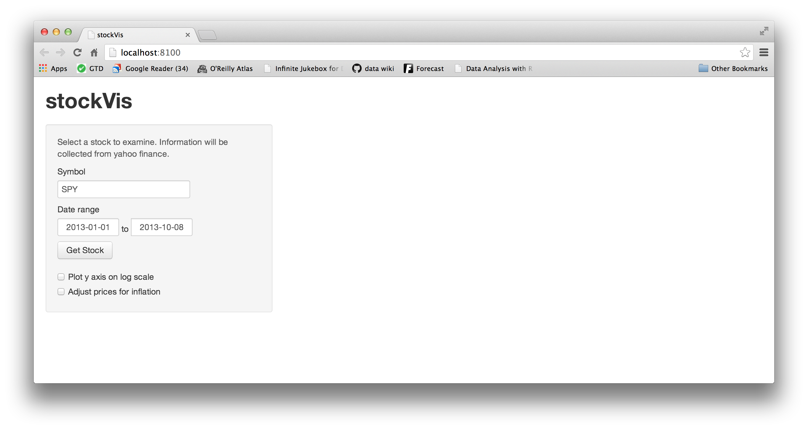

--- 
title: Control reactions with isolate
lesson: 7
layout: tutorial
categories: tutorial
---
## Delay Reactions

In [Lesson 6](../lesson6/), you used reactive expressions to control what gets re-computed during a reaction. Now let's use an isolating expression to control when reactions themselves will occur.

At the moment, your app immediately updates whenever a user changes a date or enters a new stock symbol. This might be bad in a couple of ways. For example, it might send a few extra queries to Yahoo finance before the user completes his or her final configuration of stock symbol and dates. It might even be distressing to the user to see the app try to update before they've finished entering in both the symbol _and_ the date information. Let's prevent this by giving the user a button that they can click when they are ready to retrieve new price information. The app will look like this, and it will retrieve new price data _if and only if_ the user clicks "Get Stock".

### Action buttons

It is simple to add a "Get Stock" button. You can do this with the action button widget created by `actionButton`. `actionButton` takes two arguments: a name for you to use to access its value, and a label for your user to see. To create an action button, just add a call to `actionButton` to your `ui.R` file.

    library(shiny)
    
    shinyUI(pageWithSidebar(
      headerPanel("stockVis"),
      sidebarPanel(
        helpText("Select a stock to examine. 
          Information will be collected from yahoo finance."),
        
        textInput("symb", "Symbol", "SPY"),
        
        dateRangeInput("dates", 
          "Date range",
          start = "2013-01-01", end = as.character(Sys.Date())),
        actionButton("get", "Get Stock"),
        br(),
        br(),
        checkboxInput("log", "Plot y axis on log scale", 
          value = FALSE),
        checkboxInput("adjust", "Adjust prices for inflation", 
          value = FALSE)
      ),
      mainPanel(plotOutput("plot"))
    ))

When your app first opens, the action button will have a value of zero. This value will increase by one each time the user clicks the action button. So, for example, when you first launch stockVis, `input$get` will equal zero. The first time your user clicks the "Get Stock" button, `input$get` will become one. In short, `input$get` will change whenever the user clicks the action button.

How can you use this to coordinate your data downloads? You'd like the `dataInput` expression below to re-run whenever the user clicks "Get Stock". 

      dataInput <- reactive({  
          getSymbols(input$symb, src = "yahoo", 
                     from = input$dates[1],
                     to = input$dates[2],
                     auto.assign = FALSE)
      })

Another way to say this is that you'd like `dataInput` to update whenever `input$get` changes. This is easy to implement, you just need to have `dataInput` call upon `input$get`. Then `dataInput` will flag itself as invalid everytime `input$get` changes (which will prompt `dataInput` to re-run the next time it is called). You do not even need to use the value of `input$get` in any important way, `dataInput` _could_ just call `input$get` and forget about it like below.

      dataInput <- reactive({  
          input$get
          getSymbols(input$symb, src = "yahoo", 
                     from = input$dates[1],
                     to = input$dates[2],
                     auto.assign = FALSE)
      })

But this would be a lost opportunity. You can use `input$get` to tell your app what to display when it first starts up (i.e., when `input$get == 0` because the user hasn't clicked "Get Stock" yet.

      dataInput <- reactive({  
          if (input$get == 0) return(NULL)
          
          getSymbols(input$symb, src = "yahoo", 
                     from = input$dates[1],
                     to = input$dates[2],
                     auto.assign = FALSE)
      })

Our `chartSeries` call futher down in `server.R` won't like trying to plot `NULL`, so we better tell it what to do in this situation as well.

      output$plot <- renderPlot({
        if(input$get == 0) return(NULL)
        
        chartSeries(finalInput(), theme = chartTheme("white"), 
                    type = "line", log.scale = input$log, TA = NULL)
      })

Now your app and your `server.R` files should look like this.

    library(shiny)
    library(quantmod)
    source("helper.R")
    
    
    shinyServer(function(input, output) {
      
      dataInput <- reactive({  
          if (input$get == 0) return(NULL)
          
          getSymbols(input$symb, src = "yahoo", 
                     from = input$dates[1],
                     to = input$dates[2],
                     auto.assign = FALSE)
      })
      
      finalInput <- reactive({
        if (!input$adjust) return(dataInput())
        adjust(dataInput())
      })
      
      output$plot <- renderPlot({
        if(input$get == 0) return(NULL)
        
        chartSeries(finalInput(), theme = chartTheme("white"), 
                    type = "line", log.scale = input$log, TA = NULL)
      })
    })

### Isolate

Have we solved our problem? _Not quite_. Your app now updates if the user clicks "Get Stock", but not _only if_ the user clicks "Get Stock". (It may seem like the problem is solved, but try clicking "Get Stock" once and then start messing with the symbol or dates).

`dataInput` still reacts to the stock symbol widget and the date range widget because it calls on `input$symb` and `input$dates`. When it does, it leaves a context behind with a callback that creates reactivity. As a result, `dataInput` now reacts to _three widgets_ (the symbol input, the date input, and the Get Stock button) instead of just one widget (the Get Stock button). However, our hands are slightly tied. `dataInput` cannot operate correctly _without_ calling `input$symb` and `input$dates`. How could you look up the values of `input$symb` and `input$dates` without creating a reactive dependency?

This is exactly what the `isolate` function does. It creates an expression that uses values, but does not react when those values change. Can you add `isolate` to `dataInput` in a way that allows `dataInput` to react when `input$get` changes, but prevents `dataInput` from reacting when `input$symb` and `input$dates` change? Give it a try, and then compare your solution to the answer below.

    library(shiny)
    library(quantmod)
    source("helper.R")
    
    
    shinyServer(function(input, output) {
      
      dataInput <- reactive({  
        if(input$get == 0) return(NULL)
        
        isolate({
          getSymbols(input$symb, src = "yahoo", 
                     from = input$dates[1],
                     to = input$dates[2],
                     auto.assign = FALSE)
        })
      })
      
      finalInput <- reactive({
        if (!input$adjust) return(dataInput())
        adjust(dataInput())
      })
      
      output$plot <- renderPlot({
        if(input$get == 0) return(NULL)
        
        chartSeries(finalInput(), theme = chartTheme("white"), 
                    type = "line", log.scale = input$log, TA = NULL)
      })
    })

By wrapping the `getSymbols` call with `isolate` we prevent `dataInput` from creating a dependency on `input$symb` and `input$dates`. These reactive values are inside the `isolate` call. `dataInput` still creates a reactive dependency on `input$get` because it is outside of the `isolate` call. 

When `input$symb` or `input$dates` change, nothing will happen. However, if `input$get` changes, `dataInput` will mark itself as invalid. The next time it is called, it will re-run itself, including the isolated command. `getSymbols` will then look up the current values of `input$symb` and `input$dates` and fetch the new set of data.

Congratulations! You've now delayed reaction in your app. This is the basic pattern for delayed reaction in Shiny. You create it by combining a widget (usually an action button) with an isolated expression.

## Recap

You learned how to

* delay reaction with action buttons and isolate statements

You are now making some very useful apps that you should be proud of. However, your apps still only run on your own computer. How could you share an app with other users? Let's find out in [Lesson 8](../Lesson8/)

See you in [Lesson 8](../Lesson8/).
