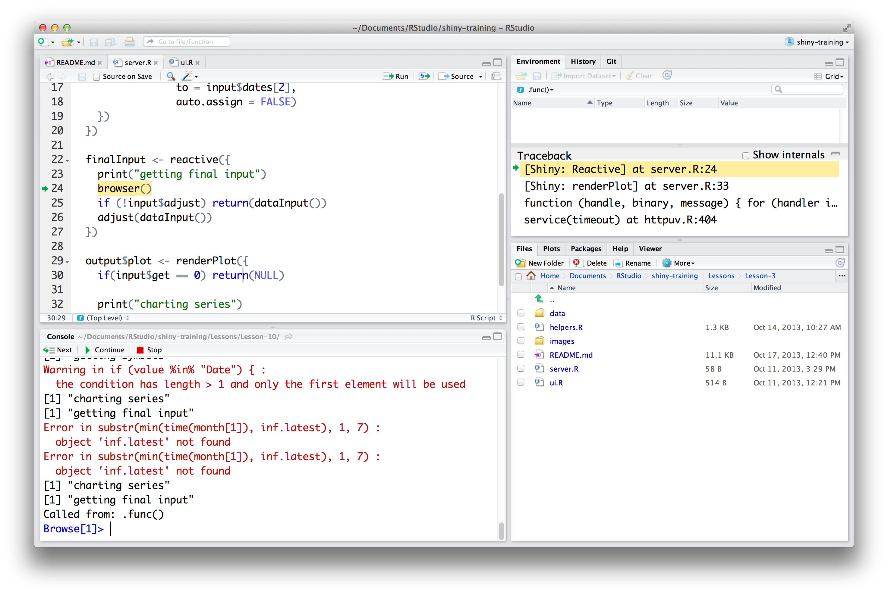
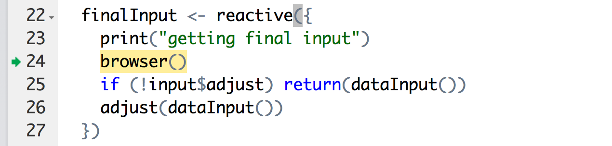
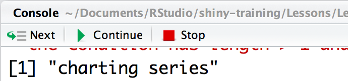
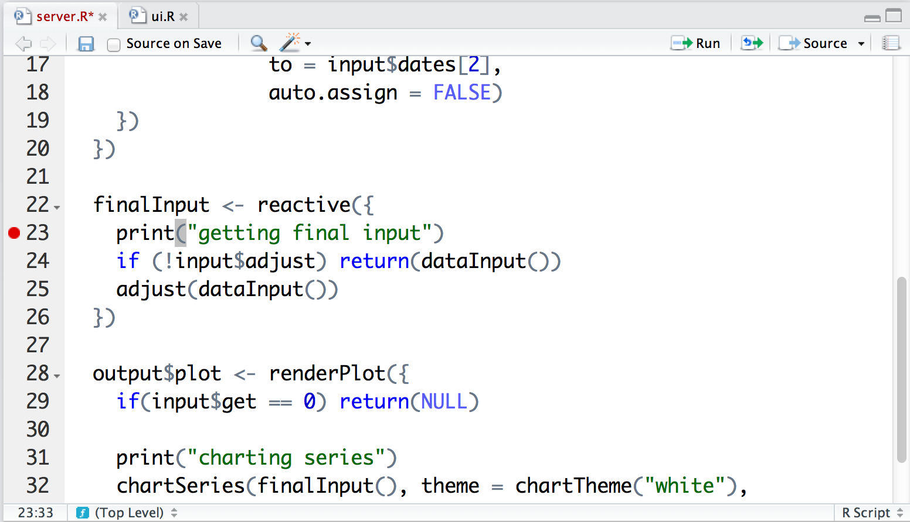

--- 
title: Debug your apps
lesson: 9
layout: tutorial
categories: tutorial
---
_Note: the debugging tips in this lesson use the development versions of RStudio and Shiny_

New code doesn't always work on the first try, and that's true for Shiny apps as well. Luckily, R comes with some useful debugging tools that you can use to debug your Shiny apps. This lesson will show you how.

## Set up

To follow along, create and launch a new Shiny app that uses the `server.R` and `ui.R` files below. Also, include this [helper.R](./helper.R) file in your app's directory. This app is a version of the stockVis app you made in [Lesson 8](../lesson8/). However, this version has a flaw.

    # server.R
    
    library(shiny)
    library(quantmod)
    source("helper.R")
    
    
    shinyServer(function(input, output) {
      
      dataInput <- reactive({  
        if(input$get == 0) return(NULL)
        
        isolate({
          getSymbols(input$symb, src = "yahoo", 
                     from = input$dates[1],
                     to = input$dates[2],
                     auto.assign = FALSE)
        })
      })
      
      finalInput <- reactive({
        if (!input$adjust) return(dataInput())
        adjust(dataInput())
      })
      
      output$plot <- renderPlot({
        if(input$get == 0) return(NULL)
        
        chartSeries(finalInput(), theme = chartTheme("white"), 
                    type = "line", log.scale = input$log, TA = NULL)
      })
    })

and

    # ui.R 
    
    library(shiny)
    
    shinyUI(pageWithSidebar(
      headerPanel("stockVis"),
      sidebarPanel(
        helpText("Select a stock to examine. 
          Information will be collected from yahoo finance."),
        
        textInput("symb", "Symbol", "SPY"),
        
        dateRangeInput("dates", 
          "Date range",
          start = "2013-01-01", end = as.character(Sys.Date())),
        actionButton("get", "Get Stock"),
        br(),
        br(),
        checkboxInput("log", "Plot y axis on log scale", 
          value = FALSE),
        checkboxInput("adjust", "Adjust prices for inflation", 
          value = FALSE)
      ),
      mainPanel(plotOutput("plot"))
    ))

Our app has a slight problem. You can acquire and plot a stock just fine; but something bad happens if you click on the "Adjust prices for inflation" check box. The graph disappears and an error message takes its place: `Error: object 'inf.latest' not found.` 

Tracking down errors in Shiny apps may seem daunting because each app uses many lines of R code. Moreover, the reactive nature of Shiny apps means this code comes together in complicated ways. It is not always clear what code gets run when. Nevertheless, debugging Shiny code is not very different than debugging normal R code. You can use all of the same tools.

## Print

The simplest way to track down a Shiny bug is to include `print` or `cat` statements inside your `shinyServer` function. Whenever Shiny runs one of these statements, the output will appear in your console window. 

So for example, you could add a print statement to each chunk of code in your `server.R` file, like this

    # server.R
    
    library(shiny)
    library(quantmod)
    source("helper.R")
    
    
    shinyServer(function(input, output) {
      
      dataInput <- reactive({  
        if(input$get == 0) return(NULL)
        
        isolate({
          print("getting symbols")
          getSymbols(input$symb, src = "yahoo", 
                     from = input$dates[1],
                     to = input$dates[2],
                     auto.assign = FALSE)
        })
      })
      
      finalInput <- reactive({
        print("getting final input")
        if (!input$adjust) return(dataInput())
        adjust(dataInput())
      })
      
      output$plot <- renderPlot({
        if(input$get == 0) return(NULL)
        
        print("charting series")
        chartSeries(finalInput(), theme = chartTheme("white"), 
                    type = "line", log.scale = input$log, TA = NULL)
      })
    })

Now the print output will tell you what Shiny is doing and when. You don't even have to relaunch your app to see it. If you left your app running while you made the changes, you can just save your `server.R` file and then click your browser's refresh button. The app will relaunch using the new code. This live reloading behavior can save you a lot of time when testing and debugging Shiny apps. There's no need to close and relaunch the app each time you make a change.

Let's try out our `print` statements. Refresh your app and click "Get stock". Then take a look at your R console window to see which print statements have appeared. You should see a list like this

    [1] "charting series"
    [1] "getting final input"
    [1] "getting symbols"

The list tells us that Shiny first called `chartSeries`, which then called `finalInput()`, which finally called `dataInput()`, where `getSymbols` was run. So far, so good, and no errors have appeared.

Now click "Adjust prices for inflation." The error immediately appears in your web app, but a new list of print statements appears in your console.

    [1] "charting series"
    [1] "getting final input"
    Error in substr(min(time(month[1]), inf.latest), 1, 7) : 
      object 'inf.latest' not found

You can literally trace the path Shiny took to its doom -- well at least to its error message. Shiny again called `chartSeries`, which again called `finalInput()`. Then the error happened. You can tell that the app never made it to `getSymbols` because the print statement that returns `"getting symbols"` was not run.

Print statements provide a convenient way to track what Shiny is executing and when, but they don't give you any control over the execution. You can take Shiny by the reigns and tell it what to execute and when with a breakpoint or a browser statement.

## Breakpoints and browser statements

Breakpoints and browser statements are two different ways of doing the exact same thing. They tell Shiny to pause at a specific place and give execution control back to you. This let's you run commands, poke around, and generally see things from Shiny's point of view at the moment your error occurs. 

We know that something bad is happening in `finalInput()`, so let's put a `browser` statement at the start of that code chunk. To do this, just insert the statement `browser()` into the chunk, like this

      finalInput <- reactive({
        print("getting final input")
        browser()
        if (!input$adjust) return(dataInput())
        adjust(dataInput())
      })

Now save `server.R`, refresh your app, and click "Get Stock." When Shiny gets to the `browser()` command, it will pause and open a browser environment in your console. This is what that will look like in your RStudio window. A number of things will start happening, so let's take a look at each of them.

First, in your console pane, R displays a new prompt that looks like this `Browse[1]>`. This is a new command line for you to execute R code in. You can start using R again even though your app is still running (well, your app is in a state of suspended animation). Not only that, R will evaluate each command that you run as if the command appeared in the same place in your script as the `browser()` statement does. 

Why would you want to do this? It gives you an "inside view" of your R process that you might not be able to get otherwise. For example, you call objects at the browser prompt to see what value they have at this point in your Shiny process. Notice that RStudio's scripts pane and environment pane are getting in on the act. The scripts pane has highlighted the place in the script that your code will be "run from." And, the environment pane has opened a Traceback window that displays all of the functions that R has called to get to this point. If you put a `browser()` statement inside a function that creates its own variables, the environment pane will display those variables and their values (just like it normally displays the variables and values that are defined in the global environment).

So what about that "inside view"? Well, we paused R right before it could run `if (!input$adjust) return(dataInput())`. This statement will get called multiple times during the life of your Shiny app. Sometimes `input$adjust` will be `FALSE` when the statement is called. Sometimes it will be `TRUE`. Would you like to know what it will be this time? R will tell you if you type `input$adjust` at the `Browse[1]>` prompt. Your call will be evaluated as if it appeared in the script at this moment. 

    input$adjust
    ## FALSE

RStudio even realizes that we're debugging a Shiny app, and it does some legwork to show us the value of `input$adjust` instead of the error message that normally occurs if you try to access a reactive value like `input$adjust` without using `isolate` (see [Lesson 7](../lesson7/) for a refresher on `isolate` and reactive values).

Looking ahead, you can see that if `input$adjust` is `FALSE`, then `!input$adjust` will be `TRUE` and the if statement will cause `finalInput()` to return `dataInput()`. Looking back, you may remember that our error doesn't occur until we make `input$adjust` equal `TRUE` by clicking the "Adjust prices for inflation" button. Let's let Shiny continue doing what it was doing, so we can click that button and recreate our error.

### Controlling the browser

You can advance, close, and quit the browser environment with the controls that appear above your console when you call `browser()`.

If you click "Next" (or type `n` at the browser prompt), R will run the next line of code in your script and move the active line forward one line. You'll still have control of the browser environment, but now each command you run will be run as if it occurs at the new active line in your R script.

If you click "Continue" (or type `c` at the browser prompt), R will close the browser environment and run the rest of your original process (i.e., the process that was running before you paused it with `browser()` (i.e.e., your Shiny app)).

If you click "Stop" (or type `Q` at the browser prompt), R will close the browser environment without running the rest of the interrupted process. You'll get your normal R console back, and your app will go grey.

Let's click Continue. That way our app will keep running, and we can keep searching for the error. Is it running again? Great. Now click "Adjust prices for inflation." This should start a new browser environment (because Shiny will call `finalInput()` in response to your click, which will call `browser()`). Can you tell what value `input$adjust` has now?

Just check at the browser prompt.

    input$adjust
    ## TRUE

Aha. So things are different than before. Let's step through the app now one line at a time, until we get our error message. Do you remember how to do this? Just click Next until an error occurs. You can watch the highlighted line advance in your `server.R` script as it tracks Shiny's progress. When it gets to `adjust(dataInput())` the error occurs.

You've now found the source of the error. Something is wrong with the `adjust` function. `adjust` is defined in `helper.R`, so we'll have to open that file and take a look at it. But before we do, let's look at a few more techniques related to `browser`.

### Conditional browser statements

Sometimes you know that an error only occurs under a certain set of conditions. For example, we knew that our error only occurred when the "Adjust prices for inflation" box is checked. It can be annoying to have a `browser()` statement repeatedly pause your app before the suspicious conditions occur. In this case, you can instruct your `browser` to only open in certain cases with the `expr` argument. `expr` takes a logical test, and the browser statement will only run when the test evaluates to `TRUE`. So, for example, we could instruct our browser to only open when "Adjust prices for inflation" is checked with

    browser(expr = input$adjust == TRUE)

### Break points

Break points do the same thing as `browser` statements, but with less of a hassle. To use a break point in RStudio, click next to the line number in your script where you'd like to insert a `browser()` call. A red dot will appear next to the line and RStudio will treat the script as if it had a `browser()` statement at that location.

To remove the break point, just click on the red dot.

### options(error = browser)

If you decide you like the browser system, you can instruct R to open a browser _whenever_ it encounters an error. To do this, run the following command at your regular R prompt

    options(error = browser)

R will then open a browser environment for you to explore whenever it encounters an error. The browser will open from the function where R encountered the error. It can be a little hard to tell which function this is, so you'll have to study the functions listed in traceback carefully. The function on top will be the function that caused the error. The functions below will be the sequence of functions that led to that function being called, with the most recent functions listed first.

Alternatively, you can tell R to open a _recover_ prompt whenever an error occurs. A recover prompt will display the list of functions that R called before the error occured, and then let you choose which of those functions you would like to open a browser environment in. You can set this option with

    options(error = recover)

Once you set an error option, R will continue to use it everytime it encounters an error until you close your R session or run

    options(error = NULL)

## The bug

Now that you know the bug is in the `adjust` function (which comes in `helper.R`), you can examine the function and remove the bug. Here, the actual error message becomes helpful: `Error: object 'inf.latest' not found.` You can see that line 8 of `adjust` calls `inf.latest`, but no line defines it. 

    adjust <- function(data) {
    
          latestcpi <- last(.inflation)[[1]]
          inflatest <- time(last(.inflation))
          months <- split(data)               
          
          adjust_month <- function(month) {               
            date <- substr(min(time(month[1]), inf.latest), 1, 7)
            coredata(month) * latestcpi / .inflation[date][[1]]
          }
          
          adjs <- lapply(months, adjust_month)
          adj <- do.call("rbind", adjs)
          axts <- xts(adj, order.by = time(data))
          axts[ , 5] <- Vo(data)
          axts
    }

That is a mistake. Line 4 is supposed to read `inf.latest <- time(last(.inflation))` not `inflatest <- time(last(.inflation))`. If you make the change, save your file, and relaunch your app, the error should go away.

### Recap

Debugging R code takes investigation and intuition. Unfortunately, R can't tell us where our code goes wrong, because it doesn't know what our code is supposed to do to begin with. However, R does provide some tools to help your investigation, and you can use those tools to debug your Shiny apps. These tools include 

* `print` statements
* `browser()` calls and break points
* RStudio's traceback window, which tells you what functions have been called when you're in a browser environment
* RStudio's environment pane, which tells you the values of any variables in the browser environment
* error options, which can automatically open a browser or recover prompt

This is the last lesson in the [Introduction to Shiny tutorial](../Intro/). These lessons provided you with the core knowledge you need to build Shiny apps. Now it's time for you to take Shiny out on your own. I can't wait to see what you make!

The best way to get better at Shiny is to start building your own apps. Our [Shiny widget gallery]() (coming soon) and [Shiny cookbook]() (comming soon) can help guide you along the way. If you get stuck, be sure to check in with the [Shiny discussion group](https://groups.google.com/forum/#!forum/shiny-discuss) for advice and ideas. If you make an awesome app that you're proud of, let us know and we can add it to the [Shiny showcase](http://www.rstudio.com/shiny/showcase/).
