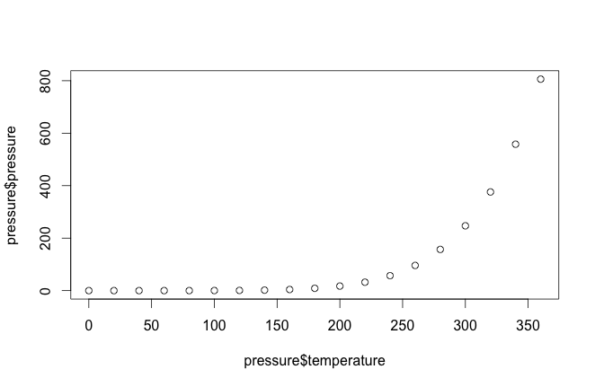
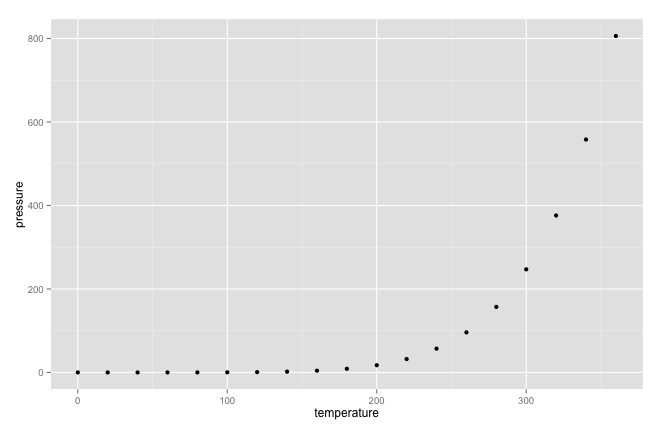
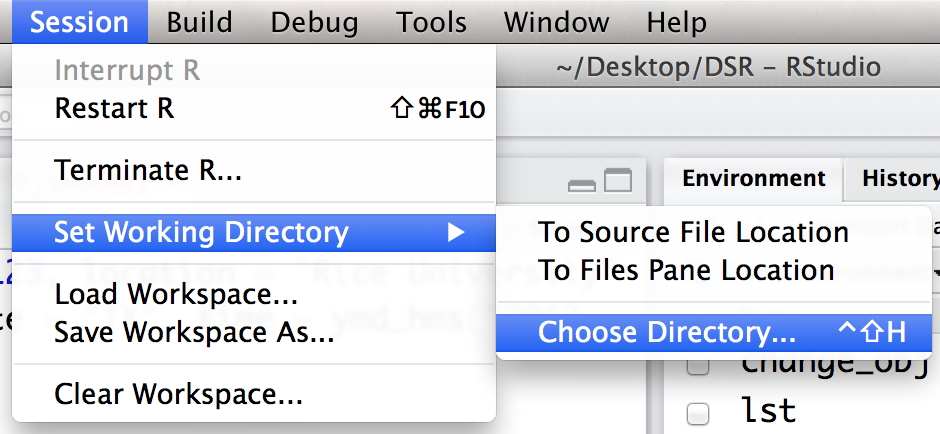
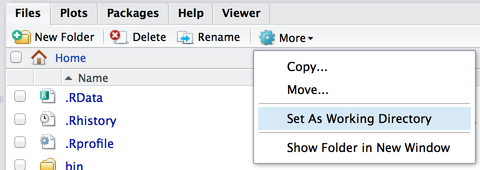
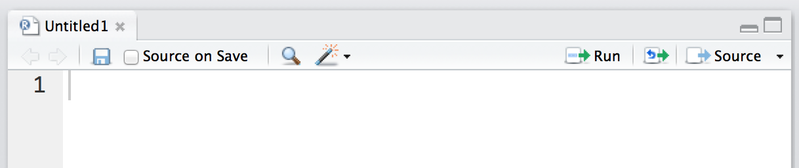

--- 
title: Are you ready for Shiny?
layout: quiz
categories: tutorial
---

# Are you ready for Shiny?

You should know a little about R before you learn Shiny. Shiny is not a substitute for the R language, but a way to extend R to a new domain, interactive web apps.

But how much R do you need to know?

This quiz will help you decide whether you know enough about R to feel confident with Shiny. You are ready to make the most of Shiny if you can answer each of the questions below. 

### 1. Common Errors

`qplot()` is a function that comes in the `ggplot2` package in R. You can use `qplot()` to create quick scatterplots if you pass `qplot()` two variable names and the name of the data set that contains the variables. 

The code below is a correctly written `qplot()` call; but if you copy and paste the code into R, you will get an error message when you run the code. Why?


qplot(Sepal.Width, Sepal.Length, data = iris)



`qplot()` is defined in the `ggplot2` package, which means that you will not be able to use `qplot()` until you install and load the `ggplot2` package. If you try to use `qplot()` without loading the `ggplot2` package, R will return the error


Error: could not find function "qplot"


You can install the `ggplot2` package from CRAN with


install.packages("ggplot2")


Once you've installed `ggplot2` you can run the command above with 


library("ggplot2")
qplot(Sepal.Width, Sepal.Length, data = iris)


You will need to load `ggplot2` with `library()` once in each new R session that you would like to use `qplot()` in.


### 2. More Common Errors

You can assign values to R objects. For example, you could assign the age of your cat to an object named `cat` like this, `cat <- 4`.

Suppose you ran the code below and received the error message that follows. What does it mean?


cat + 1
## Error in cat + 1 : non-numeric argument to binary operator



The error message suggests that you have not yet run `cat <- 4`. In this case, R will evaluate the expression with the object named `cat` that comes in base R. This object is a function. Since `+` does not know how to operate on functions, it returns an error message.


cat
## function (..., file = "", sep = " ", fill = FALSE, labels = NULL, 
##     append = FALSE) 
## {
##     if (is.character(file)) 
##         if (file == "") 
##             file <- stdout()
##         else if (substring(file, 1L, 1L) == "|") {
##             file <- pipe(substring(file, 2L), "w")
##             on.exit(close(file))
##         }
##         else {
##             file <- file(file, ifelse(append, "a", "w"))
##             on.exit(close(file))
##         }
##     .Internal(cat(list(...), file, sep, fill, labels, append))
## }
<bytecode: 0x109fe8008>
<environment: namespace:base>

cat + 1
## Error in cat + 1 : non-numeric argument to binary operator


Compare this to


cat <- 4
cat
## [1] 4

cat + 1
## [1] 5


Notice that the error message would have been more clear had we used a different object name, one that is not already used by base R, e.g.


dog + 1
## Error: object 'dog' not found


But in practice it is difficult to tell which names are already in use and which are not.


### 3. One More Common Error

The code below creates a function that returns a list. Assume that you run the code.


make_list <- function() {
	list(date = Sys.Date(),
	       time = Sys.time(),
	       timezone = Sys.timezone())
}

make_list()
## $date
## [1] "2015-03-12"
## 
## $time
## [1] "2015-03-12 16:58:13 EDT"
## 
## $timezone
## [1] "America/New_York"


You can call the function and immediately subset its result with R's dollar sign syntax. However, the code below will fail to do this. Why does the code fail, and how can you fix it?


make_list$time
## Error in make_list$time : object of type 'closure' is not subsettable



You can subset the _result_ of `make_list()`, but not `make_list()` itself. 

When you run the name of an object in R, R will show you the contents of the object. If the object is a function, this content will be the code in the function body, e.g.


make_list
## function() {
##     list(date = Sys.Date(),
## 	     time = Sys.time(),
## 	     timezone = Sys.timezone())
## }

make_list$time
## Error in make_list$time : object of type 'closure' is not subsettable


This body of code is not subsettable so `make_list$time` fails.

To return the result of a function in R, you must follow the function name with a pair of parentheses, `()`. If you add these parentheses to the call above, R will use `$time` to subset the list returned by `make_fun()`, which produces a valid result.


make_list()
## $date
## [1] "2015-03-12"
## 
## $time
## [1] "2015-03-12 17:11:59 EDT"
## 
## $timezone
## [1] "America/New_York"

make_list()$time
## [1] "2015-03-12 17:11:59 EDT"



### 4. Lists 
The code below creates a list object. 


lst <- list(numbers = 1:10, letters = letters, boolean = c(TRUE, FALSE))
lst
## $numbers
##  [1]  1  2  3  4  5  6  7  8  9 10

## $letters
##  [1] "a" "b" "c" "d" "e" "f" "g" "h" "i" "j" "k" "l" "m" 
## [14] "n" "o" "p" "q" "r" "s" "t" "u" "v" "w" "x" "y" "z"

## $boolean
## [1]  TRUE FALSE


What will each of these return? What type of object will each be? 


lst$numbers
lst[1]
lst[[1]]




`lst$numbers` and `lst[[1]]` will return the first element of `lst` as a vector of integers. `lst[1]` will return a new list that has one element -- the first element of `lst`.


lst$numbers
## [1]  1  2  3  4  5  6  7  8  9 10
lst[1]
## $numbers
##  [1]  1  2  3  4  5  6  7  8  9 10
lst[[1]]
##  [1]  1  2  3  4  5  6  7  8  9 10

class(lst$numbers)
## [1] "integer"
class(lst[1])
## [1] "list"
class(lst[[1]])
## [1] "integer"


In summary, subsetting a list with dollar signs or double brackets will return elements of the list just as they are. Subsetting with single brackets will return the elements as part of a new list. This is an important distinction because many R functions cannot work with an element when it is contained in a list.


### 5. Data frames
Here is a data frame that comes with R. How can you calculate the sum of its `temperature` column?


pressure
##    temperature pressure
## 1            0   0.0002
## 2           20   0.0012
## 3           40   0.0060
## 4           60   0.0300
## 5           80   0.0900
## 6          100   0.2700
## 7          120   0.7500
## 8          140   1.8500
## 9          160   4.2000
## 10         180   8.8000
## 11         200  17.3000
## 12         220  32.1000
## 13         240  57.0000
## 14         260  96.0000
## 15         280 157.0000
## 16         300 247.0000
## 17         320 376.0000
## 18         340 558.0000
## 19         360 806.0000



You can calculate the sum with 


sum(pressure$temperature)
## [1] 3420


`pressure$temperature` returns the `temperature` column of the `pressure` data frame as a vector. The `sum` function calculates the sum of the vector.


### 6. Plots 
How can you make a scatterplot of the `pressure` data? The plot should show temperature on the _x_ axis and pressure on the _y_ axis.


You can draw a scatterplot with the `plot` function


plot(pressure$temperature, pressure$pressure)


Or you could use the `qplot` function in the `ggplot2` package

library(ggplot2)
qplot(temperature, pressure, data = pressure)


You can make a scatterplot in R with other functions as well. As long as you know at least one way to visualize your data, you will be able to include visualizations in your Shiny apps.


### 7. Missing values
Suppose I change the first temperature value to `NA`, which stands for a missing value. 

pressure$temperature[1] <- NA


What will `sum(pressure$temperature)` return? How can I ask `sum` to ignore the `NA`?


pressure
   temperature pressure
1           NA   0.0002
2           20   0.0012
3           40   0.0060
4           60   0.0300
5           80   0.0900
6          100   0.2700
7          120   0.7500
8          140   1.8500
9          160   4.2000
10         180   8.8000
11         200  17.3000
12         220  32.1000
13         240  57.0000
14         260  96.0000
15         280 157.0000
16         300 247.0000
17         320 376.0000
18         340 558.0000
19         360 806.0000



`sum` will return an `NA` because it no longer has enough information to calculate the sum of the column. You can avoid this by including the argument `na.rm = TRUE`. Then `sum` will return the sum of all of the elements that do not equal `NA.`


sum(pressure$temperature)
## [1] NA

sum(pressure$temperature, na.rm = TRUE)
## [1] 3420




### 8. Functions
Write a function that can take a vector of numbers as input, and return the mean of the numbers as output. Recall that the mean of a vector is the sum of the vector divided by the length of the vector.


Your function should look and work like this.


my_mean <- function(vec) {
  sum(vec)/length(vec)
}

my_mean(1:10)
## [1] 5.5


To make the most of Shiny, you should feel comfortable writing your own functions in R.


### 9. Scoping
What will this code return?


x <- 1
f <- function() {
  y <- 2
  c(x, y)
}
f()



The code returns

f()
## 1 2


`f` returns the last line of its function body, `c(x, y)`, which uses an object named `x`. There is no object named `x` defined in the function body or arguments of `f`, so `f` looks in the environment where `f` was defined. There it finds an object named `x` that is equal to 1.



### 10. Assignment
What will the code below return?


obj <- 1
change_obj <- function(obj){
  obj <- 2
}
change_obj(obj)
obj



The code will return `1`. `change_obj` creates a copy of  `obj` in its local environment when it runs, and it gives that copy the value `2`. However, this does not affect the verison of `obj` that lives in the global workspace. As a result, `obj` still returns `1` after you run `change_obj(obj)`.

As a general rule in R, the value of an object will not change when you change a copy of the object. However, there _are_ some exceptions to this rule. For example, reference class objects (also known as RC or R5 objects) will change when a copy of the object changes. The Shiny package uses this behavior, but you should realize that it is not common in other parts of the R language.


### 11. Packages
How would you install and load the `shiny` package so that you can use it in your R session? How often will you need to install the package? How often will you need to load it?


You can install the Shiny package by running the R command


install.packages("shiny")


R will then download Shiny from [cran.r-project.org](cran.r-project.org) and install it on your hard drive (so you will need to be connected to the internet when you install the package). 

You only need to install a package once, but you may wish to reinstall the package when an updated version becomes available.

To use the Shiny package, you will need to load it with 


library(shiny)


You'll need to reload Shiny each time you start a new R session (if you want to use Shiny in that R session).


### 12. Working directory
What is your working directory and how can you change it?


Your working directory is a folder on your computer that R associates itself with. When you ask R to open a file, it will look for the file in the working directory. When you ask R to save a file, it will save the file in the working directory. In general, R will interpret file paths as if they begin in the working directory. You can prevent this by using full file paths that start at your root directory.

You can learn the location of your working directory with


getwd()


You can change your working directory with `setwd`. Provide `setwd` with a file path that leads to the new working directory, e.g.


setwd("/Users/garrett/")


You can also set your working directory with the RStudio menu command Session > Set Working Directory > Choose Directory... 

or with the More > Set as Working Directory option in RStudio's Files tab.



### 13. Scripts
What is an R script? How can you "source" one, and what will that do?


An R script is a text file that contains R code. 

When you "source" an R script, R reads the file and runs all of the code in the script. You can source an R script with the `source` command. Give `source` the filepath to the script you wish to source, e.g.


source("/Users/garrett/script.R")


You can also source a script by opening it in RStudio's Scripts pane and then clicking the "Source" icon in the top right corner of the pane.



## Results

If you stumbled on these questions, you may find learning Shiny to be frustrating or confusing. But don't feel glum, R is easy to learn! 

You can learn more about R by attending a [live training](https://rstudio.com/workshops/), reading a [book](https://rstudio.com/resources/books/), or studying the [free online resources](https://education.rstudio.com/learn/) at the [RStudio Education](https://education.rstudio.com/) website.

If you answered all of the questions above, you're ready to go! A good way to learn Shiny is with our online tutorial.
