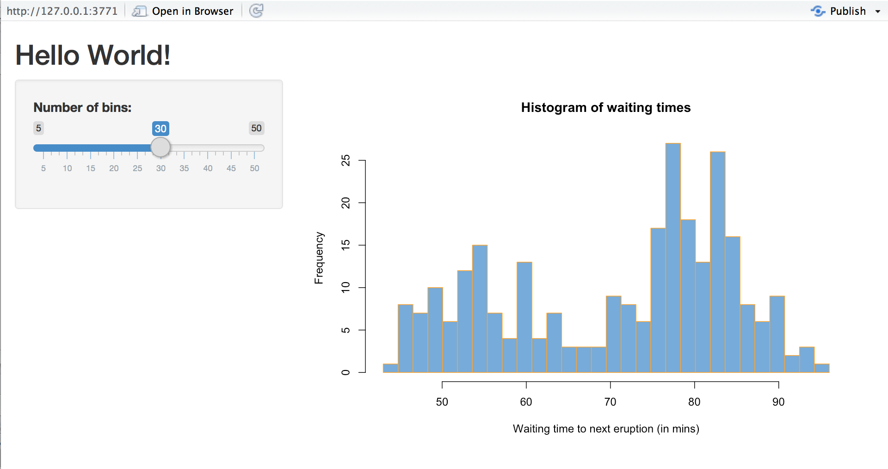
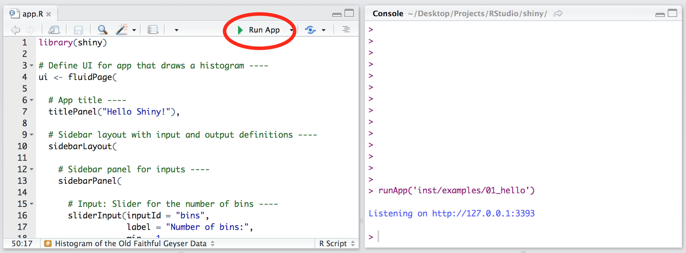
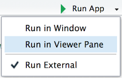

--- 
title: Welcome to Shiny
lesson: 1
layout: tutorial
categories: tutorial
author: Garrett Grolemund and Mine Cetinkaya-Rundel
---

Shiny is an R package that makes it easy to build interactive web applications (apps) straight from R. This lesson will get you started building Shiny apps right away. 

If you still haven't installed the Shiny package, open an R session, connect to the internet, and run


install.packages("shiny")


## Examples

{: .example-screenshot}

The Shiny package has [eleven built-in examples](#Go Further) that each demonstrate how Shiny works. Each example is a self-contained Shiny app.

The **Hello Shiny** example plots a histogram of R's `faithful` dataset with a configurable number of bins. Users can change the number of bins with a slider bar, and the app will immediately respond to their input. You'll use **Hello Shiny** to explore the structure of a Shiny app and to create your first app. 

To run **Hello Shiny**, type: 


library(shiny)
runExample("01_hello")


## Structure of a Shiny App

Shiny apps are contained in a single script called `app.R`. The script `app.R` lives in a directory (for example, `newdir/`) and the app can be run with `runApp("newdir")`.

`app.R` has three components:

* a user interface object

* a server function

* a call to the `shinyApp` function

The user interface (`ui`) object controls the layout and appearance of your app. The `server` function contains the instructions that your computer needs to build your app. Finally the `shinyApp` function creates Shiny app objects from an explicit UI/server pair. 

**Note:** Prior to version 0.10.2, Shiny did not support single-file apps and the `ui` object and `server` function needed to be contained in separate scripts called `ui.R` and `server.R`, respectively. This functionality is still supported in Shiny, however the tutorial and much of the supporting documentation focus on single-file apps.

One nice feature about single-file apps is that you can copy and paste the entire app into the R console, which makes it easy to quickly share code for others to experiment with. For example, if you copy and paste the code above into the R command line, it will start a Shiny app.

#### ui 

Here is the `ui` object for the **Hello Shiny** example.


library(shiny)

# Define UI for app that draws a histogram ----
ui <- fluidPage(

  # App title ----
  titlePanel("Hello Shiny!"),

  # Sidebar layout with input and output definitions ----
  sidebarLayout(

    # Sidebar panel for inputs ----
    sidebarPanel(

      # Input: Slider for the number of bins ----
      sliderInput(inputId = "bins",
                  label = "Number of bins:",
                  min = 1,
                  max = 50,
                  value = 30)

    ),

    # Main panel for displaying outputs ----
    mainPanel(

      # Output: Histogram ----
      plotOutput(outputId = "distPlot")

    )
  )
)


#### server

Here is the `server` function for the **Hello Shiny** example.


# Define server logic required to draw a histogram ----
server <- function(input, output) {

  # Histogram of the Old Faithful Geyser Data ----
  # with requested number of bins
  # This expression that generates a histogram is wrapped in a call
  # to renderPlot to indicate that:
  #
  # 1. It is "reactive" and therefore should be automatically
  #    re-executed when inputs (input$bins) change
  # 2. Its output type is a plot
  output$distPlot <- renderPlot({

    x    <- faithful$waiting
    bins <- seq(min(x), max(x), length.out = input$bins + 1)

    hist(x, breaks = bins, col = "#007bc2", border = "white",
         xlab = "Waiting time to next eruption (in mins)",
         main = "Histogram of waiting times")

    })

}


At one level, the **Hello Shiny** `server` function is very simple. The script does some calculations and then plots a histogram with the requested number of bins.

However, you'll also notice that most of the script is wrapped in a call to `renderPlot`. The comment above the function explains a bit about this, but if you find it confusing, don't worry. We'll cover this concept in much more detail soon.

Play with the **Hello Shiny** app and review the source code. Try to develop a feel for how the app works. But before you do so, note that in your `app.R` file you will need to start with loading the Shiny package and end with a call to `shinyApp`: 


library(shiny)

# See above for the definitions of ui and server
ui <- ...

server <- ...

shinyApp(ui = ui, server = server)


Your R session will be busy while the **Hello Shiny** app is active, so you will not be able to run any R commands. R is monitoring the app and executing the app's reactions. To get your R session back, hit escape or click the stop sign icon (found in the upper right corner of the RStudio console panel).

## Running an App

Every Shiny app has the same structure: an `app.R` file that contains `ui` and `server`. You can create a Shiny app by making a new directory and saving an `app.R` file inside it. It is recommended that each app will live in its own unique directory.

You can run a Shiny app by giving the name of its directory to the function `runApp`. For example if your Shiny app is in a directory called `my_app`, run it with the following code:


library(shiny)
runApp("my_app")


Note: `runApp` is similar to `read.csv`, `read.table`, and many other functions in R. The first argument of `runApp` is the filepath from your [working directory](http://www.rstudio.com/ide/docs/using/workspaces) to the app's directory. The code above assumes that the app directory is in your working directory. In this case, the filepath is just the name of the directory.

(In case you are wondering, the **Hello Shiny** app's files are saved in a special system directory called `"01_hello"`. This directory is designed to work with the `runExample ("01_hello")` call.)
 
## Your Turn

Create a new directory named `App-1` in your [working directory](http://www.rstudio.com/ide/docs/using/workspaces). Then copy and paste the `app.R` script above into your directory (the scripts from **Hello Shiny**). When you are finished the directory should look like this:

{: .example-screenshot}

Launch your app by running `runApp("App-1")`. Then click escape and make some changes to your app:

1. Change the title from "Hello Shiny!" to "Hello World!".

2. Set the minimum value of the slider bar to 5.

3. Change the histogram border color from `"white"` to `"orange"`.

When you are ready, launch your app again. Your new app should match the image below. If it doesn't, or if you want to check your code, press the model answers button to reveal how we did these tasks. 

{: .example-screenshot}

By default, Shiny apps display in "normal" mode, like the app pictured above. **Hello Shiny** and the other built in examples display in "showcase mode", a different mode that displays the `app.R` script alongside the app.

If you would like your app to display in showcase mode, you can run `runApp("App-1", display.mode = "showcase")`.

### Model Answers


Change the title of your app and the slider bar values in the `ui` object.

#### ui


ui <- fluidPage(

  # App title ----
  titlePanel("Hello World!"),

  # Sidebar layout with input and output definitions ----
  sidebarLayout(

    # Sidebar panel for inputs ----
    sidebarPanel(

      # Input: Slider for the number of bins ----
      sliderInput(inputId = "bins",
                  label = "Number of bins:",
                  min = 5,
                  max = 50,
                  value = 30)

    ),

    # Main panel for displaying outputs ----
    mainPanel(

      # Output: Histogram ----
      plotOutput(outputId = "distPlot")

    )
  )
)


Use the `server` function to change how your computer builds the histogram.


# Define server logic required to draw a histogram ----
server <- function(input, output) {

  # Histogram of the Old Faithful Geyser Data ----
  # with requested number of bins
  # This expression that generates a histogram is wrapped in a call
  # to renderPlot to indicate that:
  #
  # 1. It is "reactive" and therefore should be automatically
  #    re-executed when inputs (input$bins) change
  # 2. Its output type is a plot
  output$distPlot <- renderPlot({

    x    <- faithful$waiting
    bins <- seq(min(x), max(x), length.out = input$bins + 1)

    hist(x, breaks = bins, col = "#007bc2", border = "orange",
         xlab = "Waiting time to next eruption (in mins)",
         main = "Histogram of waiting times")

    })

}




## Relaunching Apps

To relaunch your Shiny app:

* Run `runApp("App-1")`, or

* Open the `app.R` script in your RStudio editor. RStudio will recognize the Shiny script and provide a Run App button (at the top of the editor). Either click this button to launch your app or use the keyboard shortcut: Command+Shift+Enter (Control+Shift+Enter on Windows).

{: .example-screenshot}

RStudio will launch the app in a new window by default, but you can also choose to have the app launch in a dedicated viewer pane, or in your external web browser. Make your selection by clicking the icon next to Run App.

{: .example-screenshot}

## Recap

To create your own Shiny app:

* Make a directory named `myapp/` for your app.

* Save your `app.R` script inside that directory. 

* Launch the app with `runApp` or RStudio's keyboard shortcuts. 

* Exit the Shiny app by clicking escape.

## Go Further

You can create Shiny apps by copying and modifying existing Shiny apps. The Shiny [gallery](/gallery) provides some good examples, or use the eleven pre-built Shiny examples listed below. 


runExample("01_hello")      # a histogram
runExample("02_text")       # tables and data frames
runExample("03_reactivity") # a reactive expression
runExample("04_mpg")        # global variables
runExample("05_sliders")    # slider bars
runExample("06_tabsets")    # tabbed panels
runExample("07_widgets")    # help text and submit buttons
runExample("08_html")       # Shiny app built from HTML
runExample("09_upload")     # file upload wizard
runExample("10_download")   # file download wizard
runExample("11_timer")      # an automated timer


Each demonstrates a feature of Shiny apps. All Shiny example apps open in "showcase" mode (with the `app.R` script in the display).

But why limit yourself to copying other apps? The next few lessons will show you how to build your own Shiny apps from scratch. You'll learn about each part of a Shiny app, and finish by deploying your own Shiny app online.

When you are ready, continue to [Lesson 2](../lesson2/), where you will learn how to build the layout and appearance of your Shiny apps.
