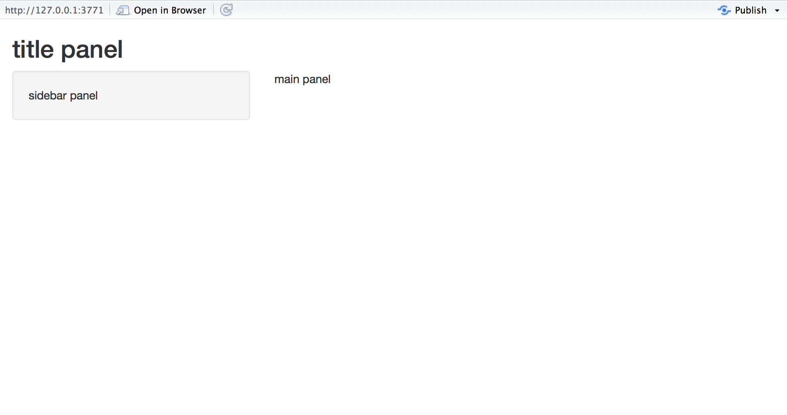
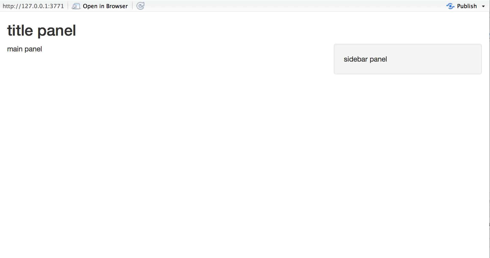
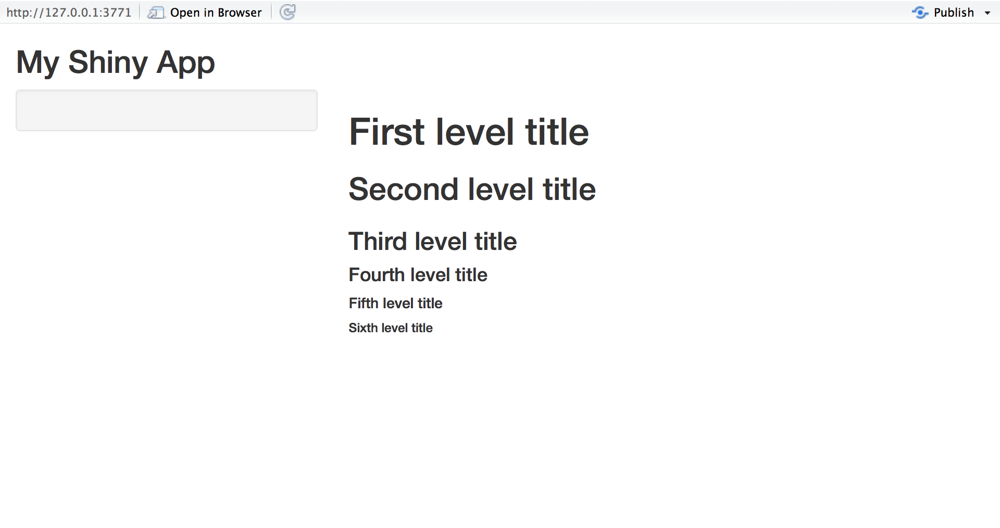
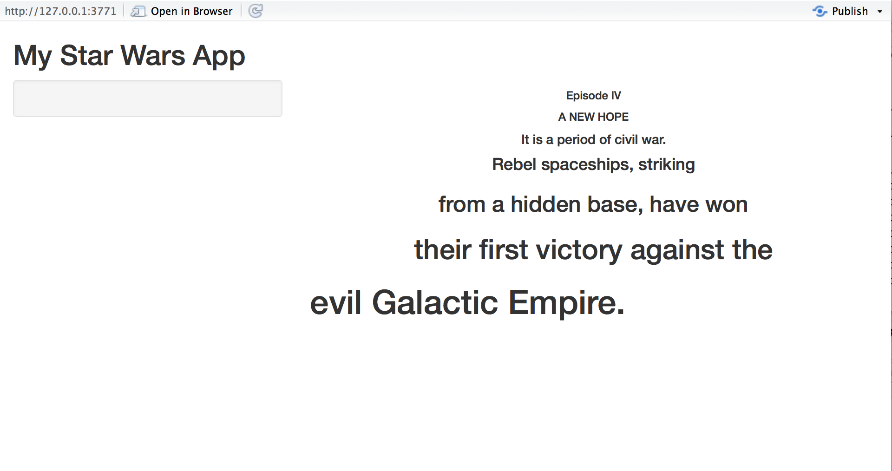
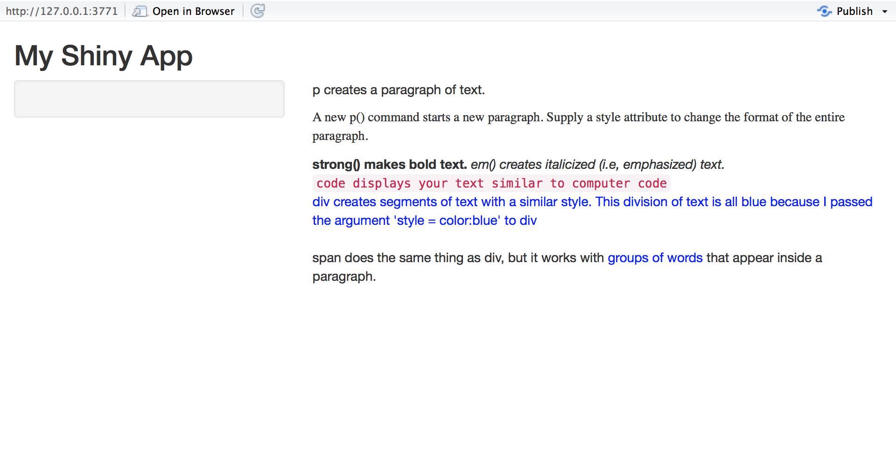
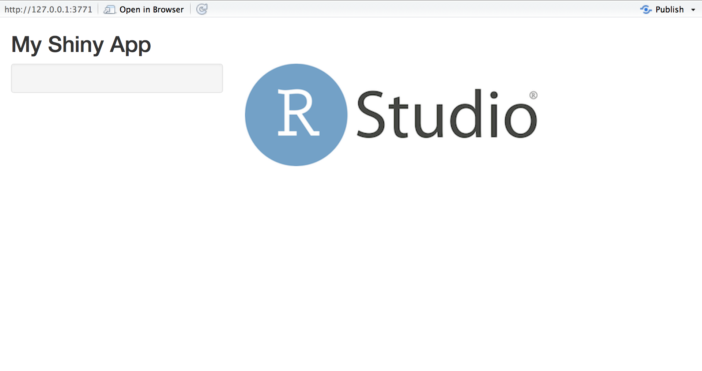
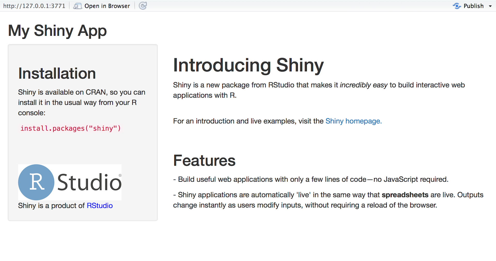

--- 
title: Build a user interface
lesson: 2
layout: tutorial
categories: tutorial
author: Garrett Grolemund and Mine Cetinkaya-Rundel
---

Now that you understand the structure of a Shiny app, it's time to build your first app from scratch. 

This lesson will show you how to build a user interface for your app. You will learn how to lay out the user interface and then add text, images, and other HTML elements to your Shiny app.

We'll use the `App-1` app you made in [Lesson 1](../lesson1/). To get started, open its `app.R` file. Edit the script to match the one below: 


library(shiny)

# Define UI ----
ui <- fluidPage(
  
)

# Define server logic ----
server <- function(input, output) {
  
}

# Run the app ----
shinyApp(ui = ui, server = server)


This code is the bare minimum needed to create a Shiny app. The result is an empty app with a blank user interface, an appropriate starting point for this lesson.

## Layout

Shiny uses the function `fluidPage` to create a display that automatically adjusts to the dimensions of your user's browser window. You lay out the user interface of your app by placing elements in the `fluidPage` function. 

For example, the `ui` function below creates a user interface that has a title panel and a sidebar layout, which includes a sidebar panel and a main panel. Note that these elements are placed within the `fluidPage` function.


ui <- fluidPage(
  titlePanel("title panel"),

  sidebarLayout(
    sidebarPanel("sidebar panel"),
    mainPanel("main panel")
  )
)


{: .example-screenshot}

`titlePanel` and `sidebarLayout` are the two most popular elements to add to `fluidPage`. They create a basic Shiny app with a sidebar. 

`sidebarLayout` always takes two arguments: 

* `sidebarPanel` function output

* `mainPanel` function output

These functions place content in either the sidebar or the main panels. 

The sidebar panel will appear on the left side of your app by default. You can move it to the right side by giving `sidebarLayout` the optional argument `position = "right"`.


ui <- fluidPage(
  titlePanel("title panel"),
  
  sidebarLayout(position = "right",
                sidebarPanel("sidebar panel"),
                mainPanel("main panel")
  )
)


{: .example-screenshot}

`titlePanel` and `sidebarLayout` create a basic layout for your Shiny app, but you can also create more advanced layouts. You can use `navbarPage` to give your app a multi-page user interface that includes a navigation bar. Or you can use `fluidRow` and `column` to build your layout up from a grid system. If you'd like to learn more about these advanced options, read the [Shiny Application Layout Guide](/articles/layout-guide.html). We will stick with `sidebarLayout` in this tutorial.

## HTML Content

You can add content to your Shiny app by placing it inside a `*Panel` function. For example, the apps above display a character string in each of their panels. The words "sidebar panel" appear in the sidebar panel, because we added the string to the `sidebarPanel` function, e.g. `sidebarPanel("sidebar panel")`. The same is true for the text in the title panel and the main panel. 

To add more advanced content, use one of Shiny's HTML tag functions. These functions parallel common HTML5 tags. Let's try out a few of them.

shiny function  | HTML5 equivalent | creates 
--------------- | ---------------- | ---------
`p`             | `
`            | A paragraph of text
`h1`            | `<h1>`           | A first level header
`h2`            | `<h2>`           | A second level header
`h3`            | `<h3>`           | A third level header
`h4`            | `<h4>`           | A fourth level header
`h5`            | `<h5>`           | A fifth level header
`h6`            | `<h6>`           | A sixth level header
`a`             | `<a>`            | A hyper link
`br`            | ` `           | A line break (e.g. a blank line)
`div`           | `
`          | A division of text with a uniform style
`span`          | ``         | An in-line division of text with a uniform style
`pre`           | `<pre>`          | Text 'as is' in a fixed width font
`code`          | `<code>`         | A formatted block of code
`img`           | ``          | An image
`strong`        | `<strong>`       | Bold text
`em`            | `<em>`           | Italicized text
`HTML`          |                  | Directly passes a character string as HTML code

## Headers

To create a header element:

* select a header function (e.g., h1 or h5)

* give it the text you want to see in the header

For example, you can create a first level header that says "My title" with `h1("My title")`. If you run the command at the command line, you'll notice that it produces HTML code.

    > library(shiny)
    > h1("My title")
    <h1>My title</h1>

To place the element in your app:

* pass `h1("My title")` as an argument to `titlePanel`, `sidebarPanel`, or `mainPanel`

The text will appear in the corresponding panel of your web page. You can place multiple elements in the same panel if you separate them with a comma.

Give this a try. The new script below uses all six levels of headers. Update your `ui.R` to match the script and then relaunch your app. Remember to relaunch a Shiny app you may run `runApp("App-1")`, click the Run App button, or use your keyboard shortcuts.


ui <- fluidPage(
  titlePanel("My Shiny App"),
  sidebarLayout(
    sidebarPanel(),
    mainPanel(
      h1("First level title"),
      h2("Second level title"),
      h3("Third level title"),
      h4("Fourth level title"),
      h5("Fifth level title"),
      h6("Sixth level title")
    )
  )
)


Now your app should look like this.

{: .example-screenshot}

If George Lucas had a first app, it might look like this.

{: .example-screenshot}

You can create this effect with `align = "center"`, as in `h6("Episode IV", align = "center")`. In general, any HTML tag attribute can be set as an argument in any Shiny tag function. 

If you are unfamiliar with HTML tag attributes, you can look them up in one of the many free online HTML resources such as [w3schools](http://www.w3schools.com/tags/tag_hn.asp).

Here's the code for the `ui` that made the Star Wars-inspired user interface:


ui <- fluidPage(
  titlePanel("My Star Wars App"),
  sidebarLayout(
    sidebarPanel(),
    mainPanel(
      h6("Episode IV", align = "center"),
      h6("A NEW HOPE", align = "center"),
      h5("It is a period of civil war.", align = "center"),
      h4("Rebel spaceships, striking", align = "center"),
      h3("from a hidden base, have won", align = "center"),
      h2("their first victory against the", align = "center"),
      h1("evil Galactic Empire.")
    )
  )
)


## Formatted text

Shiny offers many tag functions for formatting text. The easiest way to describe them is by running through an example. 

Paste the `ui` object below into your `app.R` file and save it. If your Shiny app is still running, you can refresh your web page or preview window, and it will display the changes. If your app is closed, just relaunch it.

Compare the displayed app to your updated `ui` object definition to discover how to format text in a Shiny app.


ui <- fluidPage(
  titlePanel("My Shiny App"),
  sidebarLayout(
    sidebarPanel(),
    mainPanel(
      p("p creates a paragraph of text."),
      p("A new p() command starts a new paragraph. Supply a style attribute to change the format of the entire paragraph.", style = "font-family: 'times'; font-si16pt"),
      strong("strong() makes bold text."),
      em("em() creates italicized (i.e, emphasized) text."),
      br(),
      code("code displays your text similar to computer code"),
      div("div creates segments of text with a similar style. This division of text is all blue because I passed the argument 'style = color:blue' to div", style = "color:blue"),
      br(),
      p("span does the same thing as div, but it works with",
        span("groups of words", style = "color:blue"),
        "that appear inside a paragraph.")
    )
  )
)


{: .example-screenshot}

## Images

Images can enhance the appearance of your app and help your users understand the content. Shiny looks for the `img` function to place image files in your app. 

To insert an image, give the `img` function the name of your image file as the `src` argument (e.g., `img(src = "my_image.png")`). You must spell out this argument since `img` passes your input to an HTML tag, and `src` is what the tag expects.

You can also include other HTML friendly parameters such as height and width. Note that height and width numbers will refer to pixels. 


img(src = "my_image.png", height = 72, width = 72)


The `img` function looks for your image file in a specific place. Your file _must_ be in a folder named `www` in the same directory as the `app.R` script. Shiny treats this directory in a special way. Shiny will share any file placed here with your user's web browser, which makes `www` a great place to put images, style sheets, and other things the browser will need to build the web components of your Shiny app.

So if you want to use an image named [rstudio.png](www/rstudio.png), your `App-1` directory should look like this one:

{: .example-screenshot}

 
With this file arrangment, the `ui` object below can create this app. Download rstudio.png [here](www/rstudio.png) and try it out.


ui <- fluidPage(
  titlePanel("My Shiny App"),
  sidebarLayout(
    sidebarPanel(),
    mainPanel(
      img(src = "rstudio.png", height = 140, width = 400)
    )
  )
)


{: .example-screenshot}

## Other tags

This lesson covers the most popular Shiny tag functions, but there are many more tag functions for you to use. You can learn about additional tag functions in [Customize your UI with HTML](/articles/html-tags.html) and the [Shiny HTML Tags Glossary](/articles/tag-glossary.html).

## Your turn

You can use Shiny's layout, HTML, and `img` functions to create very attractive and useful user interfaces. See how well you understand these functions by recreating the Shiny app pictured below. Use the examples in this tutorial to work on it and then test it out. 

Our `app.R` script is found under the Model Answer button, but don't just copy and paste it. Make sure you understand how the code works before moving on.

{: .example-screenshot}

### Model Answer




library(shiny)

# Define UI ----
ui <- fluidPage(
  titlePanel("My Shiny App"),
  sidebarLayout(
    sidebarPanel(
      h2("Installation"),
      p("Shiny is available on CRAN, so you can install it in the usual way from your R console:"),
      code('install.packages("shiny")'),
      br(),
      br(),
      br(),
      br(),
      img(src = "rstudio.png", height = 70, width = 200),
      br(),
      "Shiny is a product of ", 
      span("RStudio", style = "color:blue")
    ),
    mainPanel(
      h1("Introducing Shiny"),
      p("Shiny is a new package from RStudio that makes it ", 
        em("incredibly easy "), 
        "to build interactive web applications with R."),
      br(),
      p("For an introduction and live examples, visit the ",
        a("Shiny homepage.", 
          href = "http://shiny.rstudio.com")),
      br(),
      h2("Features"),
      p("- Build useful web applications with only a few lines of code—no JavaScript required."),
      p("- Shiny applications are automatically 'live' in the same way that ", 
        strong("spreadsheets"),
        " are live. Outputs change instantly as users modify inputs, without requiring a reload of the browser.")
    )
  )
)

# Define server logic ----
server <- function(input, output) {
  
}

# Run the app ----
shinyApp(ui = ui, server = server)




## Recap

With your new skills, you can:

* create a user interface with `fluidPage`, `titlePanel` and `sidebarLayout`

* create an HTML element with one of Shiny's tag functions

* set HTML tag attributes in the arguments of each tag function

* add an element to your web page by passing it to `titlePanel`, `sidebarPanel` or `mainPanel`

* add multiple elements to each panel by separating them with a comma

* add images by placing your image in a folder labeled `www` within your Shiny app directory and then calling the `img` function

Now that you can place simple content in your user interface, let's look at how you would place more complicated content, like widgets. Widgets are interactive web elements that your user can use to control the app. They are also the subject of [Lesson 3](../lesson3/).
