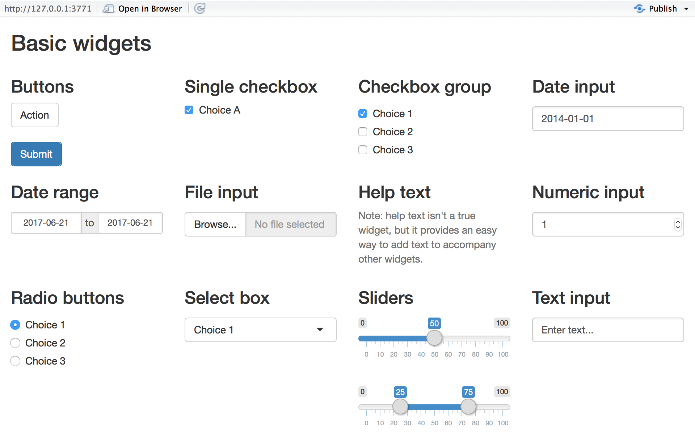
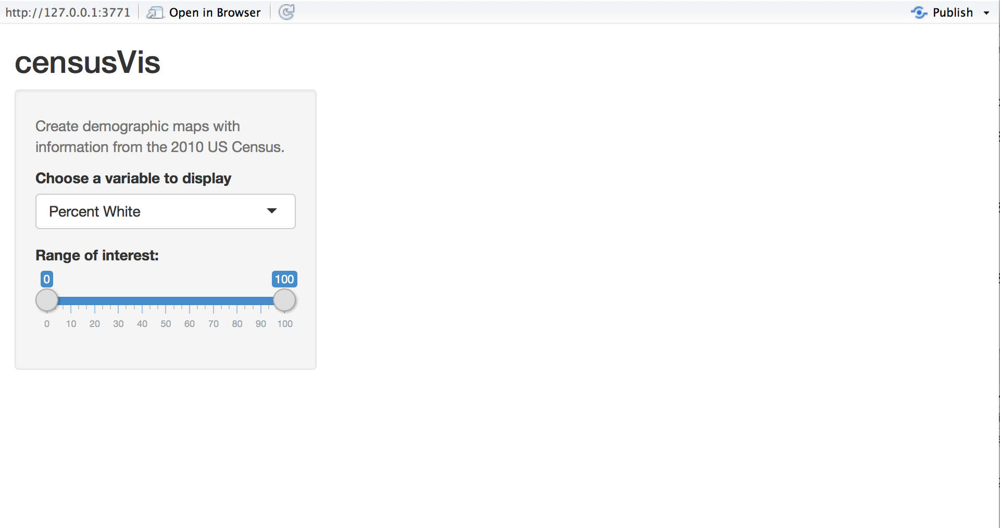
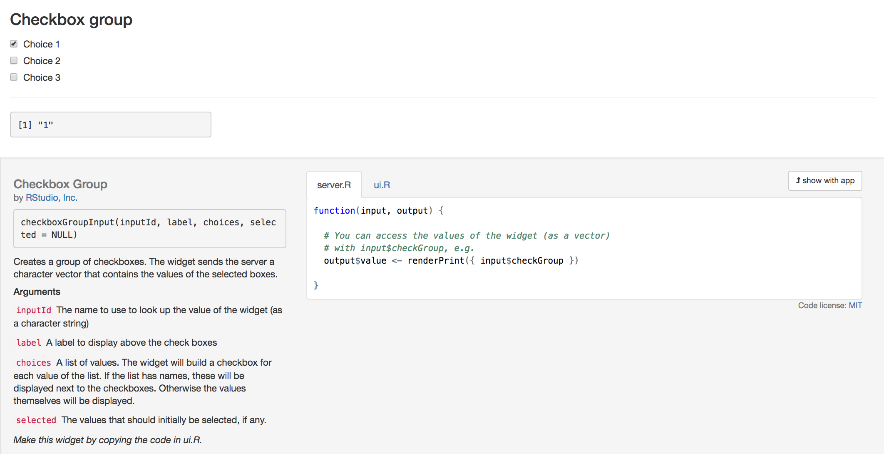

--- 
title: Add control widgets
lesson: 3
layout: tutorial
categories: tutorial
author: Garrett Grolemund and Mine Cetinkaya-Rundel
---

This lesson will show you how to add control widgets to your Shiny apps. What's a widget? A web element that your users can interact with. Widgets provide a way for your users to send messages to the Shiny app. 

Shiny widgets collect a value from your user. When a user changes the widget, the value will change as well. This sets up opportunities that we'll explore in [Lesson 4](../lesson4/). 

## Control widgets

{: .example-screenshot}

Shiny comes with a family of pre-built widgets, each created with a transparently named R function. For example, Shiny provides a function named `actionButton` that creates an Action Button and a function named `sliderInput` that creates a slider bar. 

The standard Shiny widgets are: 

function             |  widget
-------------------- | ---------
`actionButton`       | Action Button
`checkboxGroupInput` | A group of check boxes
`checkboxInput`      | A single check box
`dateInput`          | A calendar to aid date selection
`dateRangeInput`     | A pair of calendars for selecting a date range
`fileInput`          | A file upload control wizard
`helpText`           | Help text that can be added to an input form
`numericInput`       | A field to enter numbers
`radioButtons`       | A set of radio buttons
`selectInput`        | A box with choices to select from
`sliderInput`        | A slider bar
`submitButton`       | A submit button
`textInput`          | A field to enter text

Some of these widgets are built using the [Twitter Bootstrap](http://getbootstrap.com/) project, a popular open source framework for building user interfaces.

## Adding widgets

You can add widgets to your web page in the same way that you added other types of HTML content in [Lesson 2](.../lesson2/). To add a widget to your app, place a widget function in `sidebarPanel` or `mainPanel` in your `ui` object.
 
Each widget function requires several arguments. The first two arguments for each widget are

* a **name for the widget**: The user will not see this name, but you can use it to access the widget's value. The name should be a character string.  

* a **label**: This label will appear with the widget in your app. It should be a character string, but it can be an empty string `""`.   

In this example, the name is "action" and the label is "Action": `actionButton("action", label = "Action")`

The remaining arguments vary from widget to widget, depending on what the widget needs to do its job. They include things like initial values, ranges, and increments. You can find the exact arguments needed by a widget on the widget function's help page, (e.g., `?selectInput`).

The `app.R` script below makes the app pictured above. Change your own `App-1/app.R` script to match it, and then launch the app (`runApp("App-1")`, select Run App, or use shortcuts). 

Play with each widget to get a feel for what it does. Experiment with changing the values of the widget functions and observe the effects. If you are interested in the layout scheme for this Shiny app, read the description in the [application layout guide](/articles/layout-guide.html). This lesson will not cover this slightly more complicated layout scheme, but it is interesting to note what it does.


library(shiny)

# Define UI ----
ui <- fluidPage(
  titlePanel("Basic widgets"),
  
  fluidRow(
    
    column(3,
           h3("Buttons"),
           actionButton("action", "Action"),
           br(),
           br(), 
           submitButton("Submit")),
    
    column(3,
           h3("Single checkbox"),
           checkboxInput("checkbox", "Choice A", value = TRUE)),
    
    column(3, 
           checkboxGroupInput("checkGroup", 
                              h3("Checkbox group"), 
                              choices = list("Choice 1" = 1, 
                                             "Choice 2" = 2, 
                                             "Choice 3" = 3),
                              selected = 1)),
    
    column(3, 
           dateInput("date", 
                     h3("Date input"), 
                     value = "2014-01-01"))   
  ),
  
  fluidRow(
    
    column(3,
           dateRangeInput("dates", h3("Date range"))),
    
    column(3,
           fileInput("file", h3("File input"))),
    
    column(3, 
           h3("Help text"),
           helpText("Note: help text isn't a true widget,", 
                    "but it provides an easy way to add text to",
                    "accompany other widgets.")),
    
    column(3, 
           numericInput("num", 
                        h3("Numeric input"), 
                        value = 1))   
  ),
  
  fluidRow(
    
    column(3,
           radioButtons("radio", h3("Radio buttons"),
                        choices = list("Choice 1" = 1, "Choice 2" = 2,
                                       "Choice 3" = 3),selected = 1)),
    
    column(3,
           selectInput("select", h3("Select box"), 
                       choices = list("Choice 1" = 1, "Choice 2" = 2,
                                      "Choice 3" = 3), selected = 1)),
    
    column(3, 
           sliderInput("slider1", h3("Sliders"),
                       min = 0, max = 100, value = 50),
           sliderInput("slider2", "",
                       min = 0, max = 100, value = c(25, 75))
    ),
    
    column(3, 
           textInput("text", h3("Text input"), 
                     value = "Enter text..."))   
  )
  
)

# Define server logic ----
server <- function(input, output) {
  
}

# Run the app ----
shinyApp(ui = ui, server = server)


## Your turn

Rewrite your `ui` to create the user interface displayed below. Notice that this Shiny app uses a basic Shiny layout (no columns) and contains three of the widgets pictured above. The other values of the select box are shown below the image of the app. 

{: .example-screenshot}

{: .example-screenshot}

### Model Answer



Be sure your `ui` is identical to the one displayed below before you move on. You will use the script in [Lesson 4](../lesson4/) and [Lesson 5](../lesson5/), as part of an app that visualizes census data. 

In particular, make sure that your select box widget is named "var", and your slider widget is named "range". 

Also notice that the slider widget has _two_ values, not one.


ui <- fluidPage(
  titlePanel("censusVis"),
  
  sidebarLayout(
    sidebarPanel(
      helpText("Create demographic maps with 
               information from the 2010 US Census."),
      
      selectInput("var", 
                  label = "Choose a variable to display",
                  choices = list("Percent White", 
                                 "Percent Black",
                                 "Percent Hispanic", 
                                 "Percent Asian"),
                  selected = "Percent White"),
      
      sliderInput("range", 
                  label = "Range of interest:",
                  min = 0, max = 100, value = c(0, 100))
    ),
    
    mainPanel()
  )
)




## Recap

It is easy to add fully functional widgets to your Shiny app. 

* Shiny provides a family of functions to create these widgets. 

* Each function requires a name and a label. 

* Some widgets need specific instructions to do their jobs.

* You add widgets to your Shiny app just like you added other types of HTML content (see [Lesson 2](../lesson2/))

<!--Write your own Shiny widgets as your skills increase. To find out more, read [Build Custom Shiny Widgets]().-->

## Go Further

The [Shiny Widgets Gallery](http://shiny.rstudio.com/gallery/widget-gallery.html) provides templates that you can use to quickly add widgets to your Shiny apps.

To use a template, visit the [gallery](http://shiny.rstudio.com/gallery/widget-gallery.html). The gallery displays each of Shiny's widgets, and demonstrates how the widgets' values change in response to your input. 

{: .example-screenshot}

Select the widget that you want and click the "See Code" button below the widget. The gallery will take you to an example app that describes the widget. To use the widget, copy and paste the code in the example's `app.R` file to your `app.R` file.

{: .example-screenshot}

In [Lesson 4](../lesson4/), you will learn how to connect widgets to reactive output, objects that update themselves whenever your user changes a widget.
