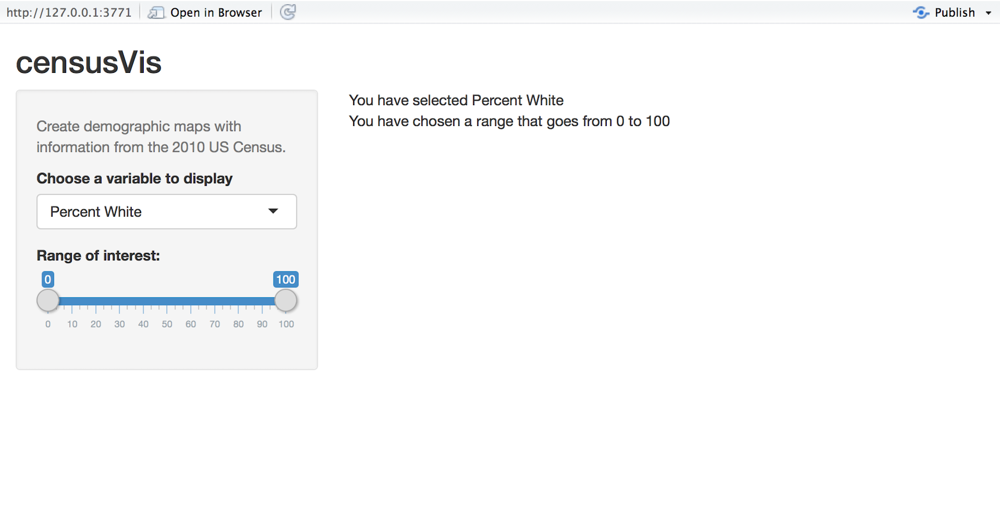
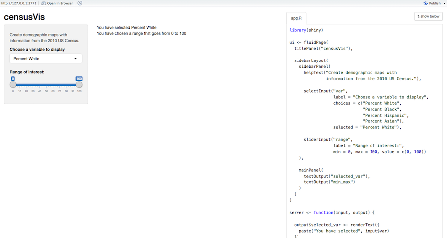

--- 
title: Display reactive output
lesson: 4
layout: tutorial
categories: tutorial
author: Garrett Grolemund and Mine Cetinkaya-Rundel
---

Time to give your Shiny app a "live" quality! This lesson will teach you how to build reactive output to displays in your Shiny app. Reactive output automatically responds when your user toggles a widget.

By the end of this lesson, you’ll know how to make a simple Shiny app with two reactive lines of text. Each line will display the values of a widget based on your user’s input.

{: .example-screenshot}

This new Shiny app will need its own, new directory. Create a folder in your working directory named `census-app`. This is where we'll save the `app.R` file that you make in this lesson.

## Two steps

You can create reactive output with a two step process. 

1. Add an R object to your user interface. 
2. Tell Shiny how to build the object in the server function. The object will be reactive if the code that builds it calls a widget value.

### Step 1: Add an R object to the UI

Shiny provides a family of functions that turn R objects into output for your user interface. Each function creates a specific type of output. 

Output function      | Creates
---------------------| -------------
`dataTableOutput`    | DataTable
`htmlOutput`         | raw HTML
`imageOutput`        | image
`plotOutput`         | plot
`tableOutput`        | table
`textOutput`         | text
`uiOutput`           | raw HTML
`verbatimTextOutput` | text

You can add output to the user interface in the same way that you added HTML elements and widgets.  Place the output function inside `sidebarPanel` or `mainPanel` in the `ui`.

For example, the `ui` object below uses `textOutput` to add a reactive line of text to the main panel of the Shiny app pictured above. 


ui <- fluidPage(
  titlePanel("censusVis"),
  
  sidebarLayout(
    sidebarPanel(
      helpText("Create demographic maps with 
               information from the 2010 US Census."),
      
      selectInput("var", 
                  label = "Choose a variable to display",
                  choices = c("Percent White", 
                              "Percent Black",
                              "Percent Hispanic", 
                              "Percent Asian"),
                  selected = "Percent White"),
      
      sliderInput("range", 
                  label = "Range of interest:",
                  min = 0, max = 100, value = c(0, 100))
    ),
    
    mainPanel(
      textOutput("selected_var")
    )
  )
)


Notice that `textOutput` takes an argument, the character string `"selected_var"`. Each of the `*Output` functions require a single argument: a character string that Shiny will use as the name of your reactive element. Your users will not see this name, but you will use it later.

### Step 2: Provide R code to build the object.

Placing a function in `ui` tells Shiny where to display your object. Next, you need to tell Shiny how to build the object. 

We do this by providing the R code that builds the object in the `server` function.

The `server` function plays a special role in the Shiny process; it builds a list-like object named `output` that contains all of the code needed to update the R objects in your app. Each R object needs to have its own entry in the list. 

You can create an entry by defining a new element for `output` within the `server` function, like below. The element name should match the name of the reactive element that you created in the `ui`. 

In the `server` function below, `output$selected_var` matches `textOutput("selected_var")` in your `ui`.


server <- function(input, output) {
  
  output$selected_var <- renderText({ 
    "You have selected this"
  })
  
}


You do not need to explicitly state in the `server` function to return `output` in its last line of code. R will automatically update `output` through reference class semantics.

Each entry to `output` should contain the output of one of Shiny's `render*` functions. These functions capture an R expression and do some light pre-processing on the expression. Use the `render*` function that corrresponds to the type of reactive object you are making.

render function  | creates
-----------------|-------------
`renderDataTable`| DataTable
`renderImage`    | images (saved as a link to a source file)
`renderPlot`     | plots
`renderPrint`    | any printed output
`renderTable`    | data frame, matrix, other table like structures
`renderText`     | character strings
`renderUI`       | a Shiny tag object or HTML

Each `render*` function takes a single argument: an R expression surrounded by braces, `{}`. The expression can be one simple line of text, or it can involve many lines of code, as if it were a complicated function call. 

Think of this R expression as a set of instructions that you give Shiny to store for later. Shiny will run the instructions when you first launch your app, and then Shiny will re-run the instructions every time it needs to update your object. 

For this to work, your expression should return the object you have in mind (a piece of text, a plot, a data frame, etc.). You will get an error if the expression does not return an object, or if it returns the wrong type of object.

### Use widget values

If you run the app with the `server` function above, it will display "You have selected this" in the main panel. However, the text will not be reactive. It will not change even if you manipulate the widgets of your app. 

You can make the text reactive by asking Shiny to call a widget value when it builds the text. Let's look at how to do this.

Take a look at the first line of code in the `server` function. Do you notice that the `server` function mentions _two_ arguments, `input` and `output`? You already saw that `output` is a list-like object that stores instructions for building the R objects in your app.

`input` is a second list-like object. It stores the current values of all of the widgets in your app. These values will be saved under the names that you gave the widgets in your `ui`. 

So for example, our app has two widgets, one named `"var"` and one named `"range"` (you gave the widgets these names in [Lesson 3](../lesson3/)). The values of `"var"` and `"range"` will be saved in `input` as `input$var` and `input$range`. Since the slider widget has two values (a min and a max), `input$range` will contain a vector of length two. 

Shiny will automatically make an object reactive if the object uses an `input` value. For example, the `server` function below creates a reactive line of text by calling the value of the select box widget to build the text.


server <- function(input, output) {
  
  output$selected_var <- renderText({ 
    paste("You have selected", input$var)
  })
  
}


Shiny tracks which outputs depend on which widgets. When a user changes a widget, Shiny will rebuild all of the outputs that depend on the widget, using the new value of the widget as it goes. As a result, the rebuilt objects will be completely up-to-date. 

This is how you create reactivity with Shiny, by connecting the values of `input` to the objects in `output`. Shiny takes care of all of the other details.

## Launch your app and see the reactive output

When you are ready, update your `server` and `ui` functions to match those above. Then launch your Shiny app by running `runApp("census-app", display.mode = "showcase")` at the command line. Your app should look like the app below, and your statement should update instantly as you change the select box widget.

Watch the `server` portion of the script. When Shiny rebuilds an output, it highlights the code it is running. This temporary highlighting can help you see how Shiny generates reactive output.

{: .example-screenshot}

## Your turn

Add a second line of reactive text to the main panel of your Shiny app. This line should display "You have chosen a range that goes from _something_ to _something_", and each _something_ should show the current minimum (min) or maximum (max) value of the slider widget.

Don't forget to update both your `ui` object and your `server` function.

### Model answer



Add the second line of text in the same way that you added the first one. Use `textOutput` in `ui` to place the second line of text in the main panel. Use `renderText` in `server` to tell Shiny how to build the text. You'll need to use the same name to refer to the text in both scripts (e.g., `"min_max"`). 

Your text should use both the slider's min value (saved as `input$range[1]`) and its max value (saved as `input$range[2]`). 

Remember that your text will be reactive as long as you connect `input` values to `output` objects. Shiny creates reactivity automatically when it recognizes these connections.


library(shiny)

ui <- fluidPage(
  titlePanel("censusVis"),
  
  sidebarLayout(
    sidebarPanel(
      helpText("Create demographic maps with 
               information from the 2010 US Census."),
      
      selectInput("var", 
                  label = "Choose a variable to display",
                  choices = c("Percent White", 
                              "Percent Black",
                              "Percent Hispanic", 
                              "Percent Asian"),
                  selected = "Percent White"),
      
      sliderInput("range", 
                  label = "Range of interest:",
                  min = 0, max = 100, value = c(0, 100))
    ),
    
    mainPanel(
      textOutput("selected_var"),
      textOutput("min_max")
    )
  )
)

server <- function(input, output) {
  
  output$selected_var <- renderText({ 
    paste("You have selected", input$var)
  })
  
  output$min_max <- renderText({ 
    paste("You have chosen a range that goes from",
          input$range[1], "to", input$range[2])
  })
  
}

shinyApp(ui, server)




## Recap

In this lesson, you created your first reactive Shiny app. Along the way, you learned to

* use an `*Output` function in the `ui` to place reactive objects in your Shiny app,
* use a `render*` function in the `server` to tell Shiny how to build your objects,
* surround R expressions by curly braces, `{}`, in each `render*` function,
* save your `render*` expressions in the `output` list, with one entry for each reactive object in your app, and
* create reactivity by including an `input` value in a `render*` expression.

If you follow these rules, Shiny will automatically make your objects reactive.

In [Lesson 5](../lesson5/) you will create a more sophisticated reactive app that relies on R scripts and external data. 
