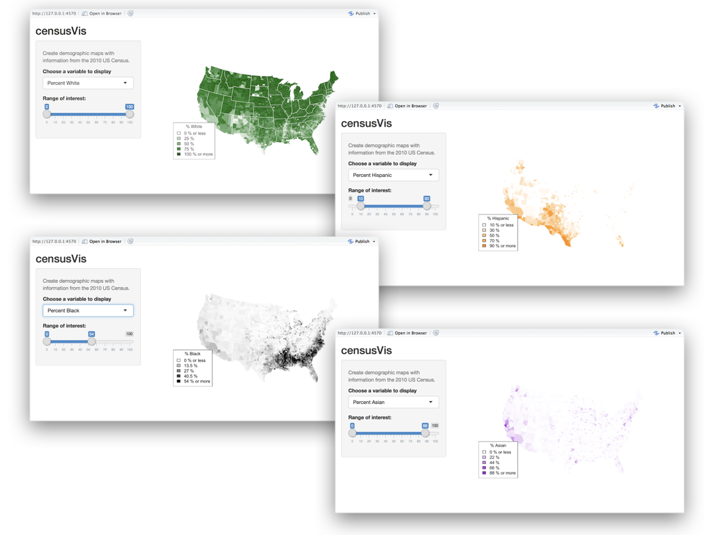
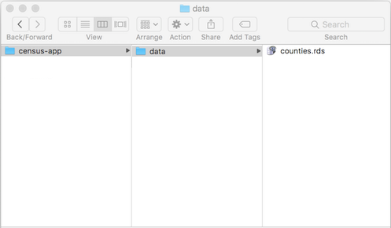
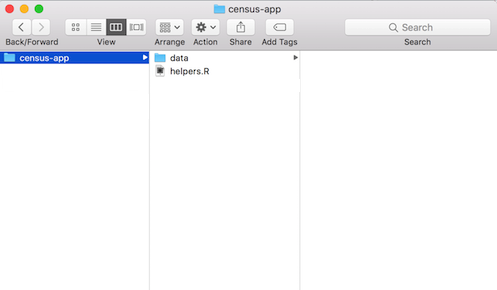
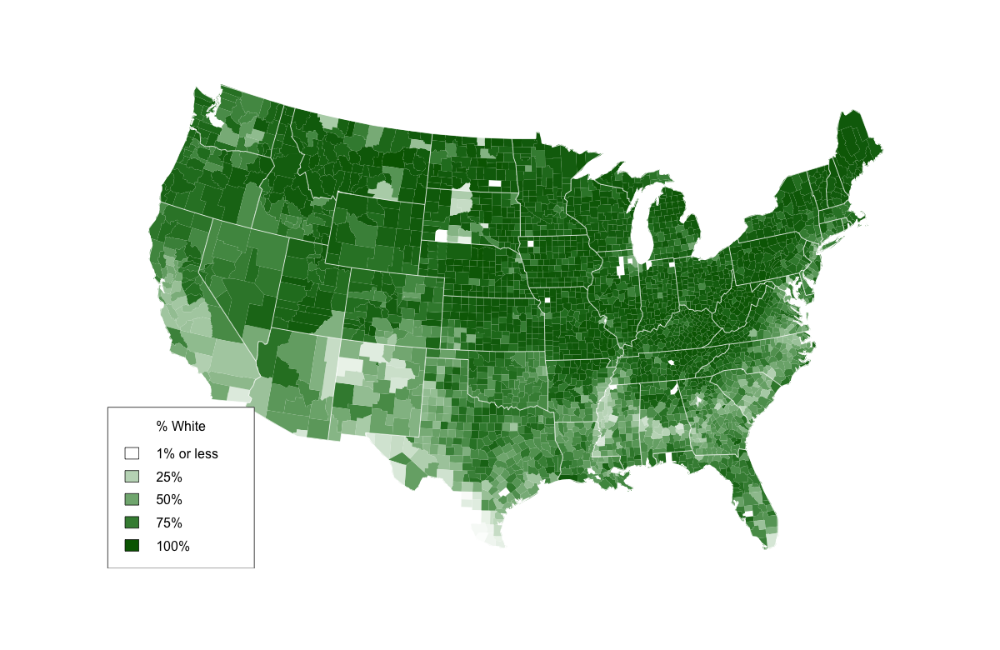
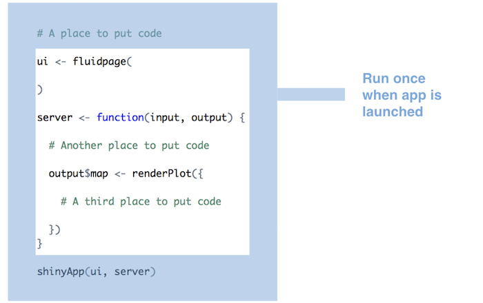
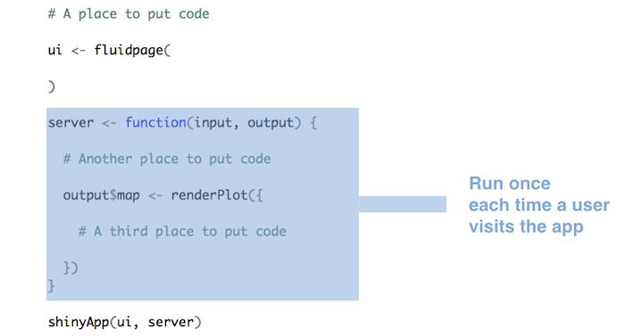
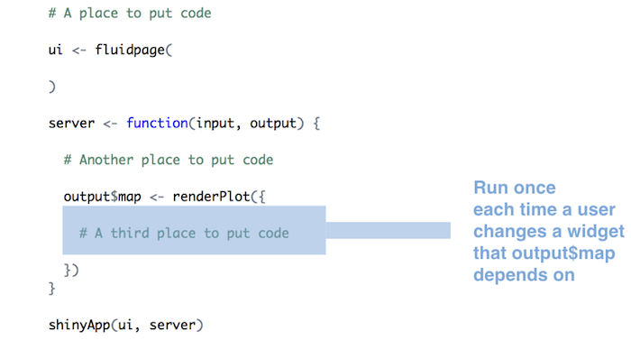
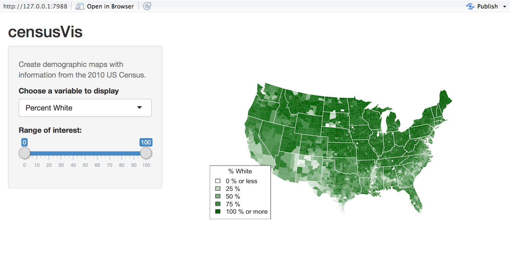

--- 
title: Use R scripts and data
lesson: 5
layout: tutorial
categories: tutorial
author: Garrett Grolemund and Mine Cetinkaya-Rundel
---

This lesson will show you how to load data, R Scripts, and packages to use in your Shiny apps. Along the way, you will build a sophisticated app that visualizes US Census data.

## counties.rds

`counties.rds` is a dataset of demographic data for each county in the United States, collected with the `UScensus2010` R package. You can download it [here](census-app/data/counties.rds). 

Once you have the file, 

* Create a new folder named `data` in your `census-app` directory.
* Move `counties.rds` into the `data` folder. 

When you're done, your `census-app` folder should look like this.

{: .example-screenshot}

The dataset in `counties.rds` contains 

* the name of each county in the United States 
* the total population of the county
* the percent of residents in the county who are White, Black, Hispanic, or Asian


counties <- readRDS("census-app/data/counties.rds")
head(counties)
             name total.pop white black hispanic asian
1 alabama,autauga     54571  77.2  19.3      2.4   0.9
2 alabama,baldwin    182265  83.5  10.9      4.4   0.7
3 alabama,barbour     27457  46.8  47.8      5.1   0.4
4    alabama,bibb     22915  75.0  22.9      1.8   0.1
5  alabama,blount     57322  88.9   2.5      8.1   0.2
6 alabama,bullock     10914  21.9  71.0      7.1   0.2


## helpers.R

`helpers.R` is an R script that can help you make [choropleth maps](http://en.wikipedia.org/wiki/Choropleth_map), like the ones pictured above. A choropleth map is a map that uses color to display the regional variation of a variable. In our case, `helpers.R` will create `percent_map`, a function designed to map the data in `counties.rds`. You can download `helpers.R` [here](census-app/helpers.R). 

`helpers.R` uses the `maps` and `mapproj` packages in R. If you've never installed these packages before, you'll need to do so before you make this app. Run


install.packages(c("maps", "mapproj"))


Save `helpers.R` inside your `census-app` directory, like below. 

{: .example-screenshot}

The `percent_map` function in `helpers.R` takes five arguments: 

Argument  | Input
--------- | -------------
`var`     | a column vector from the `counties.rds` dataset
`color`   | any character string you see in the output of `colors()`
`legend.title` | A character string to use as the title of the plot's legend
`max` | A parameter for controlling shade range (defaults to 100)
`min` | A parameter for controlling shade range (defaults to 0)

You can use `percent_map` at the command line to plot the counties data as a choropleth map, like this.


library(maps)
library(mapproj)
source("census-app/helpers.R")
counties <- readRDS("census-app/data/counties.rds")
percent_map(counties$white, "darkgreen", "% White")


_Note: The code above assumes that `census-app` is a sub-directory in your working directory. Make certain to set your working directory as the parent directory for `census-app`. To change your working directory location, click on Session > Set Working Directory > Choose Directory… in the RStudio menu bar._

`percent_map` plots the counties data as a choropleth map. Here it will plot the percent of white residents in the counties in the color dark green.

{: .example-screenshot}

## Loading files and file paths

Take a look at the above code. To use `percent_map`, we first ran `helpers.R` with the `source` function, and then loaded `counties.rds` with the `readRDS` function. We also ran `library(maps)` and `library(mapproj)`.

You will need to ask Shiny to call the same functions before it uses `percent_map` in your app, but how you write these functions will change. Both `source` and `readRDS` require a file path, and file paths do not behave the same way in a Shiny app as they do at the command line.

When Shiny runs the commands in `server.R`, it will treat all file paths as if they begin in the same directory as `server.R`. In other words, the directory that you save `server.R` in will become the working directory of your Shiny app. 

Since you saved `helpers.R` in the same directory as `server.R`, you can ask Shiny to load it with


source("helpers.R")


Since you saved `counties.rds` in a sub-directory (named data) of the directory that `server.R` is in, you can load it with.


counties <- readRDS("data/counties.rds")


You can load the `maps` and `mapproj` packages in the normal way with 


library(maps)
library(mapproj)


which does not require a file path.

## Execution

Shiny will execute all of these commands if you place them in your `app.R` script. However, where you place them will determine how many times they are run (or re-run), which will in turn affect the performance of your app, since Shiny will run some sections your `app.R` script more often than others. 

Shiny will run the whole script the first time you call `runApp`. This causes Shiny to execute the `server` function.

Shiny saves the `server` function until a new user arrives. Each time a new user visits your app, Shiny runs the `server` function again, one time. The function helps Shiny build a distinct set of reactive objects for each user. 

As users interact with the widgets and change their values, Shiny will re-run the R expressions assigned to each reactive object that depend on a widget whose value was changed. If your user is very active, these expressions may be re-run many, many times a second.

Here's what we've learned so far:

* The `shinyApp` function is run once, when you launch your app
* The `server` function is run once _each time_ a user visits your app
* The R expressions inside `render*` functions are run many times. Shiny runs them once each time a user change the value of a widget.

How can you use this information?

Source scripts, load libraries, and read data sets at the beginning of `app.R` _outside_ of the `server` function. Shiny will only run this code once, which is all you need to set your server up to run the R expressions contained in `server`.

Define user specific objects inside `server` function, but outside of any `render*` calls. These would be objects that you think each user will need their own personal copy of. For example, an object that records the user's [session information](articles/client-data.html). This code will be run once per user.

Only place code that Shiny _must_ rerun to build an object inside of a `render*` function. Shiny will rerun _all_ of the code in a `render*` chunk each time a user changes a widget mentioned in the chunk. This can be quite often.

You should generally avoid placing code inside a `render` function that does not need to be there. Doing so will slow down the entire app.

## Your Turn 1

Copy and paste the following `app.R` file to your `census-app` directory. Then add 


source("helpers.R")
counties <- readRDS("data/counties.rds")
library(maps)
library(mapproj)


to your `app.R` script. Be sure to place the commands in an efficient location.

_Note: This is the first of two steps that will complete your app. Choose the best place to insert the code above, but do not try to run the app. Your app will return an error until you replace `# some arguments` with real code in Your Turn 2._

#### ui.R


# User interface ----
ui <- fluidPage(
  titlePanel("censusVis"),
  
  sidebarLayout(
    sidebarPanel(
      helpText("Create demographic maps with 
        information from the 2010 US Census."),
      
      selectInput("var", 
                  label = "Choose a variable to display",
                  choices = c("Percent White", "Percent Black",
                              "Percent Hispanic", "Percent Asian"),
                  selected = "Percent White"),
      
      sliderInput("range", 
                  label = "Range of interest:",
                  min = 0, max = 100, value = c(0, 100))
    ),
    
    mainPanel(plotOutput("map"))
  )
)

# Server logic ----
server <- function(input, output) {
  output$map <- renderPlot({
    percent_map( # some arguments )
  })
}

# Run app ----
shinyApp(ui, server)


### Model Answer 1



Since your app only needs to load `helpers.R` and `counties.rds` once, they should go outside of the `ui` and `server` functions. This is also a good place to load the `maps` library (which `percent_map` uses).


library(maps)
library(mapproj)
source("helpers.R")
counties <- readRDS("data/counties.rds")

# User interface ----
ui <- fluidPage(
  titlePanel("censusVis"),
  
  sidebarLayout(
    sidebarPanel(
      helpText("Create demographic maps with 
        information from the 2010 US Census."),
      
      selectInput("var", 
                  label = "Choose a variable to display",
                  choices = c("Percent White", "Percent Black",
                              "Percent Hispanic", "Percent Asian"),
                  selected = "Percent White"),
      
      sliderInput("range", 
                  label = "Range of interest:",
                  min = 0, max = 100, value = c(0, 100))
    ),
    
    mainPanel(plotOutput("map"))
  )
)

# Server logic ----
server <- function(input, output) {
  output$map <- renderPlot({
    percent_map( # some arguments )
  })
}

# Run app ----
shinyApp(ui, server)


You may wonder, "Won't each user need their own copy of `counties` and `percent_map`?" (which would imply that the code should go inside of the `server` function). No, each user will not. 

Keep in mind that your user's computer won't run any of the R code in your Shiny app. In fact, their computer won't even see the R code. The computer that you use as a server will run all of the R code necessary for all of your users. It will send the results over to your users as HTML elements.

Your server can rely on a single global copy of `counties.rds` and `percent_map` to do all of the R execution necessary for all of the users. You only need to build a separate object for each user if the objects will have different values for each of your users. 



## Finishing the app

The census visualization app has one reactive object, a plot named `"map"`. The plot is built with the `percent_map` function, which takes five arguments. 

* The first three arguments, `var`, `color`, and `legend.title`, depend on the value of the select box widget. 
* The last two arguments, `max` and `min`, should be the max and min values of the slider bar widget.

The `server` function below shows one way to craft reactive arguments for `percent_map`. R's `switch` function can transform the output of a select box widget to whatever you like. However, the script is incomplete. It does not provide values for `color`, `legend.title`, `max`, or `min`. **Note: the script will not run as is. You will need to finish the script before you run it, which is the task of Your Turn 2.**


server <- function(input, output) {
  output$map <- renderPlot({
    data <- switch(input$var, 
                   "Percent White" = counties$white,
                   "Percent Black" = counties$black,
                   "Percent Hispanic" = counties$hispanic,
                   "Percent Asian" = counties$asian)
    
    percent_map(var = data, color = ?, legend.title = ?, max = ?, min = ?)
  })
}


## Your Turn 2

Complete the code to build a working census visualization app. 

When you're ready to deploy your app, save your `app.R` file and run `runApp("census-app")`. If everything works, your app should look like the picture below. 

You'll need to decide 

* how to create the argument values for `percent_map`, and 
* where to put the code that creates these arguments. 

Remember, you'll want the argument values to switch whenever a user changes the associated widget. When you are finished, or if you get stuck, read on below for a model answer.

{: .example-screenshot}

### Model Answers 2




# Load packages ----
library(shiny)
library(maps)
library(mapproj)

# Load data ----
counties <- readRDS("data/counties.rds")

# Source helper functions -----
source("helpers.R")

# User interface ----
ui <- fluidPage(
  titlePanel("censusVis"),
  
  sidebarLayout(
    sidebarPanel(
      helpText("Create demographic maps with 
        information from the 2010 US Census."),
      
      selectInput("var", 
                  label = "Choose a variable to display",
                  choices = c("Percent White", "Percent Black",
                              "Percent Hispanic", "Percent Asian"),
                  selected = "Percent White"),
      
      sliderInput("range", 
                  label = "Range of interest:",
                  min = 0, max = 100, value = c(0, 100))
    ),
    
    mainPanel(plotOutput("map"))
  )
)

# Server logic ----
server <- function(input, output) {
  output$map <- renderPlot({
    data <- switch(input$var, 
                   "Percent White" = counties$white,
                   "Percent Black" = counties$black,
                   "Percent Hispanic" = counties$hispanic,
                   "Percent Asian" = counties$asian)
    
    color <- switch(input$var, 
                    "Percent White" = "darkgreen",
                    "Percent Black" = "black",
                    "Percent Hispanic" = "darkorange",
                    "Percent Asian" = "darkviolet")
    
    legend <- switch(input$var, 
                     "Percent White" = "% White",
                     "Percent Black" = "% Black",
                     "Percent Hispanic" = "% Hispanic",
                     "Percent Asian" = "% Asian")
    
    percent_map(data, color, legend, input$range[1], input$range[2])
  })
}

# Run app ----
shinyApp(ui, server)


A more concise version of the `server` function:


server <- function(input, output) {
  output$map <- renderPlot({
    args <- switch(input$var,
      "Percent White" = list(counties$white, "darkgreen", "% White"),
      "Percent Black" = list(counties$black, "black", "% Black"),
      "Percent Hispanic" = list(counties$hispanic, "darkorange", "% Hispanic"),
      "Percent Asian" = list(counties$asian, "darkviolet", "% Asian"))
        
    args$min <- input$range[1]
    args$max <- input$range[2]
  
    do.call(percent_map, args)
  })
}




## Recap

You can create more complicated Shiny apps by loading R Scripts, packages, and data sets. 

Keep in mind:

* The directory that `app.R` appears in will become the working directory of the Shiny app
* Shiny will run code placed at the start of `app.R`, before the `server` function, only once during the life of the app.
* Shiny will run code placed inside `server` function multiple times, which can slow down the app. 

You also learned that `switch` is a useful companion to multiple choice Shiny widgets. Use `switch` to change the values of a widget into R expressions. 

As your apps become more complex, they can become inefficient and slow. [Lesson 6](../lesson6/) will show you how to build fast, modular apps with reactive expressions.
